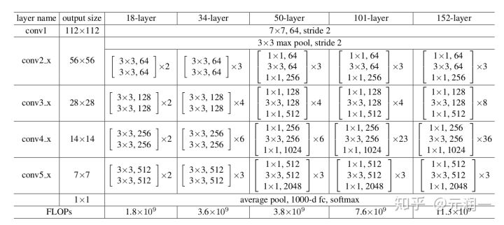
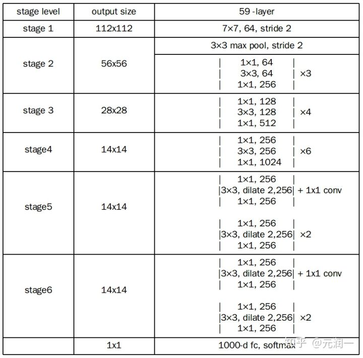
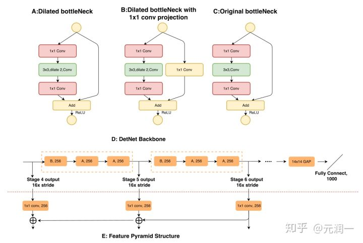
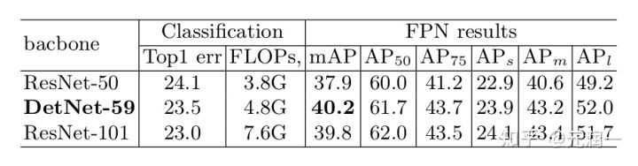

用于检测任务的主干网，兼顾空间分辨率与感受野。

有效的原因：

- 即在后面几层不做下采样，从而保留了一定空间分辨率的特征图
- 使用空洞卷积，增加了感受野
- 在 ImageNet 预训练 添加的P6 层，使得初始化权重更为科学

与ResNet50对比：

改变之处：

图A为改进的带有空洞卷积残差单元。图B在A的基础上在残差单元的支路加了一层卷积，目前没有代码，推测这一层卷积之后还会有relu和bn的操作。图C是原始残差单元结构。

detnet在stage4之前是和resnet结构一样的，在stage4之后会用图D的结构，首先生成stage5需要经过3个残差单元，图D中的意思是把原来的3个残差单元用一次B和两次A的结构做替换以此来输出stage5，然后用相同的结构（添加三个改进的残差单元，9次卷积）来生成stage6，此时这个stage6输出的特征图的尺寸为14×14×256来链接FC层做预测。由于从stage6是detnet自己添加3个改进的残差单元生成的，所以网络叫做detnet-59。

增加了计算量，但性价比还可以：

为什么使用空洞卷积？

提高感受野。

为什么提高感受野不用大的卷积核？

减少计算量。