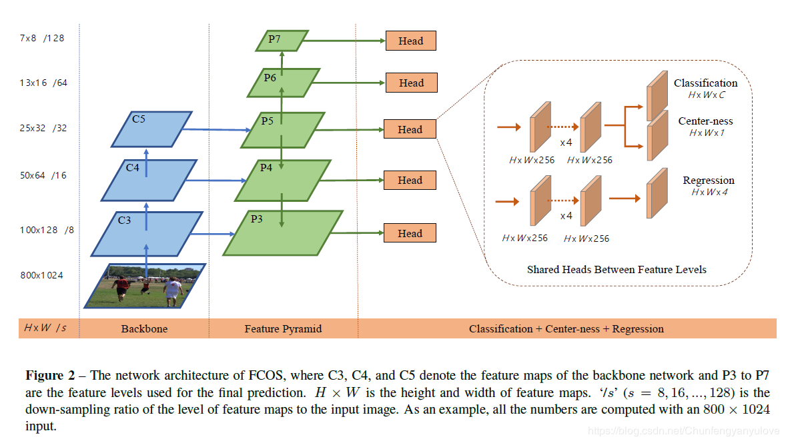
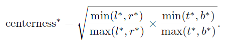
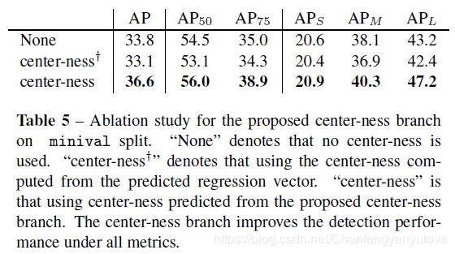
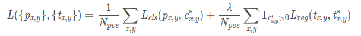
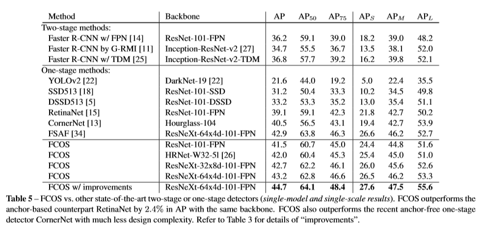

**FCOS: Fully Convolutional One-Stage Object Detection**

于19年4月发布于arxiv上

三个分支：回归分支(框)、中心点(sigmoid)、类别(softmax，可做框置信度)

中心点以概率形式乘到框置信度上，远离中心点的置信度会被降低。

回归分支：每个特征点预测一个框

### 框回归

对FCN输出特征图每点预测4个向量，分别是到上下左右四条边的距离，代表一个框。

FCOS可以使用的正样本的数量很多

### 如何解决重合的边界框

这里的边界框不是指检测框，而是指GT框。两个GT框如果有重合，那么重合区域点的类别如何划分？

作者使用了FPN结构，将不同大小的目标框分散到不同的层中进行预测，这样就很大程度上减少了重叠的发生，作者也做了统计，不使用FPN存在大约23.16%的重合框，使用之后，降到了7.14%。并且使用FPN对小目标也有一定的帮助。

### Center-ness层

衡量点的中心度，解决一个框内所有点等概率权重问题，这样就无法区分那个点代表这个框。（实际上可以通过`l=r, t=b`近似的限制筛选过滤，但这样就引入了超参，不够好）作者添加了一个Center-ness层分支，目的是为找到目标的中心点，减少多余的误检框。

此公式实现：离目标中心越近，输出值越大，反之越小。最中心点centerness值为1，距离越远的点，centerness的值越小。

训练的时候，使用Binary CrossEntropy Loss。

在inference阶段，网络前向之后，将该Center-ness的值与classification的输出值相乘，这样可以有效的过滤掉一批误检框，提高识别准确度。

center-ness的效果：

其中center-ness+，代表的是在检测分支上直接进行中心点的预测，而不是在分类上增加一个分支，结果可以发现：

1. 在检测分支进行直接预测的结果并没有原来的好，在分类分支增加了center-ness，mAP可以提高大约3个点左右。
2. 另外作者也进行了实验，如果center-ness预测的全部都对的情况下（理想情况），mAP可以达到42.1%的准确率，说明其实center-ness还是有提升空间的，所以作者进一步进行了实验，将center-ness加深，结果显示mAP从36.6%提高到了36.8%。

### 损失函数

Lcls是 focal loss， Lreg是IoU loss。Npos表示正样本的个数，在论文中 λ=1用于平衡Lreg的权重。1c∗是指标函数，当c∗i>0时候，它等于1，否则为0。

为什么回归使用IoU loss不使用L1或L2 loss：L1或L2损失需要同时去优化四个独立的变量，这就会导致一个预测框的一个或两个变量非常接近真实框，但整体来看却不是那么好！另外一个原因，给定两个像素点，一个落在较大的bounding box，另外一个落在较小的bounding box，这样去计算L2 loss时，显而易见，前者对于bounding box影响更大，这就导致模型优化更加关注较大的物体，而忽略较小的物体。

center-ness分支使用了交叉熵损失，没写在上面。

附效果图：

