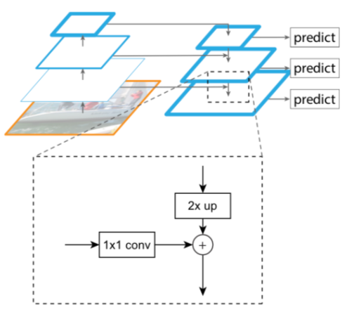
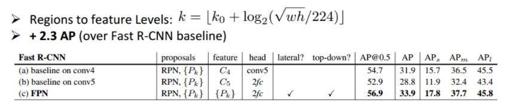
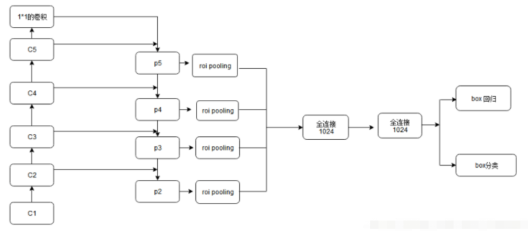

提供一个多尺寸的特征表征，每一层级的语义更强

#### 自下而上结构

该结构就是简单的卷积前向过程。作者将不改变特征映射尺寸的多个卷积层合称为一个stage，每一个stage的最后一个残差块的输出作为该stage的特征输出，传到自上而下的结构。作者共定义了C2，C3，C4，C5四个特征输出，尺寸分别为`32*32`，`16*16`，`8*8`，`4*4`。

#### 自上而下和侧边连接结构

自上而下结构采用C5的特征输出作为最上层，每一层经过2倍的上采样后，再与侧边传过来的，经过1*1卷积的自下而上的特征相加，得到下一层的特征映射，每一层新得到的特征映射都再经过3*3的卷积，来得到该层最终的特征映射，这样可以减少上采样带来的混叠效应。最终特征映射为P2，P3，P4，P5。

作者固定了每一个卷积后的特征的通道维度，设为256。

FPN能够很好地处理小目标的主要原因是：

- FPN可以利用经过top-down模型后的那些上下文信息（高层语义信息）；
- 对于小目标而言，FPN增加了特征映射的分辨率（即在更大的feature map上面进行操作，这样可以获得更多关于小目标的有用信息）；

## Faster R-CNN + FPN

