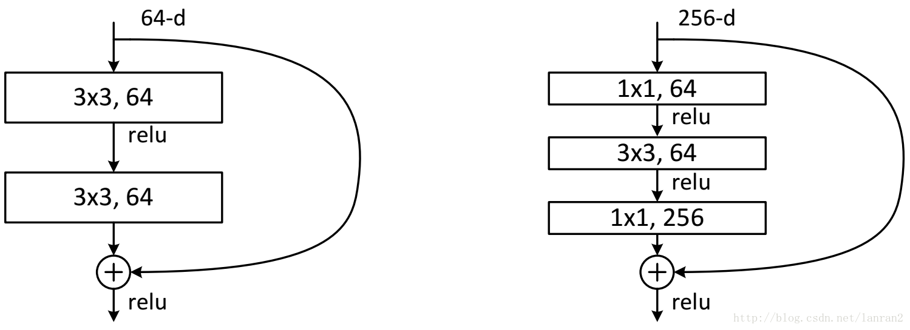
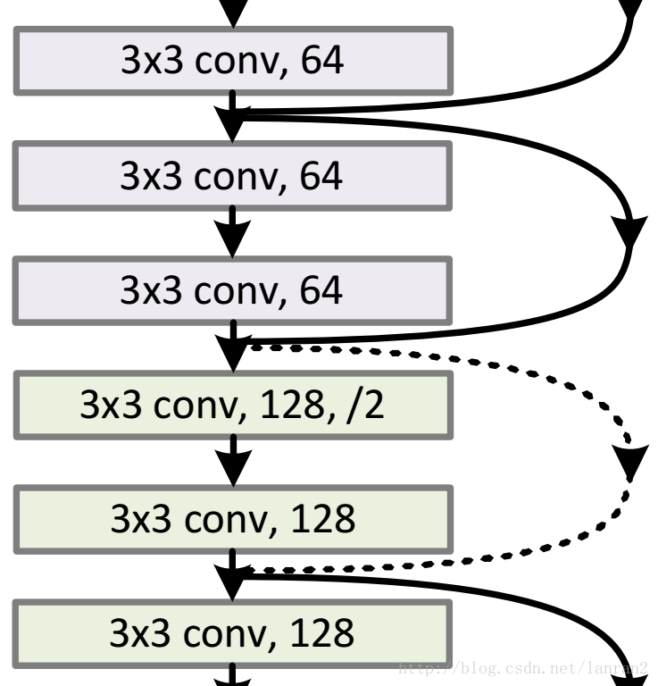
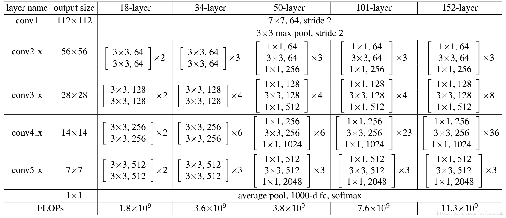

### 两种ResNet设计



这两种结构分别针对ResNet34（左图）和ResNet50/101/152（右图），一般称整个结构为一个”building block“。其中右图又称为”bottleneck design”，目的一目了然，就是为了降低参数的数目，第一个1x1的卷积把256维channel降到64维，然后在最后通过1x1卷积恢复，整体上用的参数数目：1x1x256x64 + 3x3x64x64 + 1x1x64x256 = 69632，而不使用bottleneck的话就是两个3x3x256的卷积，参数数目: 3x3x256x256x2 = 1179648，差了16.94倍。 
对于常规ResNet，可以用于34层或者更少的网络中，对于Bottleneck Design的ResNet通常用于更深的如101这样的网络中，目的是减少计算和参数量（实用目的）。

### 两种shortcut连接方式



实线的的Connection部分都是执行3x3x64的卷积，他们的channel个数一致，所以采用计算方式： 

```
y=F(x)+x 
```

虚线的的Connection部分分别是3x3x64和3x3x128的卷积操作，他们的channel个数不同(64和128)，所以采用计算方式： 

```
y=F(x)+Wx 
```


其中W是1x1卷积操作，用来调整x的channel维度的。


### 设计实例

