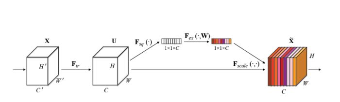
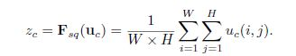
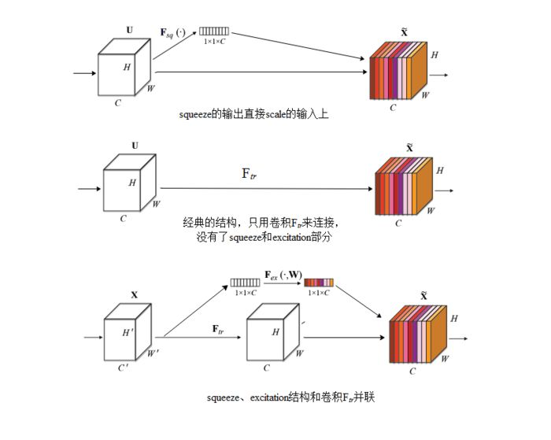
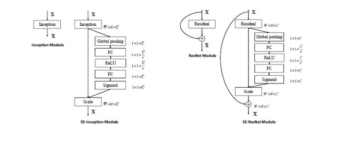

有点类似于注意力机制。

Squeeze-and-Excitation Networks（SENet）是由自动驾驶公司Momenta在2017年公布的一种全新的图像识别结构，它通过对特征通道间的相关性进行建模，**把重要的特征进行强化**来提升准确率。这个结构是2017 ILSVR竞赛的冠军，top5的错误率达到了2.251%，比2016年的第一名还要低25%，可谓提升巨大。

图1是SENet的Block单元。

图中的Ftr是传统的卷积结构，X和U是Ftr的输入（C'xH'xW'）和输出（CxHxW），这些都是以往结构中已存在的。SENet增加的部分是U后的结构：对U先做一个Global Average Pooling（图中的Fsq(.)，作者称为Squeeze过程），输出的1x1xC数据再经过两级全连接（图中的Fex(.)，作者称为Excitation过程），最后用sigmoid（论文中的self-gating mechanism）限制到[0，1]的范围，把这个值作为scale乘到U的C个通道上， 作为下一级的输入数据。

这种结构的原理是想通过控制scale的大小，把重要的特征增强，不重要的特征减弱，从而让提取的特征指向性更强。

下面来看下SENet的一些细节：

先是Squeeze部分。GAP有很多算法，作者用了最简单的求平均的方法（公式1），将空间上一个通道的HxW信息都平均成了一个值。这么做是因为最终的scale是对整个通道作用的，这就得基于通道的整体信息来计算scale。另外作者要利用的是通道间的相关性，而不是空间分布中的相关性，用GAP屏蔽掉空间上的分布信息能让scale的计算更加准确。

公式1：Squeeze的计算

Excitation部分是用2个全连接来实现 ，第一个全连接把C个通道压缩成了C/r个通道来降低计算量（后面跟了RELU），第二个全连接再恢复回C个通道（后面跟了Sigmoid），r是指压缩的比例。作者尝试了r在各种取值下的性能 ，最后得出结论r=16时整体性能和计算量最平衡。(假设C=100,r=10，如果不压缩连接数为100x100=10000，压缩后=100x10+10x100=2000，计算量减少r/2倍)

为什么要加全连接层呢？这是为了利用通道间的相关性来训练出真正的scale。一次mini-batch个样本的squeeze输出并不代表通道真实要调整的scale值，真实的scale要基于全部数据集来训练得出，而不是基于单个batch，所以后面要加个全连接层来进行训练。

可以拿SE Block和下面3种错误的结构比较来进一步理解：

图2最上方的结构，squeeze的输出直接scale到输入上，没有了全连接层，某个通道的调整值完全基于单个通道GAP的结果，事实上只有GAP的分支是完全没有反向计算、没有训练的过程的，就无法基于全部数据集来训练得出通道增强、减弱的规律。

图2中间是经典的卷积结构，有人会说卷积训练出的权值就含有了scale的成分在里面，也利用了通道间的相关性，为啥还要多个SE Block？那是因为这种**卷积有空间的成分在里面**，为了排除空间上的干扰就得先用GAP压缩成一个点后再作卷积，压缩后因为没有了Height、Width的成分，这种卷积就是全连接了。

图2最下面的结构，SE模块和传统的卷积间采用并联而不是串联的方式，这时SE利用的是Ftr输入X的相关性来计算scale，X和U的相关性是不同的，把根据X的相关性计算出的scale应用到U上明显不合适。

图2：三种错误的SE结构

图3是两个SENet实际应用的例子，左侧是SE-Inception的结构，即Inception模块和SENet组和在一起；右侧是SE-ResNet，ResNet和SENet的组合，这种结构scale放到了直连相加之前。

图3：SE-Inception和SE-ResNet结构