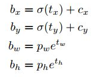
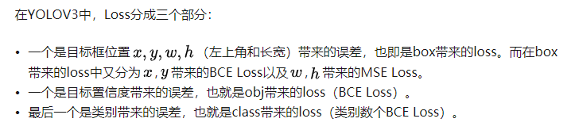
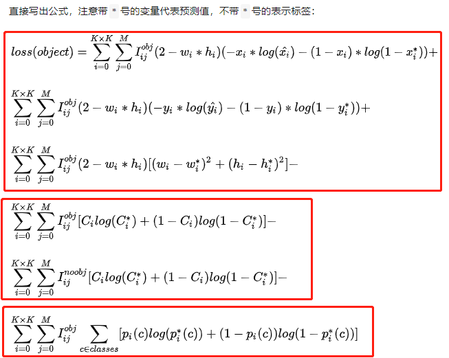

没有多个分支，多个任务预测放在了一个特征图的不同通道上，每个尺度输出大小：HxWx(4+1+C)。结构高度整齐。

v1

- 没有anchor，或者说anchor就是一个个网格
- 每个网格只预测一个目标，容易造成漏检
- 输出层为全连接层，测试时模型只支持与训练图像相同的输入分辨率

v2

- 引入Faster R-CNN的anchor机制，每个格子内有多个不同size不同宽高比的anchor，anchor的尺度是通过聚类得到。同时预测相对anchor的偏移量，使网络更容易学习
- 预测框形式与Faster R-CNN不同
- 使用了BN
- 多尺度训练，选择了多个32倍数的尺度（320~608）
- 有**跨层跳跃连接**，但是最后用于检测的是单尺度，这个时候FPN还没出世。

v3

- 考虑到检测物体的重叠情况，用多标签(sigmoid)的方式替代了之前softmax单标签方式；
- 使用了更好的主干网darknet53
- 借鉴FPN结构，引入多尺度检测
- 单独的对象预测和条件类别预测
- 识别物体位置精准性比Faster R-CNN差
- 召回率低。box的预测限制在每个网格中，这种约束方式减少了候选框的数量。但背景误检率低。

预测框解码：

bounding box按如下的方式进行预测：

损失函数由三部分构成：坐标误差（xy二值交叉熵、wh均方误差）、分类误差（多个二值交叉熵）、框置信度误差（BCE）。注意只有softmax的输出才可以作为置信度(概率)，因此v3中增加了预测置信度。

如果想提高小目标的检测效果，可以在坐标误差前添加系数`k*(1-w*h)`其中wh为gt的wh，相对于原图wh的比例，k为超参数，可以设置成1.5，这样小目标的损失就相对提高了。

