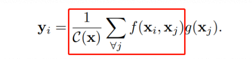
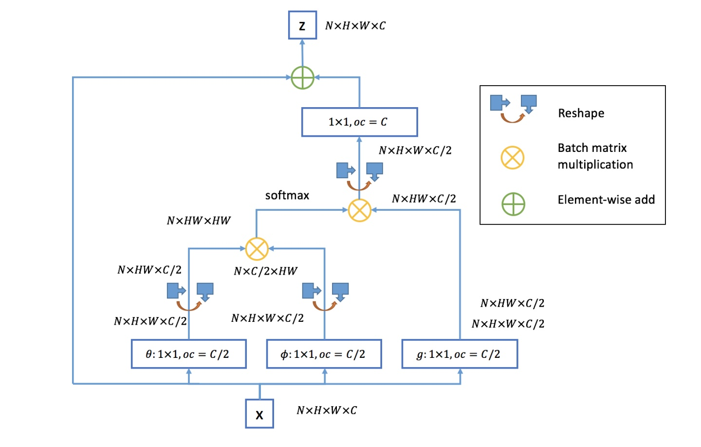

non-local模块可以增加网络的感受野。

全连接就是non-local的，而且是global的。但是全连接带来了大量的参数，给优化带来困难。

有些任务，它们可能需要原图上更多的信息，比如attention。如果在某些层能够引入全局的信息，就能很好地解决local操作无法看清全局的情况，为后面的层带去更丰富的信息。

核心就是这个公式：

yi的输出接一个残差结构。

特点：

1. 不改变输入输出大小，比FC适应性更强。