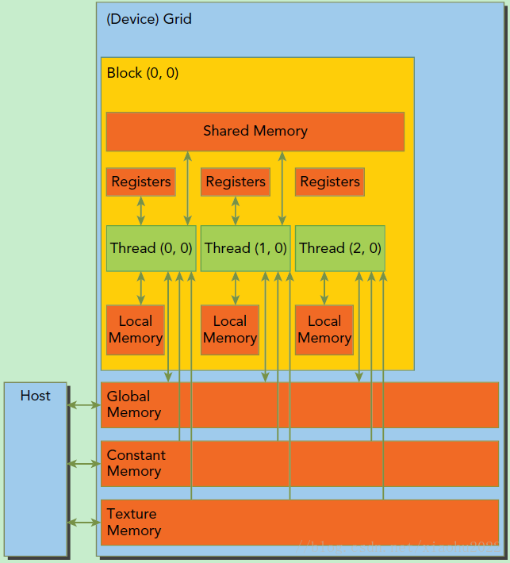

典型的CUDA程序的执行流程如下：

1. 分配host内存，并进行数据初始化；
2. 分配device内存，并从host将数据拷贝到device上；
3. 调用CUDA的核函数在device上完成指定的运算；
4. 将device上的运算结果拷贝到host上；
5. 释放device和host上分配的内存。

kernel是在device上线程中并行执行的函数，核函数用__global__符号声明，在调用时需要用<<<grid, block>>>来指定kernel要执行的线程数量，在CUDA中，每一个线程都要执行核函数，并且每个线程会分配一个唯一的线程号thread ID，这个ID值可以通过核函数的内置变量threadIdx来获得。

CUDA中是通过函数类型限定词开区别host和device上的函数，主要的三个函数类型限定词如下：

- __global__：在device上执行，从host中调用（一些特定的GPU也可以从device上调用），返回类型必须是void，不支持可变参数参数，不能成为类成员函数。注意用__global__定义的kernel是异步的，这意味着host不会等待kernel执行完就执行下一步。
- __device__：在device上执行，单仅可以从device中调用，不可以和__global__同时用。
  __host__：在host上执行，仅可以从host上调用，一般省略不写，不可以和__global__同时用，但可和__device__，此时函数会在device和host都编译。

GPU上很多并行化的轻量级线程。kernel在device上执行时实际上是启动很多线程，一个kernel所启动的所有线程称为一个网格（grid），同一个网格上的线程共享相同的全局内存空间，grid是线程结构的第一层次，而网格又可以分为很多线程块（block），一个线程块里面包含很多线程，这是第二个层次。线程两层组织结构如下图所示，这是一个gird和block均为2-dim的线程组织。grid和block都是定义为dim3类型的变量，dim3可以看成是包含三个无符号整数（x，y，z）成员的结构体变量，在定义时，缺省值初始化为1。因此grid和block可以灵活地定义为1-dim，2-dim以及3-dim结构，对于图中结构（主要水平方向为x轴），定义的grid和block如下所示，kernel在调用时也必须通过执行配置<<<grid, block>>>来指定kernel所使用的线程数及结构。

```c++
dim3 grid(3, 2);
dim3 block(5, 3);
kernel_fun<<< grid, block >>>(prams...);
```

 


所以，一个线程需要两个内置的坐标变量（blockIdx，threadIdx）来唯一标识，它们都是dim3类型变量，其中blockIdx指明线程所在grid中的位置，而threaIdx指明线程所在block中的位置，如图中的Thread (1,1)满足：

```C++
threadIdx.x = 1
threadIdx.y = 1
blockIdx.x = 1
blockIdx.y = 1
```

一个线程块上的线程是放在同一个流式多处理器（SM)上的，但是单个SM的资源有限，这导致线程块中的线程数是有限制的，现代GPUs的线程块可支持的线程数可达**1024**个。有时候，我们要知道一个线程在blcok中的全局ID，此时就必须还要知道block的组织结构，这是通过线程的内置变量blockDim来获得。它获取线程块各个维度的大小。对于一个2-dim的block(Dx,Dy)，线程(x,y)(x,y)的ID值为(x+y∗Dx)，如果是3-dim的block(Dx,Dy,Dz)，线程(x,y,z)的ID值为(x+y∗Dx+z∗Dx∗Dy)。另外线程还有内置变量gridDim，用于获得网格块各个维度的大小。

kernel的这种线程组织结构天然适合vector,matrix等运算，如我们将利用上图2-dim结构实现两个矩阵的加法，每个线程负责处理每个位置的两个元素相加，代码如下所示。线程块大小为(16, 16)，然后将N

```C++
// Kernel定义
__global__ void MatAdd(float A[N][N], float B[N][N], float C[N][N]) 
{ 
    int i = blockIdx.x * blockDim.x + threadIdx.x; 
    int j = blockIdx.y * blockDim.y + threadIdx.y; 
    if (i < N && j < N) 
        C[i][j] = A[i][j] + B[i][j]; 
}
int main() 
{ 
    ...
    // Kernel 线程配置
    dim3 threadsPerBlock(16, 16); 
    dim3 numBlocks(N / threadsPerBlock.x, N / threadsPerBlock.y);
    // kernel调用
    MatAdd<<<numBlocks, threadsPerBlock>>>(A, B, C); 
    ...
}
```

## 内存模型

### 硬件设计

如下图所示。可以看到，每个线程有自己的私有本地内存（Local Memory），而每个线程块有包含共享内存（Shared Memory）,可以被线程块中所有线程共享，其生命周期与线程块一致。此外，所有的线程都可以访问全局内存（Global Memory）。还可以访问一些只读内存块：常量内存（Constant Memory）和纹理内存（Texture Memory）。内存结构涉及到程序优化，这里不深入探讨它们。




一个kernel实际上会启动很多线程，这些线程是逻辑上并行的，但是在物理层却并不一定。这其实和CPU的多线程有类似之处，多线程如果没有多核支持，在物理层也是无法实现并行的。但是好在GPU存在很多CUDA核心，充分利用CUDA核心可以充分发挥GPU的并行计算能力。GPU硬件的一个核心组件是SM，SM的核心组件包括CUDA核心，共享内存，寄存器等，SM可以并发地执行数百个线程，并发能力就取决于SM所拥有的资源数。当一个kernel被执行时，它的gird中的线程块被分配到SM上，一个线程块只能在一个SM上被调度。SM一般可以调度多个线程块，这要看SM本身的能力。那么**有可能一个kernel的各个线程块被分配到多个SM中执行**，所以grid只是逻辑层，而SM才是执行的物理层。SM采用的是SIMT (Single-Instruction, Multiple-Thread，单指令多线程)架构，基本的执行单元是线程束（wraps)，1个线程束包含32个线程，这些线程同时执行相同的指令，但是每个线程都包含自己的指令地址计数器和寄存器状态，也有自己独立的执行路径。所以尽管线程束中的线程同时从同一程序地址执行，但是可能具有不同的行为，比如遇到了分支结构，一些线程可能进入这个分支，但是另外一些有可能不执行，它们只能死等，因为**GPU规定线程束中所有线程在同一周期执行相同的指令**，**线程束分化会导致性能下降**。当线程块被划分到某个SM上时，它将进一步划分为多个线程束，因为这才是SM的基本执行单元。SM要为每个线程块分配共享内存，也要为每个线程束中的线程分配独立的寄存器。所以SM的配置会影响其所支持的线程块和线程束并发数量。总之，就是网格和线程块只是逻辑划分，一个kernel的所有线程其实在物理层是不一定同时并发的。所以kernel的grid和block的配置不同，性能会出现差异，这点是要特别注意的。还有，由于SM的基本执行单元是包含32个线程的线程束，所以block大小一般要设置为32的倍数。

在进行CUDA编程前，可以先检查一下自己的GPU的硬件配置，这样才可以有的放矢，可以通过下面的程序获得GPU的配置属性：

```C++
int dev = 0;
cudaDeviceProp devProp;
CHECK(cudaGetDeviceProperties(&devProp, dev));
std::cout << "使用GPU device " << dev << ": " << devProp.name << std::endl;
std::cout << "SM的数量：" << devProp.multiProcessorCount << std::endl;
std::cout << "每个线程块的共享内存大小：" << devProp.sharedMemPerBlock / 1024.0 << " KB" << std::endl;
std::cout << "每个线程块的最大线程数：" << devProp.maxThreadsPerBlock << std::endl;
std::cout << "每个SM的最大线程数：" << devProp.maxThreadsPerMultiProcessor << std::endl;
std::cout << "每个SM的最大线程束数：" << devProp.maxThreadsPerMultiProcessor / 32 << std::endl;

// 输出如下
使用GPU device 0: GeForce GT 730
SM的数量：2
每个线程块的共享内存大小：48 KB
每个线程块的最大线程数：1024
每个SM的最大线程数：2048
每个SM的最大线程束数：64
```
## CUDA API

CUDA有两种类型API，一种是运行时API，一种是CUDA驱动API。运行时API是高层次封装，前缀是cuda，如上面的cudaMalloc函数，用起来比较方便。驱动API控制能力较强，但也较难编程和调试，前缀是cu，如cuMalloc，功能与cudaMalloc类似。API之间没有明显的性能差异。

It is composed of two APIs:

- A low-level API called the CUDA driver API,
- A higher-level API called the CUDA runtime API that is implemented on top of
    the CUDA driver API.

These APIs are mutually exclusive: An application should use either one or the other. API相互排斥，只能选用一种

The CUDA runtime eases device code management by providing implicit initialization, context management, and module management. The C host code generated by nvcc is based on the CUDA runtime (see Section 4.2.5), so  applications that link to this code must use the CUDA runtime API. 用NVCC编译的源码都应用cuda运行时API

In contrast, the CUDA driver API requires more code, is harder to program and debug, but offers a better level of control and is language-independent since it only deals with cubin objects (see Section 4.2.5). In particular, it is more difficult to
 configure and launch kernels using the CUDA driver API, since the execution configuration and kernel parameters must be specified with explicit function calls instead of the execution configuration syntax described in Section 4.2.3. Also, device emulation (see Section 4.5.2.9) does not work with the CUDA driver API. CUDA驱动API更难用，这也是为什么会提供CUDA运行时API的原因，但驱动API也有用武之地，比如设备仿真，运行时API就做不了，只能使用驱动API。


### 内存管理API

在device上分配内存的cudaMalloc函数：

```C++
// 和C语言中的malloc类似，但是在device上申请一定字节大小的显存，其中devPtr是指向所分配内存的指针
// 释放分配的内存使用cudaFree函数，这和C语言中的free函数对应
cudaError_t cudaMalloc(void** devPtr, size_t size);
```

负责host和device之间数据通信的cudaMemcpy函数：

```C++
cudaError_t cudaMemcpy(void* dst, const void* src, size_t count, cudaMemcpyKind kind)
```

其中src指向数据源，而dst是目标区域，count是复制的字节数，其中kind控制复制的方向：cudaMemcpyHostToHost, cudaMemcpyHostToDevice, cudaMemcpyDeviceToHost及cudaMemcpyDeviceToDevice，如cudaMemcpyHostToDevice将host上数据拷贝到device上。

现在我们来实现一个向量加法的实例，这里grid和block都设计为1-dim，首先定义kernel如下：

```C++
// 两个向量加法kernel，grid和block均为一维
__global__ void add(float* x, float * y, float* z, int n)
{
    // 获取全局索引
    int index = threadIdx.x + blockIdx.x * blockDim.x;
    // 步长
    int stride = blockDim.x * gridDim.x;
    for (int i = index; i < n; i += stride)
    {
        z[i] = x[i] + y[i];
    }
}
```

其中stride是整个grid的线程数，有时候向量的元素数很多，这时候可以将在每个线程实现多个元素（元素总数/线程总数）的加法，相当于使用了多个grid来处理，这是一种grid-stride loop方式，不过下面的例子一个线程只处理一个元素，所以kernel里面的循环是不执行的。下面我们具体实现向量加法：

```C++
int main()
{
    int N = 1 << 20;
    int nBytes = N * sizeof(float);
    // 申请host内存
    float *x, *y, *z;
    x = (float*)malloc(nBytes);
    y = (float*)malloc(nBytes);
    z = (float*)malloc(nBytes);
    
    // 初始化数据
    for (int i = 0; i < N; ++i)
    {
        x[i] = 10.0;
        y[i] = 20.0;
    }

    // 申请device内存
    float *d_x, *d_y, *d_z;
    cudaMalloc((void**)&d_x, nBytes);
    cudaMalloc((void**)&d_y, nBytes);
    cudaMalloc((void**)&d_z, nBytes);

    // 将host数据拷贝到device
    cudaMemcpy((void*)d_x, (void*)x, nBytes, cudaMemcpyHostToDevice);
    cudaMemcpy((void*)d_y, (void*)y, nBytes, cudaMemcpyHostToDevice);
    // 定义kernel的执行配置
    dim3 blockSize(256);
    dim3 gridSize((N + blockSize.x - 1) / blockSize.x);
    // 执行kernel
    add<<<gridSize, blockSize>>>(d_x, d_y, d_z, N);

    // 将device得到的结果拷贝到host
    cudaMemcpy((void*)z, (void*)d_z, nBytes, cudaMemcpyHostToDevice);

    // 检查执行结果
    float maxError = 0.0;
    for (int i = 0; i < N; i++)
        maxError = fmax(maxError, fabs(z[i] - 30.0));
    std::cout << "最大误差: " << maxError << std::endl;

    // 释放device内存
    cudaFree(d_x);
    cudaFree(d_y);
    cudaFree(d_z);
    // 释放host内存
    free(x);
    free(y);
    free(z);

    return 0;
}
```
这里我们的向量大小为1<<20(2^20)，而block大小为256(2^8)，那么grid大小是4096(2^12)，kernel的线程层级结构如下图所示：


使用nvprof工具可以分析kernel运行情况，结果如下所示，可以看到kernel函数费时约1.5ms。

```sh
nvprof cuda9.exe
==7244== NVPROF is profiling process 7244, command: cuda9.exe
最大误差: 4.31602e+008
==7244== Profiling application: cuda9.exe
==7244== Profiling result:
            Type  Time(%)      Time     Calls       Avg       Min       Max  Name
 GPU activities:   67.57%  3.2256ms         2  1.6128ms  1.6017ms  1.6239ms  [CUDA memcpy HtoD]
                   32.43%  1.5478ms         1  1.5478ms  1.5478ms  1.5478ms  add(float*, float*, float*, int)
```

调整block的大小，对比不同配置下的kernel运行情况，这里测试的是当block为128时，kernel费时约1.6ms，而block为512时kernel费时约1.7ms，当block为64时，kernel费时约2.3ms。看来不是block越大越好，而要适当选择。

在上面的实现中，我们需要单独在host和device上进行内存分配，并且要进行数据拷贝，这是很容易出错的。好在CUDA 6.0引入统一内存（Unified Memory）来避免这种麻烦，简单来说就是统一内存使用一个托管内存来共同管理host和device中的内存，并且<font color=red size=4>自动在host和device中进行数据传输</font>。CUDA中使用cudaMallocManaged函数分配托管内存：

```C++
// 如果数据仅需要放在CPU则无需用此函数
cudaError_t cudaMallocManaged(void **devPtr, size_t size, unsigned int flag=0);
```

利用统一内存，可以将上面的程序简化如下：

```C++

int main()
{
    int N = 1 << 20;
    int nBytes = N * sizeof(float);// 申请托管内存
    float *x, *y, *z;
    cudaMallocManaged((void**)&x, nBytes);
    cudaMallocManaged((void**)&y, nBytes);
    cudaMallocManaged((void**)&z, nBytes);

    // 初始化数据
    for (int i = 0; i < N; ++i)
    {
        x[i] = 10.0;
        y[i] = 20.0;
    }

    // 定义kernel的执行配置
    dim3 blockSize(256);
    dim3 gridSize((N + blockSize.x - 1) / blockSize.x);
    // 执行kernel
    add << < gridSize, blockSize >> >(x, y, z, N);

    // 同步device 保证结果能正确访问
    cudaDeviceSynchronize();
    // 检查执行结果
    float maxError = 0.0;
    for (int i = 0; i < N; i++)
        maxError = fmax(maxError, fabs(z[i] - 30.0));
    std::cout << "最大误差: " << maxError << std::endl;

    // 释放内存
    cudaFree(x);
    cudaFree(y);
    cudaFree(z);

    return 0;
}
```
相比之前的代码，使用统一内存更简洁了，值得注意的是kernel执行是与host异步的，由于托管内存自动进行数据传输，这里要用cudaDeviceSynchronize()函数保证device和host同步，这样后面才可以正确访问kernel计算的结果。

矩阵乘法实例

最后我们再实现一个稍微复杂一些的例子，就是两个矩阵的乘法，设输入矩阵为AA和BB，要得到C=A×BC=A×B。实现思路是每个线程计算CC的一个元素值Ci,jCi,j，对于矩阵运算，应该选用grid和block为2-D的。首先定义矩阵的结构体：

```C++
// 矩阵类型，行优先，M(row, col) = *(M.elements + row * M.width + col)
struct Matrix
{
    int width;
    int height;
    float *elements;
};
```

然后实现矩阵乘法的核函数，这里我们定义了两个辅助的__device__函数分别用于获取矩阵的元素值和为矩阵元素赋值，具体代码如下：

```C++
 // 获取矩阵A的(row, col)元素
__device__ float getElement(Matrix *A, int row, int col)
{
    return A->elements[row * A->width + col];
}

// 为矩阵A的(row, col)元素赋值
__device__ void setElement(Matrix *A, int row, int col, float value)
{
    A->elements[row * A->width + col] = value;
}

// 矩阵相乘kernel，2-D，每个线程计算一个元素
__global__ void matMulKernel(Matrix *A, Matrix *B, Matrix *C)
{
    float Cvalue = 0.0;
    int row = threadIdx.y + blockIdx.y * blockDim.y;
    int col = threadIdx.x + blockIdx.x * blockDim.x;
    for (int i = 0; i < A->width; ++i)
    {
        Cvalue += getElement(A, row, i) * getElement(B, i, col);
    }
    setElement(C, row, col, Cvalue);
}
```

最后我们采用统一内存编写矩阵相乘的测试实例：

```C++
int main()
{
    int width = 1 << 10;
    int height = 1 << 10;
    Matrix *A, *B, *C;
    // 申请托管内存
    cudaMallocManaged((void**)&A, sizeof(Matrix));
    cudaMallocManaged((void**)&B, sizeof(Matrix));
    cudaMallocManaged((void**)&C, sizeof(Matrix));
    int nBytes = width * height * sizeof(float);
    cudaMallocManaged((void**)&A->elements, nBytes);
    cudaMallocManaged((void**)&B->elements, nBytes);
    cudaMallocManaged((void**)&C->elements, nBytes);

    // 初始化数据
    A->height = height;
    A->width = width;
    B->height = height;
    B->width = width;
    C->height = height;
    C->width = width;
    for (int i = 0; i < width * height; ++i)
    {
        A->elements[i] = 1.0;
        B->elements[i] = 2.0;
    }
    
    // 定义kernel的执行配置
    dim3 blockSize(32, 32);
    dim3 gridSize((width + blockSize.x - 1) / blockSize.x, 
        (height + blockSize.y - 1) / blockSize.y);
    // 执行kernel
    matMulKernel<<<gridSize, blockSize>>>(A, B, C);

    // 同步device 保证结果能正确访问
    cudaDeviceSynchronize();
    // 检查执行结果
    float maxError = 0.0;
    for (int i = 0; i < width * height; ++i)
        maxError = fmax(maxError, fabs(C->elements[i] - 2 * width));
    std::cout << "最大误差: " << maxError << std::endl;
    
    return 0;
}
```

这里矩阵大小为1024×10241024×1024，设计的线程的block大小为(32, 32)，那么grid大小为(32, 32)，最终测试结果如下：

```sh
nvprof cuda9.exe
==16304== NVPROF is profiling process 16304, command: cuda9.exe
最大误差: 0
==16304== Profiling application: cuda9.exe
==16304== Profiling result:
            Type  Time(%)      Time     Calls       Avg       Min       Max  Name
 GPU activities:  100.00%  1.32752s         1  1.32752s  1.32752s  1.32752s  matMulKernel(Matrix*, Matrix*, Matrix*)
      API calls:   83.11%  1.32762s         1  1.32762s  1.32762s  1.32762s  cudaDeviceSynchronize
                   13.99%  223.40ms         6  37.233ms  37.341us  217.66ms  cudaMallocManaged
                    2.81%  44.810ms         1  44.810ms  44.810ms  44.810ms  cudaLaunch
                    0.08%  1.3300ms        94  14.149us       0ns  884.64us  cuDeviceGetAttribute
                    0.01%  199.03us         1  199.03us  199.03us  199.03us  cuDeviceGetName
                    0.00%  10.009us         1  10.009us  10.009us  10.009us  cuDeviceTotalMem
                    0.00%  6.5440us         1  6.5440us  6.5440us  6.5440us  cudaConfigureCall
                    0.00%  3.0800us         3  1.0260us     385ns  1.5400us  cudaSetupArgument
                    0.00%  2.6940us         3     898ns     385ns  1.5390us  cuDeviceGetCount
                    0.00%  1.9250us         2     962ns     385ns  1.5400us  cuDeviceGet

==16304== Unified Memory profiling result:
Device "GeForce GT 730 (0)"
   Count  Avg Size  Min Size  Max Size  Total Size  Total Time  Name
    2051  4.0000KB  4.0000KB  4.0000KB  8.011719MB  21.20721ms  Host To Device
     270  45.570KB  4.0000KB  1.0000MB  12.01563MB  7.032508ms  Device To Host
```


详见：https://docs.nvidia.com/cuda/cuda-c-programming-guide/index.html

参考：

https://blog.csdn.net/xiaohu2022/article/details/79599947