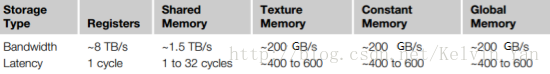
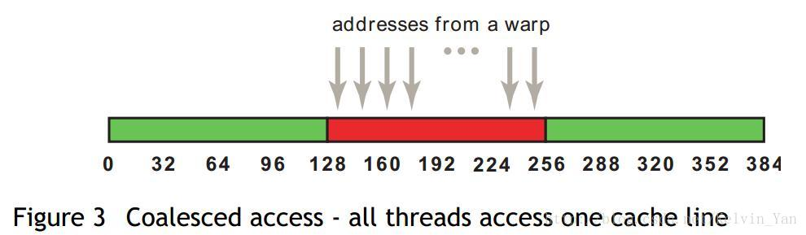

### 为什么需要合并内存访问

### 传输延迟（latency）

在host端和device端之间存在latency，数据通过PCI-E总线从CPU传输给GPU，我们必须避免频繁的host、device间数据传输，即使是最新的PCIE 3.0 x16接口，其双向带宽也只有32GB/s。

在device内部也存在latency，即数据从gpu的存储器到SM的传输，访问一次片外内存，将耗费400~600个cycle，成本是非常高的，所以必须谨慎对待片外内存的访问。

 


### 合并（coalesced）的效果

数据从全局内存到SM的传输，会进行cache，如果cache命中了，下一次的访问的耗时将大大减少。 每个SM都具有单独的L1 cache，所有的SM共用一个L2 cache。 在计算能力2.x之前的设备，全局内存的访问会在L1/L2 cache上缓存；在计算能力3.x以上的设备，全局内存的访问只在L2 cache上缓存。 对于L1 cache，每次按照128字节进行缓存；对于L2 cache，每次按照32字节进行缓存。 

合并访问是指所有线程访问连续的对齐的内存块。对于L1 cache，内存块大小支持32字节、64字节以及128字节，分别表示线程束中每个线程以一个字节、16位、32位为单位读取数据。前提是，访问必须连续，并且访问的地址是以32字节对齐。（类似于SSE\AVX的向量指令，cuda中的合并访存也是向量指令）

假设每个thread读取一个float变量，那么一个warp（32个thread）将会执行32*4=128字节的合并访存指令，通过一次访存操作完成所有thread的读取请求。 



对于L2 cache，合并访存的字节减少为32字节，那么L2 cache相对L1 cache的好处？ 
在非对齐访问、分散访问（非连续访问）的情况下，提高吞吐量（cache的带宽利用率）


### 如何合并（代码层次）

**1** . 如果有一部份的 thread 没有读取内存，并不会影响到其它的 thread 执行 coalesced 的存取:

例如：

```cpp
if (tid != 3) { 
    int number = data[tid]; 
}
```

虽然 thread 3 并没有读取数据，但是由于其它的 thread 仍符合 coalesced 的条件（假设 data 的地址是 64 bytes 的倍数），这样的内存读取仍会符合 coalesced 的条件。


**2** .每个 thread 一次读取的内存数据量，可以是 32 bits、64 bits、或 128 bits。不过，32 bits 的效率是最好的。64 bits 的效率会稍差，而一次读取 128 bits 的效率则比一次读取 32 bits 要显著来得低（但仍比 non-coalesced 的存取要好）。

**如果每个 thread 一次存取的数据并不是 32 bits、64 bits、或 128 bits，那就无法符合 coalesced 的条件.**

例如，以下的程序：

```cpp
struct vec3d { float x, y, z; }; 
__global__ void func(struct vec3d* data, float* output) { 
    output[tid] = data[tid].x * data[tid].x + data[tid].y * data[tid].y + data[tid].z * data[tid].z; }
```

这个程序并不是 coalesced 的读取，因为 vec3d 的大小是 12 bytes，而非 4 bytes、8 bytes、或 16 bytes。

要解决这个问题，可以使用 `__align(n)__`，例如：

```cpp
struct __align__(16) vec3d { 
    float x, y, z; 
};
```

这会让 compiler 在 vec3d 后面加上一个空的 4 bytes，以补齐 16 bytes。

另一个方法，是把数据结构转换成三个连续float的数组，这样每个数组访问是合并的，如下：

```cpp
__global__ void func(float* x, float* y, float* z, float* output) { 
    output[tid] = x[tid] * x[tid] + y[tid] * y[tid] + z[tid] * z[tid]; 
}
```

如果因为其它原因使数据结构无法这样调整，也可以考虑利用 shared memory 在 GPU 上做结构的调整。

例如：

```cpp
__global__ void func(struct vec3d* data, float* output) { 
    __shared__ float temp[THREAD_NUM * 3];  // 定义位于共享存储区变量
    // 使用合并访问将数据从全局区拷贝到共享区
    const float* fdata = (float*) data; 
    temp[tid] = fdata[tid];
    temp[tid + THREAD_NUM] = fdata[tid + THREAD_NUM];
    temp[tid + THREAD_NUM*2] = fdata[tid + THREAD_NUM*2]; 
    // 同步
    __syncthreads(); 
    output[tid] = temp[tid*3] * temp[tid*3] + temp[tid*3+1] * temp[tid*3+1] + \
                  temp[tid*3+2] * temp[tid*3+2]; 
}
```

在上面的例子中，我们先用连续的方式，把数据从 global memory 读到 shared memory。由于shared memory 不需要担心存取顺序（但要注意 bank conflict 存储体冲突问题），所以可以避开 non-coalesced 读取的问题。

