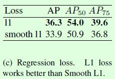
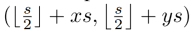
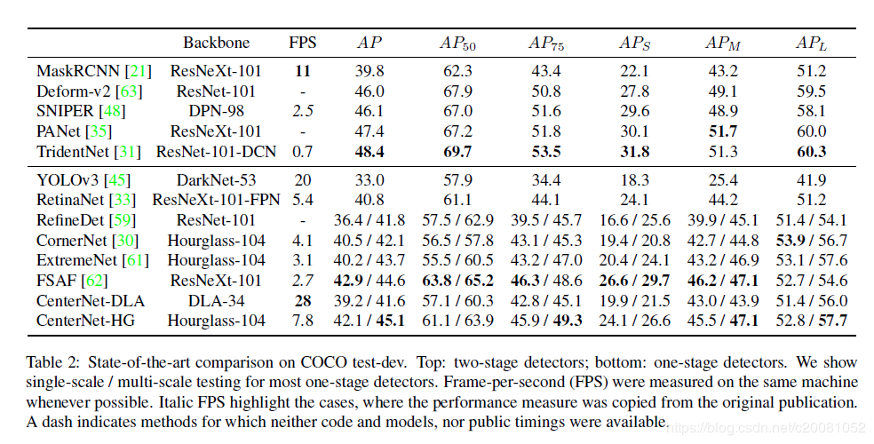

与19年4月份发布在arxiv上，基本与FCOS同期，但似乎关注度没有FCOS大。

论文中没给出网络图，因为网络真的太简单了，几乎每个细节都能在其它模型上找出蛛丝马迹，所以作者也就没画框图了，这可能也是导致知名度不高的原因，毕竟如果没有CornerNet的基础，很难明白这个网络到底长什么样，但是如有了CornerNet基础又会觉得创新点不多。但我觉得作者最大的贡献是简化了CornerNet的模型，但精度却没有下降。CornerNet是整正的第一个基于关键点估计的模型，而无论DenseNet还是FCOS都是有框预测。

### 分支

先看分支，共有三个分支：中心关键点热图预测分支、宽高预测分支和中心点位置偏移预测分支。

中心关键点热图大小为HxWxC，C为类别总数，即每个类别使用一个通道预测，使用sigmid输出。使用CornerNet修改的focal loss训练。中心点的GT生成与FCOS不同，使用的是高斯函数散开中心点，远离中心点的点置信度低，在框外的点值为0，这样变相增加了正样本，有点类似于软标签。

宽高预测分支大小为HxWx2，预测值范围没有限制。

中心点偏移分支，非必须，但加了有1-2个点的提升。大小为HxWx2，2表示x方向和y方向的偏移。

输出总大小：HxWx(C+2+2)

### 损失函数

分类使用focal loss、中心点使用交叉熵损失，宽高分支和offset分支使用L1损失。

在CornerNet中采用SmoothL1损失函数来监督回归值（宽高分支、offset分支）的计算，但是在CenterNet中发现用L1损失函数的效果要更好

### 为什么使用高斯函数散开的两点思考

1. 增加增样本数量，类似于soft label，孤立的关键点很难预测，会被淹没在众多负样本中。
2. 和anchor一样，并不是只有IoU=1的anchor才是样本，其它足够靠近的gt的anchor也可认为是正样本；CenterNet还可以区分完全重合和足够靠近的程度，某种程度上说，更优越。

### 与FCOS的对比

#### 异

1. CenterNet以关键点预测为主任务，对最终检测影响最大；FCOS的主任务还是每个点上的框预测，框不准一切免谈。
2. 中心点散开方式不同。CenterNet使用高斯函数，衰减效果为指数；FCOS使用的是衰减效果类似于线性的函数。
3. CenterNet不需要使用FPN结构，而FCOS必须使用FPN结构，否则在有目标重叠场景性能下降很多。因此FCOS的输出要比CenterNet多很多，网络速度也比CenterNet慢(不少)。
4. 框的表达形式不同。CenterNet是点+宽高；FCOS是点。
5. 中心点使用方式不同。CenterNet直接作为框的中心点使用；FCOS作为概率使用。这一点上FCOS胜出
6. 特征图映射回原图方式不同。FCOS的点在feature map中位置与原图对应的关系是如果feature map中位置为![[公式]](assets/CenterNet/equation.svg) ,映射到输入图像的位置是  。而CenterNet是`(s(x+x_off), s(y+y_off))`。这一点CenterNet胜出。
7. 损失函数因为层的设计不同而不同。FOCS框的预测使用了IoU loss，而CenterNet没有框回归。
8. 后处理。CenterNet在关键点上热图上取了极大值点(实现使用的是最大池化操作，kernel设置为3，stride设置为1，pad设置为1)，因此后续可以不需要NMS，但是基于框的算法都需要。
9. 单个尺度对输出大小。CenterNet为：HxWx(C+2+2)；FCOS为：HxWx(4+1+C)。

#### 同

1. 分类损失相同，都使用了focal loss
2. 中心点都使用了sigmoid预测，输出值范围(0, 1)

### 对CenterNet可优化点的思考

2. 非常容易扩展，只要设计对应分支和损失函数(包含GT生成)即可，如用它来预测倾斜矩形框，只需要附加预测角度信息；预测3D box，只需要附加预测深度、方向信息
2. 中心点散开函数设计，对网络性能影响很大
3. 添加注意力机制。因为中心点预测和宽高预测不是独立的，只有在中心点预测准确的前提下，宽高预测才有意义
4. 中心点预测和类别预测能不能用两个分支？类似于FCOS，但是单独的类别预测怎么解决点的类别重叠问题。在C维度其实可以用sigmoid函数，没必要非要用softmax函数。
5. 多任务loss学习，降低先后不一样，观察到hm_loss先下降，然后是wh_loss

附效果图

敢放FPS的一般速度都比较快！