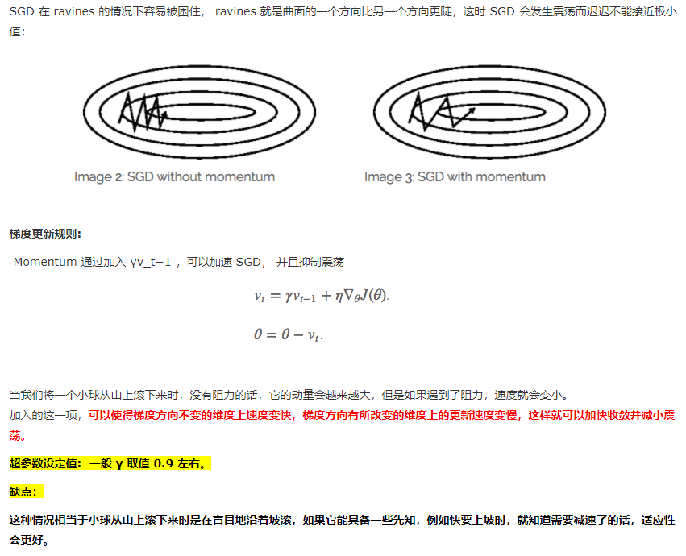
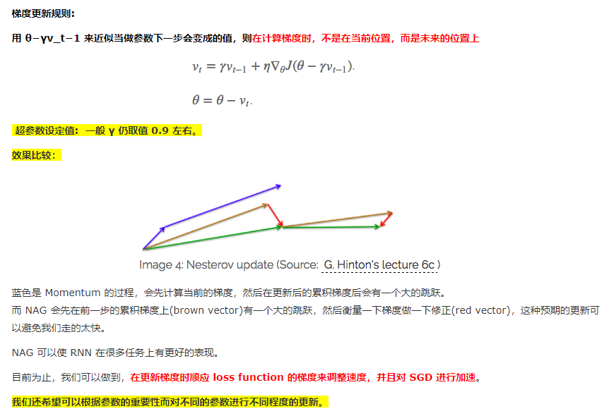
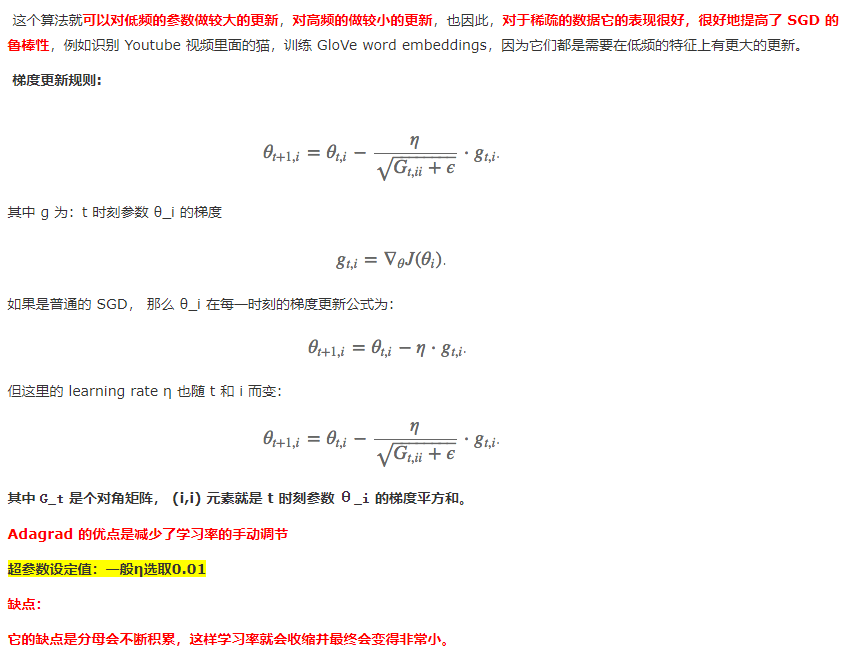
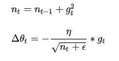
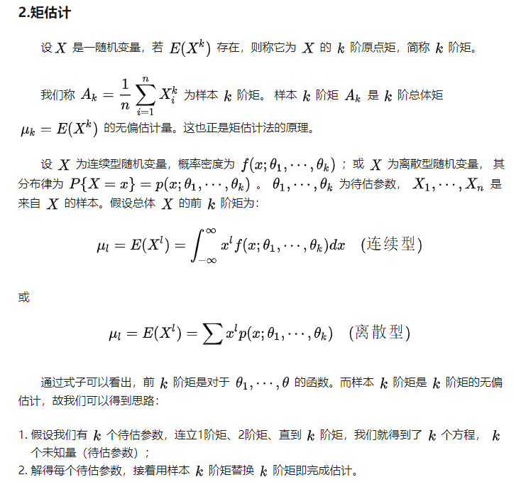
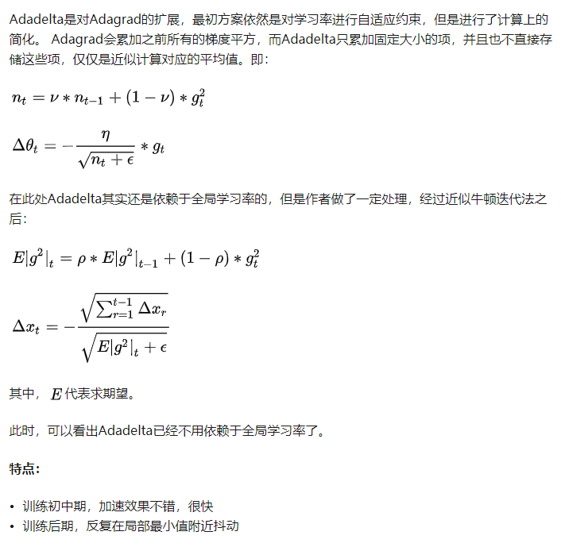
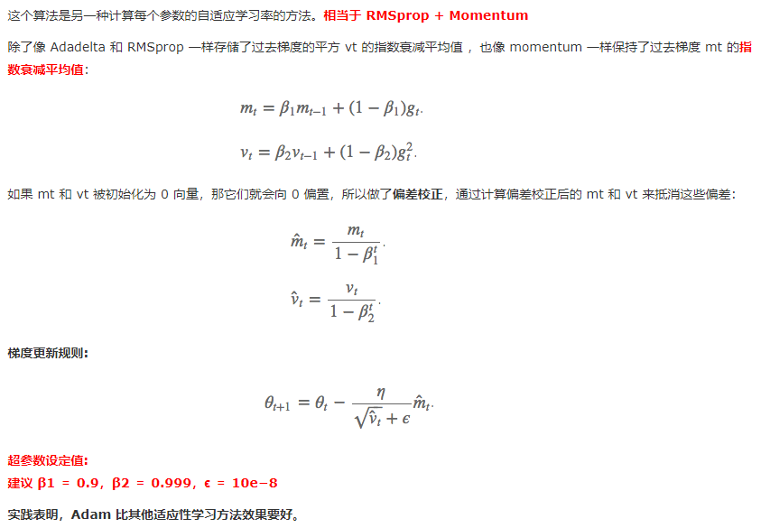

改进方向：减少震荡、自适应梯度范围

# Momentum

# Nesterov Accelerated Gradient

避免前进太快，同时提高灵敏度

# Adagrad （Adaptive gradient algorithm）

gt是带动量的二阶矩估计

**特点：**

- 前期![[公式]](https://www.zhihu.com/equation?tex=g_t)较小的时候， regularizer较大，能够放大梯度
- 后期gt较大的时候，regularizer较小，能够约束梯度
- 后期![[公式]](https://www.zhihu.com/equation?tex=g_t)较大的时候，regularizer较小，能够约束梯度
- 适合处理稀疏梯度

**缺点：**

- 由公式可以看出，仍依赖于人工设置一个全局学习率
- ![[公式]](https://www.zhihu.com/equation?tex=%5Ceta)设置过大的话，会使regularizer过于敏感，对梯度的调节太大
- 中后期，分母上梯度平方的累加将会越来越大，使![[公式]](https://www.zhihu.com/equation?tex=gradient%5Cto0)，使得训练提前结束

为什么用gt平方开根号作为约束？gt小的时候放大梯度，gt大的时候约束梯度，起到稳定梯度的作用。

矩估计：https://zhuanlan.zhihu.com/p/55780975

# Adadelta

# Adam：Adaptive Moment Estimation

PyTorch的betas参数，默认值也是[0.9, 0.999], eps默认值1e-8

参考：

- https://www.cnblogs.com/guoyaohua/p/8542554.html
- https://zhuanlan.zhihu.com/p/22252270