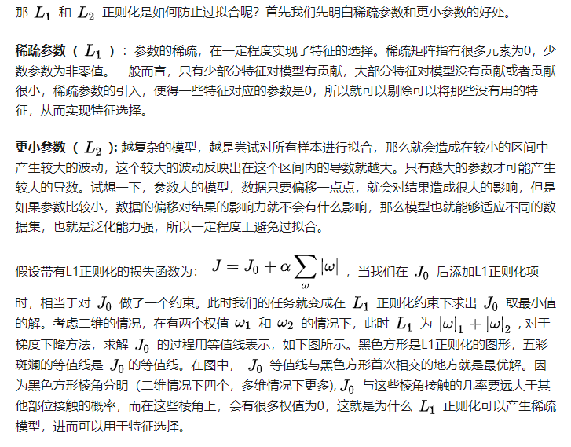
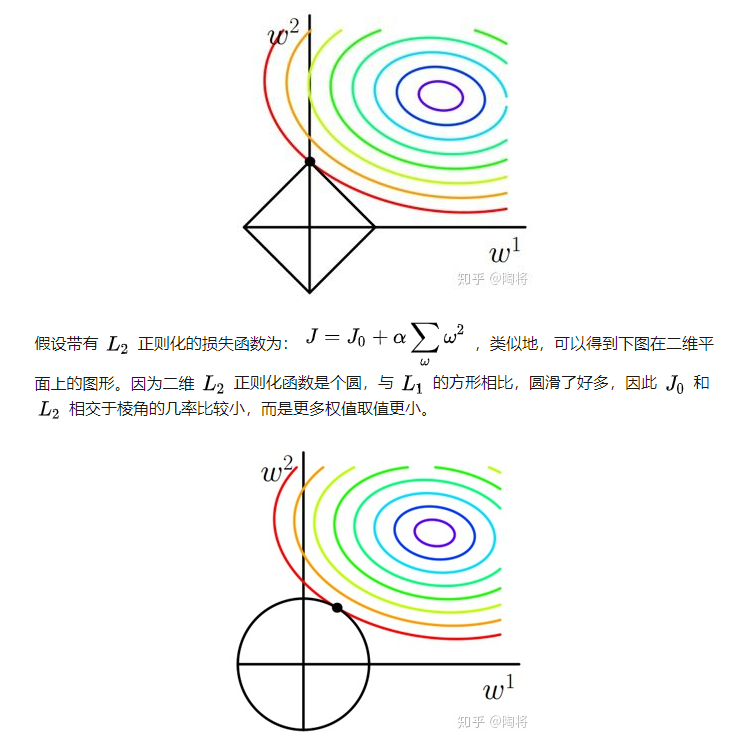
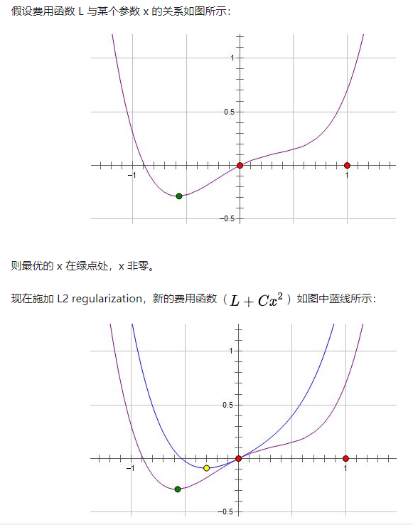
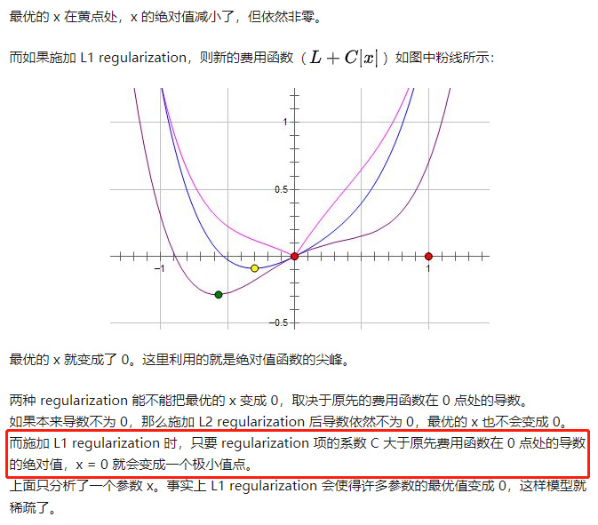

这里更小的参数指参数的绝对值更小。

实际上只要保证施加L1后x=0处左右两边导数异号就行。原函数用f(x)表示，则施加L1后x=0处左右两边导数分别是f'(0)-C和f'(0)+C，只要C>|f'(0)|就能保证异号。

参考：

- https://www.zhihu.com/question/37096933
- https://zhuanlan.zhihu.com/p/56475281