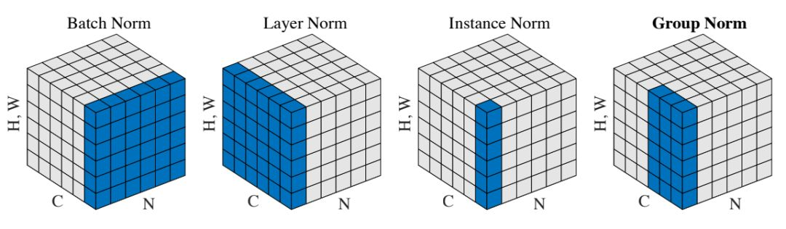
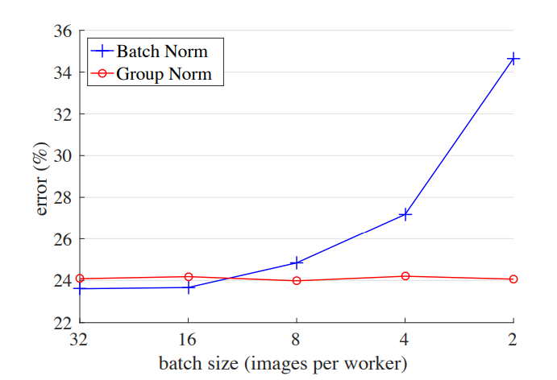
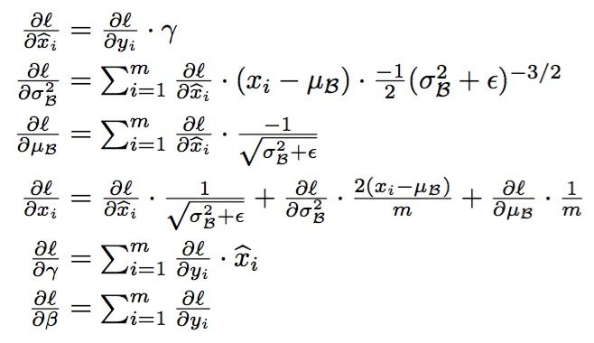
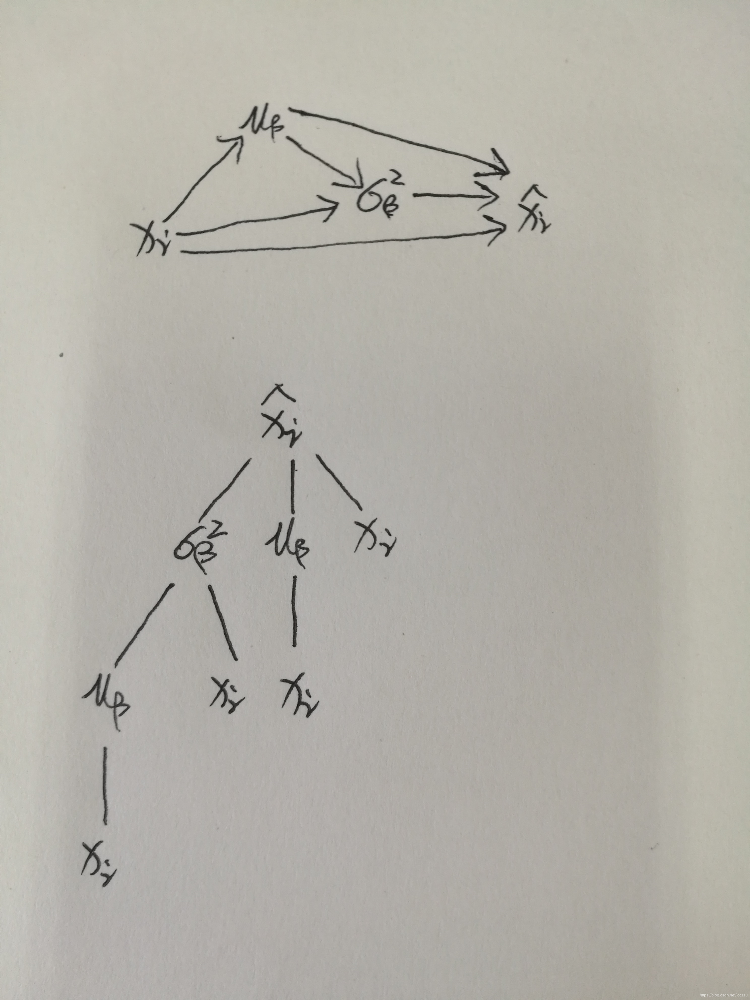
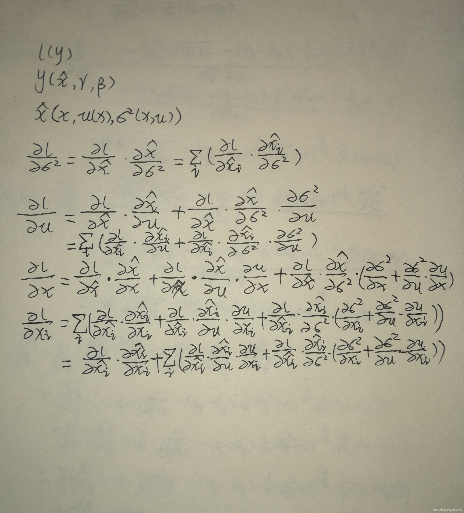

Normalization的中文翻译应该是正则化，不是归一化。归一化是将所有值转到一个固定范围，这时可能存在分布挤压情况。

其实GN论文分析的很清楚，一张图就够了：

归一化的维度不一样：

- BN是在(N, H, W)维度上，于2015年提出，BN适用于固定深度的前向神经网络，如CNN，不适用于RNN；
- LN是在(H,W,C)维度上，主要对RNN效果明显，于2016年提出
- IN是在(H,W)维度上，于2017年提出，用在风格化迁移；
- GN是在[H, W, G]维度上。于2018年提出，G通过对C分组分组得到，此时特征可以从[N, H, W, C]变成[N, H, W, C/G]，

GN和BN的效果对比如图2所示：从图中可以看到GN基本不受batch size的影响，而BN在batch size较小时性能大幅度恶化，但是在较大batch size，BN的效果是稍好于GN的。

(图2 ResNet50模型采用BN和GN在ImageNet上不同batch size下的性能差异)

解决BN在小batch性能较差的另外一个方向是直接降低训练和测试之间不一致性，比较常用的方法是Batch Renormalization (BR)，它主要的思路是限制训练过程中batch统计量的值范围。另外的一个解决办法是采用多卡BN方法训练，相当于增大batch size。

LN，IN以及GN都没有在N维度上进行归一化，所以不会有BN的问题。相比之下，GN是更常用的。

那BN到底是什么原理呢？说到底还是**为了防止“梯度弥散”**。关于梯度弥散，大家都知道一个简单的栗子：![[公式]](assets/BN&GN&IN/equation.svg)。在BN中，是通过将activation规范为均值和方差一致的手段使得原本会减小的activation的scale变大。可以说是一种更有效的local response normalization方法

前向：

反向：

反向传播不仅要求对参数的导数，还要求对输入的导数，这是因为下一层的梯度依赖损失函数对本层输入的导数

参考：

- https://blog.csdn.net/leayc/article/details/77645877
- https://blog.csdn.net/l7H9JA4/article/details/103640739
- https://www.zhihu.com/question/38102762/answer/85238569
- https://blog.csdn.net/lcczzu/article/details/89519345