> **CornerNet: Detecting Objects as Paired Keypoints**
>
> https://arxiv.org/abs/1808.01244

创新点较多！启发较多！

**整个检测网络的训练是从头开始的，并不基于预训练的分类模型，这使得用户能够自由设计特征提取网络，不用受预训练模型的限制。**

作者的思路其实来源于一篇多人姿态估计的论文[1]。基于CNN的2D多人姿态估计方法，通常有2个思路（Bottom-Up Approaches和Top-Down Approaches）：

（1）Top-Down framework，就是先进行行人检测，得到边界框，然后在每一个边界框中检测人体关键点，连接成每个人的姿态，缺点是受人体检测框影响较大，代表算法有RMPE。

（2）Bottom-Up framework，就是先对整个图片进行每个人体关键点部件的检测，再将检测到的人体部位拼接成每个人的姿态，缺点就是可能将，代表方法就是openpose。

论文的第一个创新是讲目标检测上升到方法论，基于多人姿态估计的Bottom-Up思想，首先同时预测定位框的顶点对（左上角和右下角）热点图和embedding vector，根据embedding vector对顶点进行分组。

论文第二个创新是提出了corner pooling用于定位顶点。自然界的大部分目标是没有边界框也不会有矩形的顶点，依top-left corner pooling 为例，对每个channel，分别提取特征图的水平和垂直方向的最大值，然后求和。

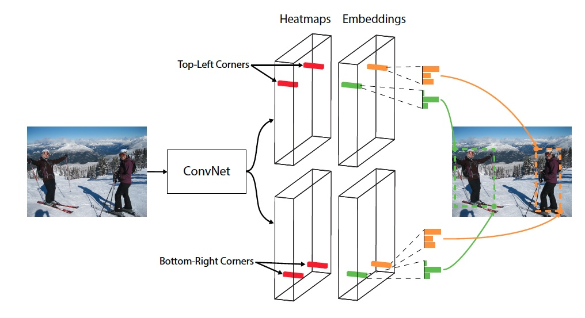

### 分支

先看分支。共有三个分支：角点检测分支、embedding vector分支、offset分支

角点检测分支大小：HxWxC，C代表类别数。PS：特征图利用率比CenterNet高，实际上解决了框的所有参数。将两种同性质角点放在了一个分支里检测。类别预测合并到角点预测里了，也减少了embedding vector训练了难度，因此属于不同框的两个角点靠近这种情况由于分散到不同通道上得到减少。

embedding vector：HxWx2，与角点校测分支大小一样，用于区分哪些角点是同一个框的两个点，这样就可以完整确定框了。

offset分支：HxWx2，角点x方向和y方向的位置偏移误差。使框的位置更准确。

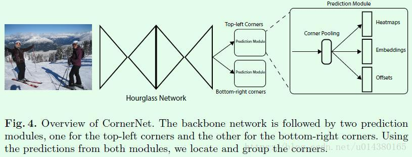

输出总大小：HxWx(C+2+2)

### **group corner**

角点的预测都是独立的，不涉及一个目标的一对角点的概念，因此如何找到一个目标的两个角点就是第三个输出embedding做的工作。这部分是受associative embedding那篇文章的启发，简而言之就是基于不同角点的embedding vector之间的距离找到每个目标的一对角点，如果一个左上角角点和一个右下角角点属于同一个目标，那么二者的embedding vector之间的距离应该很小。

之所以称之为embedding vector，原因是角点位置对应的这个值不是度量距离框中心点远近的量，而是一个嵌入在某个空间的值，在这个空间中还有另一个值与它距离很近。

### corner pooling

首先看看为什么要引入corner pooling，如图Figure2所示。因为CornerNet是预测左上角和右下角两个角点，但是这两个角点在不同目标上没有相同规律可循（没有什么目标的特征），如果采用普通池化操作，那么在训练预测角点支路时会比较困难。考虑到左上角角点的右边有目标顶端的特征信息（第一张图的头顶），左上角角点的下边有目标左侧的特征信息（第一张图的手），因此如果左上角角点经过池化操作后能有这两个信息，那么就有利于该点的预测，这就有了corner pooling，聚焦目标的特征到角点上。

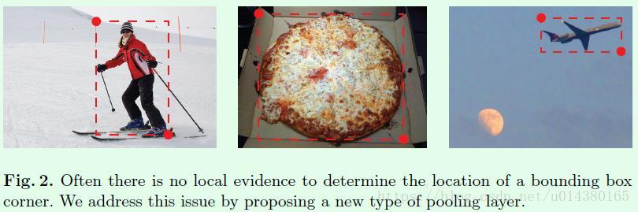

Figure3是针对左上角点做corner pooling的示意图，该层有2个输入特征图。特征图的宽高分别用W和H表示，假设接下来要对图中红色点（坐标假设是(i,j)）做corner pooling，那么就计算(i,j)到(i,H)的最大值（对应Figure3上面第二个图），类似于找到Figure2中第一张图的左侧手信息；同时计算(i,j)到(W,j)的最大值（对应Figure3下面第二个图），类似于找到Figure2中第一张图的头顶信息，然后将这两个最大值相加得到(i,j)点的值（对应Figure3最后一个图的蓝色点）。右下角点的corner pooling操作类似，只不过计算最大值变成从(0,j)到(i,j)和从(i,0)到(i,j)。

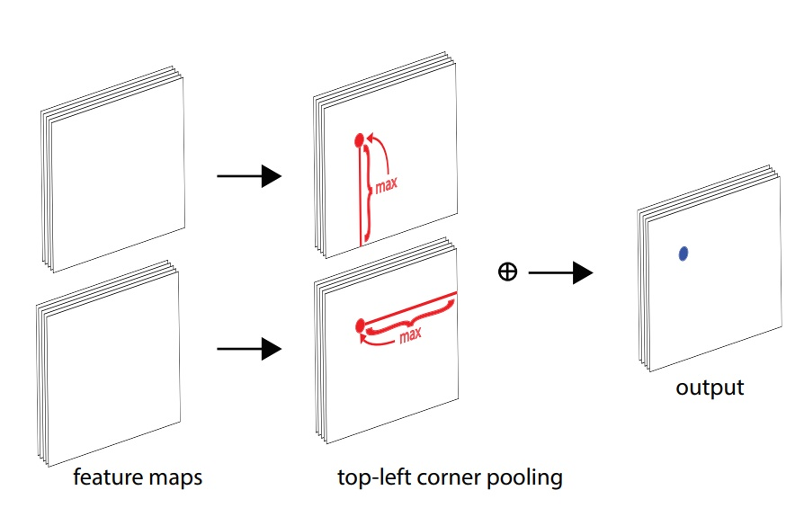

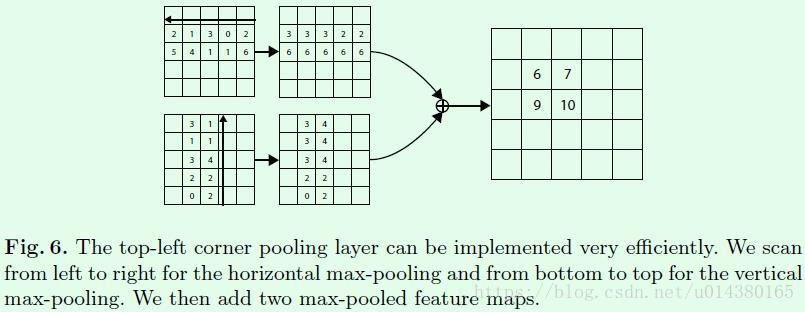

corner pooling在网络的位置：

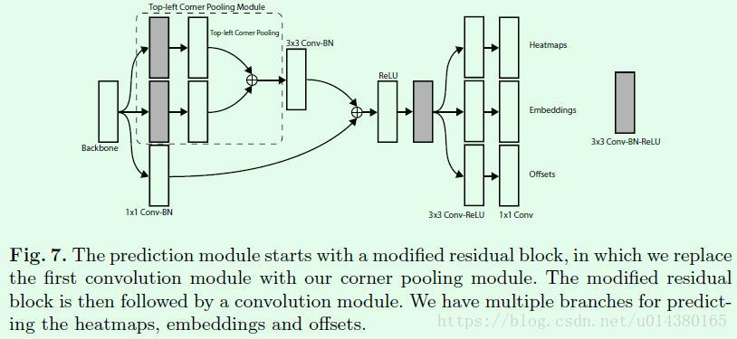

### 损失函数

分类损失：focal loss

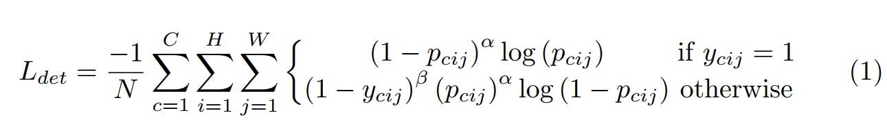

*pcij*表示类别热图上类别为*c*，坐标是*（i,j）*的一个点，*ycij*表示相应位置的ground-truth

Figure5是关于对不同负样本点的损失函数采取不同权重值的原因。红色实线框是ground truth；橘色圆圈是根据ground truth的左上角角点、右下角角点和设定的半径值画出来的，半径是根据圆圈内的角点组成的框和ground truth的IOU值大于0.7而设定的，圆圈内的点的数值是以圆心往外呈二维的高斯分布；白色虚线是一个预测框，可以看出这个预测框的两个角点和ground truth并不重合，但是该预测框基本框住了目标，因此是有用的预测框，所以要有一定权重的损失返回，这就是为什么要对不同负样本点的损失函数采取不同权重值的原因。

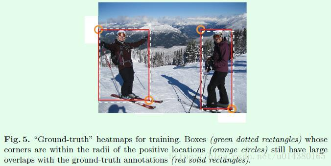

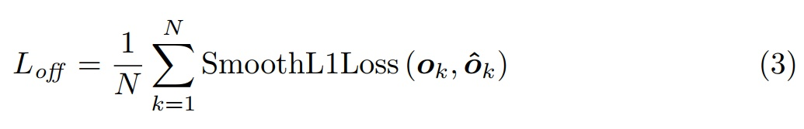

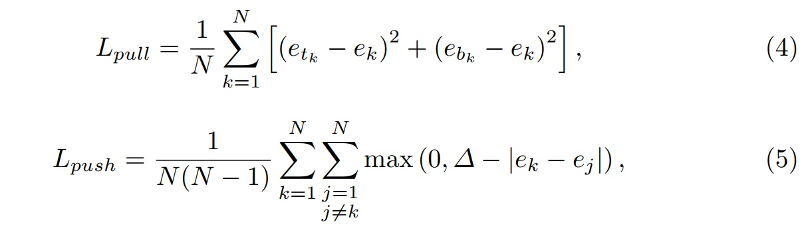

embedding这部分的训练是通过两个损失函数实现的，etk表示第k个目标的左上角角点的embedding vector，ebk表示第k个目标的右下角角点的embedding vector，ek表示etk和ebk的均值。公式4用来缩小属于同一个目标（第k个目标）的两个角点的embedding vector（etk和ebk）距离。公式5用来扩大不属于同一个目标的两个角点的embedding vector距离。

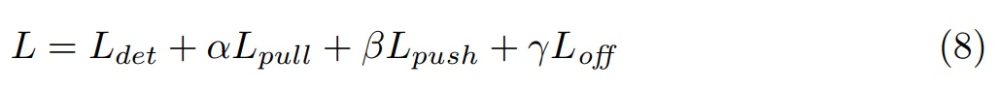

