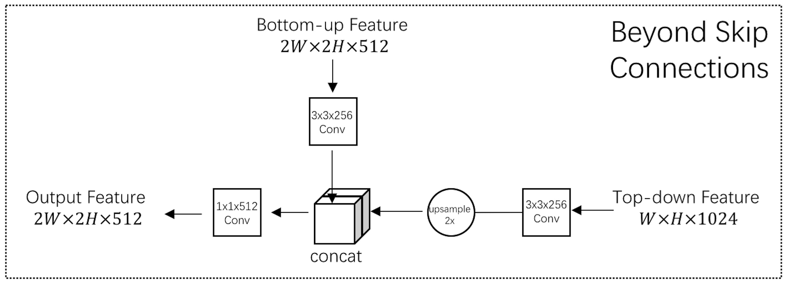
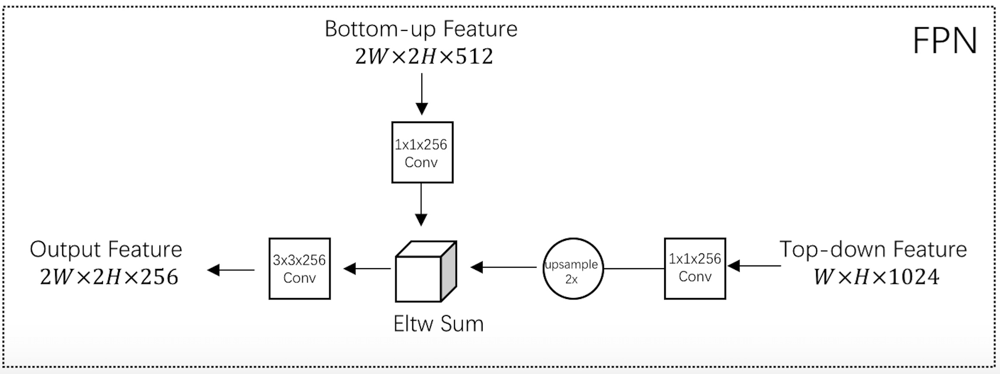
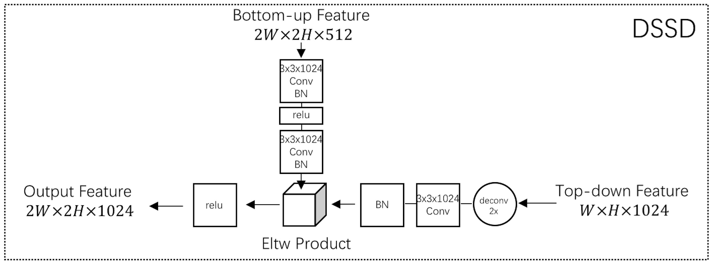
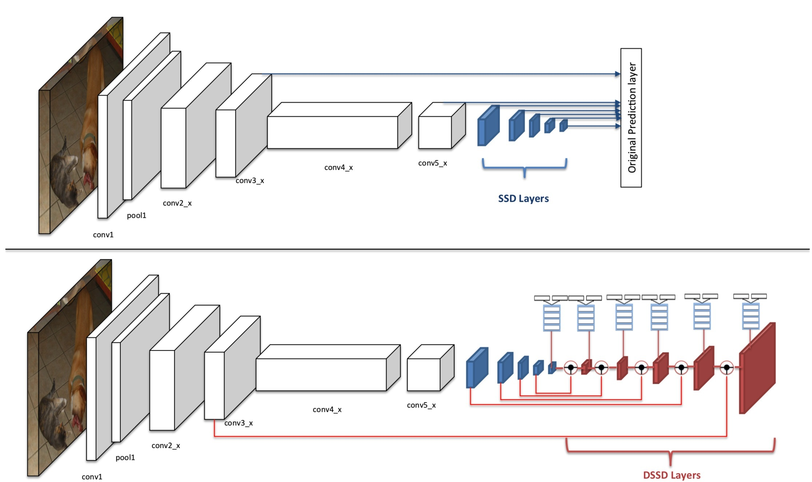

17年1月发布于arxiv。FPN是16年12月发布于arvir的。

上图给出了Google TDM、DSSD和FPN的Top Down网络结构。

在特征图信息融合的步骤中，他们用了不同的方法：Google TDM使用的是concat操作，让浅层和深层的特征图叠在一起，然后再使用1x1卷积融合。DSSD使用的是Eltw Product（也叫broadcast mul）操作，将浅层和深层的特征图在对应的信道上做乘法运算。FPN使用的是Eltw Sum（也叫broadcast add）操作，将浅层和深层的特征图在对应的信道上做加法运算。

