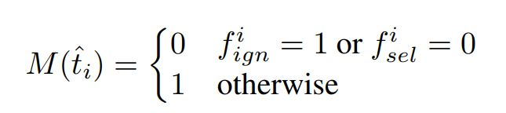
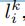
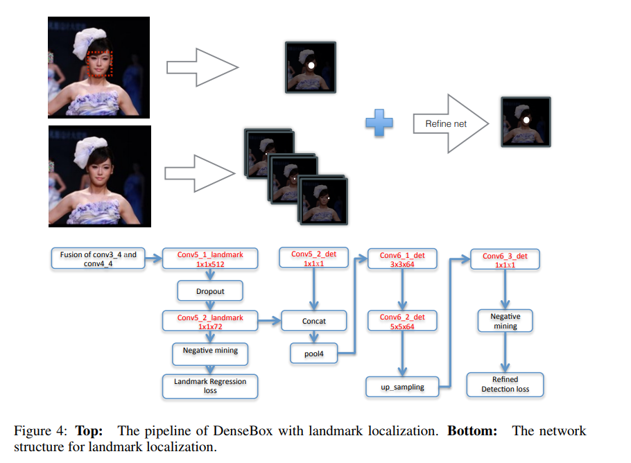
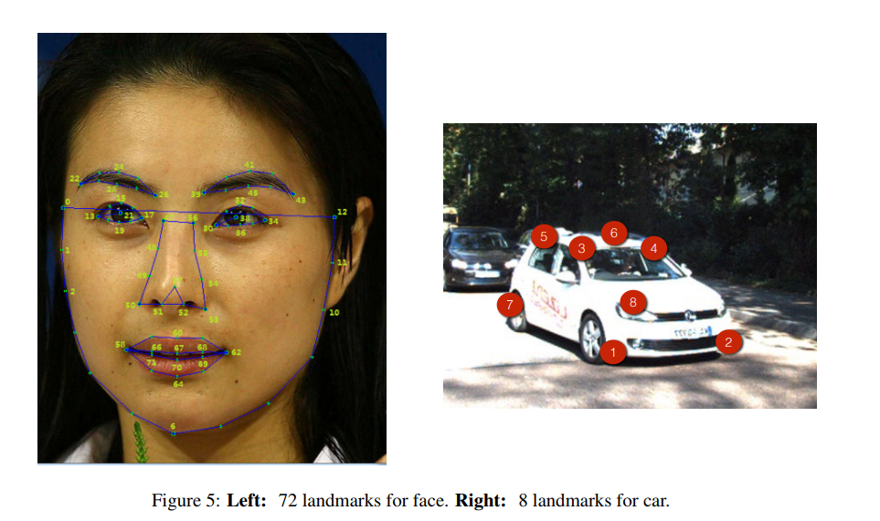
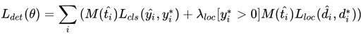
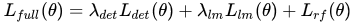
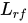
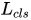

这个工作在2015年就开始了，而现在再回过头来看，这个工作是多么有前瞻性，在论文中，作者就说了，DenseBox是一个不需要产生proposal且可以进行端到端地训练的FCN_Based的物体检测器。

1. 首先使用图像金字塔（这个思想后来演变成特征金字塔FPN）
2. 经过一系列卷积和池化后，再进行上采样使特征图变大（**用于检测更多的目标**），再经过一些卷积得到最终的输出
3. 把输出的特征图转换成边框，再通过NMS和阈值进行输出

如果直接使用整幅图片进行训练的话，会在反向传播时浪费大量时间，于是使用了一种策略，对输入图片进行裁剪包含人脸和丰富背景的patches（目标检测的数据增强），在训练阶段，这些patches被裁剪后resize到240x240，其中人脸区域大约50像素。因此最后的输出为60x60且5通道的张量，因此Ground Truth在构建时，也得是60x60x5的张量，其人脸区域由一个以人脸bounding box的中心为圆心且半径为0.3倍(paper setting)的bounding box size的圆形区域确定，这个东西与segmentation类似。现在看来思想很超前！

在GT的第一个通道，我们用0来进行初始化，如果包含在正样本区域，那么就设置为1。其他的4个通道由该像素点与gt box的左上角和右下角的距离来确定。

#### 正负样本划分

作者将正负样本(pixel)的边界区域定义为gray zone，这个区域的像素简单设置成正/负样本都不合理。因此作者将所有离正样本2pixel距离的pixel的标志位（ignore flag）都置为1，视作gray zone。

首先保留所有的正样本(pixel)，同时保证正负样本(pixel)比例为1：1，然后让所有的负样本，一半从最难（即分类最糟糕）的一部分中采样，另一半从剩余的负样本中随机采样。

作者通过一种掩码的方式实现上述采样策略：

其中 ![[公式]](assets/DenseBox/equation-1582433307486.svg) 表示gray zone中的像素， ![[公式]](assets/DenseBox/equation-1582433307471.svg) 表示被选取作为样本的像素， ![[公式]](assets/DenseBox/equation-1582433307473.svg) 作为掩码函数用于损失函数判断该样本是否用于训练，不参与/影响采样行为。

文中还谈及了采样均衡问题，并对输出像素进行二进制标记来决定其是否被选来用于训练。 
 首先是直接忽略正负区域的边界，并将其loss weight设为0，其次是倾向选择预测发生严重错误的样本，这一过程通过negative mining实现，基于这些样本的梯度学习使得学习更加的鲁棒。 

##### Landmark Localization

即关键点定位，用于增强检测框结果。通过融合landmark heatmaps及目标score maps来筛选和过滤检测框。如下图所示，增加了一个分支用于landmark定位，假设存在N个landmarks，landmark 定位分支将会输出N个响应maps，其中，每个像素值代表该位置为landmark的置信分数。该任务的ground truth maps与检测的十分相似，对于一个landmark 实例，landmark k的第i个实例，其对应的ground truth 是位于输出坐标空间中第k个响应 map上的positive 标记的区域。半径rl应当较小从而避免准确率的损失。与分类任务相似，landmark 定位损失也是定义为预测值与真实值的L2损失。同样使用negative mining及ignore region。

将分类score map及landmark localization maps作为输入的增强分支的最终输出用于增强检测结果。通过一些高层次空间模型来了解landmark confidence及边界框分数的方法来进一步提高检测性能。

#### 损失函数

其中分类损失、回归损失和关键点损失都是选用L2损失；

其中  的损失函数和  相同，只是它的predict map来自refine branch的输出。