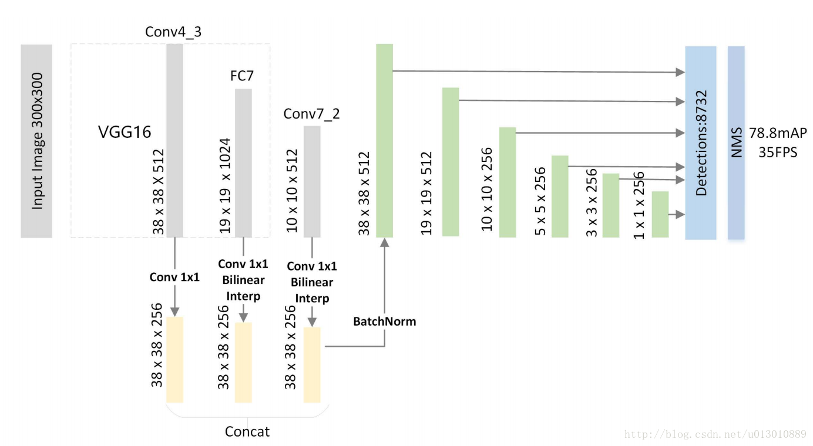

17年12月发布于arxiv。

这张图在FPN里面也有一张类似的， 
1. (a) image pyramid  
2. (b) rcnn系列，只在最后一层feature预测 
3. (c) FPN，语义信息一层传递回去，而且有很多相加的计算 
4. (d) SSD，在各个level的feature上直接预测，每个level之间没联系 
5. (e) 本文的做法，把各个level的feature concat，然后从fusion feature上生成feature pyramid

