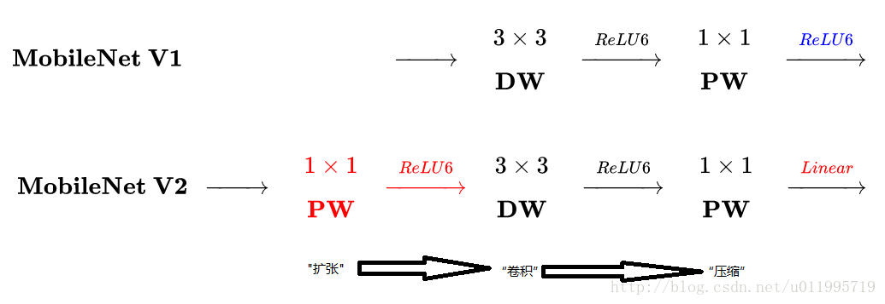
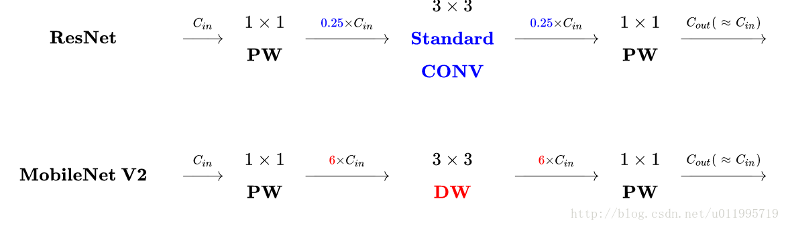

MobileNet网络模型主要是基于现有的大部分网络模型，使用计算量更小的卷积替换现有普通卷积。

在MobileNet基础上做了以下几点改进：

- 引入反向残差结构。所谓反向残差结构，我猜意思是从通道角度说的，起了一个与resnet不同的名字，以说明自己的残差结构通道是先膨胀再压缩。
- Linear Bottleneck，即残差块的最后一个1x1卷积不使用ReLU激活，采用线性激活（也就是y=wx+b），以防丢失特征（特征退化）。

DWConv layer层提取得到的特征受限于输入的通道数，若是采用以往的residual block，先“压缩”，再卷积提特征，那么DWConv layer可提取得特征就太少了，因此一开始不“压缩”，MobileNetV2反其道而行，一开始先“扩张”，本文实验“扩张”倍数为6。 通常residual block里面是 “压缩”→“卷积提特征”→“扩张”，MobileNetV2就变成了 “扩张”→“卷积提特征”→ “压缩”，因此称为Inverted residuals

