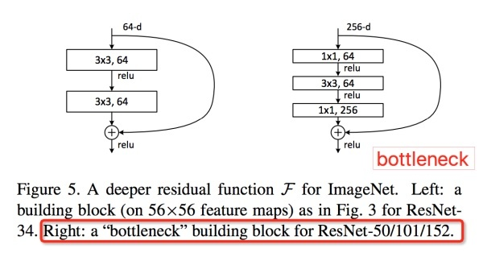
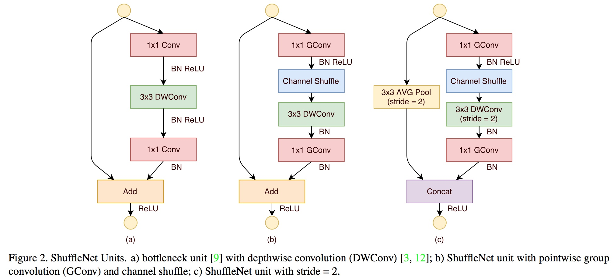
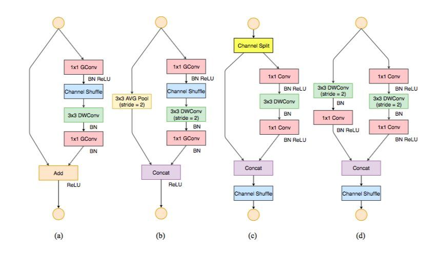

对ResNet的改进，改进点：计算量

V1特点：

- 使用ResNet结构，减少卷积计算量：分组卷积（乘变加）
- Channel shuffle。分组卷积缺点是不同组特征之间不流通，因此加了Channel shuffle，使上一个分组到下一次分组之间对应关系被打乱，即两次分组，不同通道被分在一起。

缺点：

- 分组卷积之后的shuffle是手工设计的，不是学习的，陷入了手工设计特征的老思路；
- channel shuffle不便于规整计算，索引不对齐，计算不能被很好的优化。（大量的指针跳转和Memory set）

ResNet的bottleneck网络结构

![[公式]](assets/ShuffleNet/equation.svg) ，宛如一个中间细两端粗的瓶颈，所以称为“bottleneck”。这种结构相比VGG，早已经被证明是非常效的，能够更好的提取图像特征。

那么ShuffleNet为何要这样做？既然是轻量化网络，我们还是来算算计算量。

假设输入feature为 ![[公式]](assets/ShuffleNet/equation-1582517259156.svg) ， 所有的![[公式]](assets/ShuffleNet/equation-1582517259334.svg) 卷积通道数为 ![[公式]](assets/ShuffleNet/equation-1582517259043.svg) ， ![[公式]](assets/ShuffleNet/equation-1582517259087.svg) Depthwise卷积数为 ![[公式]](assets/ShuffleNet/equation-1582517259089.svg) ，Group convolution都分为 ![[公式]](assets/ShuffleNet/equation-1582517259040.svg) 组。图14 (a)和(b)的网络乘法计算量：

- 图14(a) ResNet bottleneck： ![[公式]](assets/ShuffleNet/equation-1582517259077.svg) 
- 图14(b) ShuffleNet stride=1结构： ![[公式]](assets/ShuffleNet/equation-1582517259067.svg) 

相比原始加入Depthwise的ResNet缩小了很多的计算量。所以ShuffleNet相当于保留ResNet结构，同时又压低计算量的改进版。

V2：

- 提出一些高性能网络设计准则。flops不是衡量一个model速度的唯一考量，还有计算平台以及内存访问代价（memory access cost, MAC）等
- 影响模型执行速度的因素：
  1. 理论计算量最重要 也就是控制flops
  2. 计算访存比  访存比是线性增长 要专门考虑访存比（输入输出通道数接近）
  3. 模型的并行度 碎片化多了之后各个操作会有依赖，会有很多内存读写操作
  4. 设备特性 比如ARM
- 在设计一个轻量级网络的时候，不能只看理论计算量，要看实际速度，并且要根据特定的计算平台来设计。

研究者注意到 FLOPs 仅和卷积部分相关，尽管这一部分需要消耗大部分的时间，但其它过程例如数据 I/O、数据重排和元素级运算（张量加法、ReLU 等）也需要消耗一定程度的时间。

基于以上观察，研究者从不同层面做了运行时（速度方面）分析，并提出了设计高效网络架构需要遵循的准则：

- G1. 相同的通道宽度可最小化内存访问成本（MAC）；
- G2. 过度的组卷积会增加 MAC；
- G3. 网络碎片化（例如 GoogLeNet 的多路径结构）会降低并行度；
- G4. 元素级运算不可忽视。

结论和讨论：基于上述准则和实证研究，本文总结出一个高效的网络架构应该：

- 使用「平衡」的卷积（相同的通道宽度）；
- 考虑使用组卷积的成本；
- 降低碎片化程度；
- 减少元素级运算。

这些所需特性依赖于平台特征（例如内存控制和代码优化），且超越了理论化的 FLOPs。它们都应该在实际的网络设计中被考虑到。

ShuffleNet V1 严重依赖组卷积（违反 G2）和瓶颈形态的构造块（违反 G1）。MobileNet V2 使用一种倒置的瓶颈结构，违反了 G1。它在「厚」特征图上使用了深度分离卷积和 ReLU 激活函数，违反了 G4。自动生成结构的网络碎片化程度很高，违反了 G3

为此，本文引入一个简单的操作——通道分割（channel split）。如图 3(c) 所示。在每个单元的开始，c 特征通道的输入被分为两支，分别带有 c−c’和 c’个通道。按照准则 G3，一个分支仍然保持不变。另一个分支由三个卷积组成，为满足 G1，令输入和输出通道相同。与 ShuffleNet V1 不同的是，两个 1×1 卷积不再是组卷积。这部分是为了遵循 G2，部分是因为分割操作已经产生了两个组。

卷积之后，把两个分支拼接起来，从而通道数量保持不变 (G1)。然后进行与 ShuffleNet V1 相同的「Channel Shuffle」操作来保证两个分支间能进行信息交流。

「Shuffle」之后，下一个单元开始运算。注意，ShuffleNet V1 中的「加法」操作不再存在。像 ReLU 和深度卷积这样的操作只存在一个分支中。另外，三个连续的操作「拼接」、「Channel Shuffle」和「通道分割」合并成一个操作。根据 G4，这些变化是有利的。

对于空间下采样，该单元经过稍微修改，详见图 3(d)。通道分割运算被移除。因此，输出通道数量翻了一倍。

本文提出的构造块 (c)(d)，以及由此而得的网络，被称之为 ShuffleNet V2。基于上述分析，本文得出结论：由于对上述四个准则的遵循，该架构设计异常高效。

