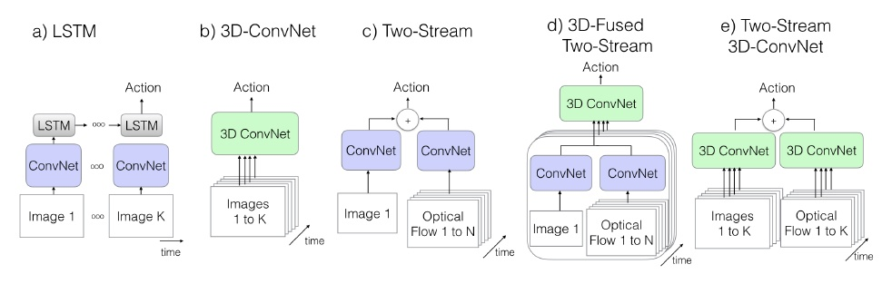

这是一个双流结构的网络，I3D表明使用了膨胀的3D卷积。

什么是膨胀的3D卷积？

这是相对于3D卷积核生成的方式而取的名字，把N×N的filter变为N×N×N。简单的办法就是对N×N的filter重复复制N遍，并归一化，这就是膨胀的(inflated)3D卷积。

目前已有的视频特征提取结构：

- **方法1：ConvNet+LSTM**
  该方案主要考虑到cnn在图像分类领域的成功以及LSTM对于序列建模的能力，很自然提出将两者结合起来的方案。如果只是用cnn的话，需要对每一帧都提取特征，然后将视频的所有帧特征进行总汇，以此来表达对视频的表示，显然这样做忽略的时间结构特征。而LSTM可以处理长时间依赖的问题，可以对视频从第一帧开始建模直到最后一帧，使用cnn网络对每帧提取特征，然后将特征送入LSTM来捕捉时间特征，最后一帧的输出用来对视频特征表示。
  LSTM往往依赖cnn的最后一层特征最为输入，因此不能够捕捉到`low-level motion`的特征，而且对于遍历整个视频也很难去训练。
- **方法2：3D ConvNets**`3D ConvNets`是对视频建模最自然的方式，和标准cnn区别在于由`2d conv`变为`3d conv`，来捕捉`spatio-temporal feature`。想法很好，但目前遇到一些问题，问题一：`3D ConvNets`的`3d conv`多了一个维度，参数量有较大增加，这将会很难去训练。问题二：没有利用那些Imagenet上成功的预训练模型来迁移学习，往往使用层数少的cnn在小数据集上从头训练。简要说就是要利用已有预训练模型，要减少参数或增大数据集。
  论文中实现了C3D（与原版略有差异）有8 conv layer、5 pooling layer 和 2 fc layer，并在所有圈卷积层和fc层加bn。输入是16×112×112（通过crop方法），将第一个pooling layer对时间的stride由1变成2，为了可以减少memory和允许更大batch。
- **方法3：Two-Stream Networks**
  该方案利用短的视频段来建模，用每个clip的预测分数平均的方式（其实C3D也是类似），但不同的是输入，包括一张RGB和10张`optical flow`(其实是5张，x/y两个方向，运动特征)。模型能使用`two-branch`方式，利用预训练的imagenet模型，最后将预测结果平均下（最原始的，或者在最后softmax做融合），这样建模的模型比较好训练，同时也能获得更高的分数。
  模型的两个输入流也可以在后面的cnn层来进行融合，以提升相同，同时可以`end-to-end`训练。论文实现一个类似的two-stream方案，在最后一层用`3d conv`将spatial和flow特征进行融合。
- **方法4：Two-Stream Inflated 3D ConvNets**
  该方案是论文提出的，出发点是要利用imagenet的预训练模型，同时利用`3d conv`来提取`RGB stream`的`temporal feature`，最后再利用`optical-flow stream`提升网络性能，也就大融合的方案（把有效的技巧都用上）。
  通过对预训练的`2D conv`增加temporal维度，把N×N的filter变为N×N×N。简单的办法就是对N×N的filter重复复制N遍，并归一化，这样多的出发点是短期内时间不变性的假设，姑且把这当成`3D filter`初始化的一种策略吧。
  池化操作怎么膨胀？stride怎么选？主要依赖感受野尺寸，如果图像水平方向和竖直方向相等，那么stride也相等，而且越深的特征感受野越大。但是考虑到时间因素，对称感受野不是必须的，这主要还是依赖帧率和图片大小。时间相对于空间变化过快，将合并不同object的边信息，过慢将不能捕捉场景变化。
  虽然3D conv能够捕捉motion信息，但是与光流优化的方式和效果还是不一样，因此使用`two-stream`的方式构建，并分开训练两个网络。

参考：

1. https://zhuanlan.zhihu.com/p/34919655