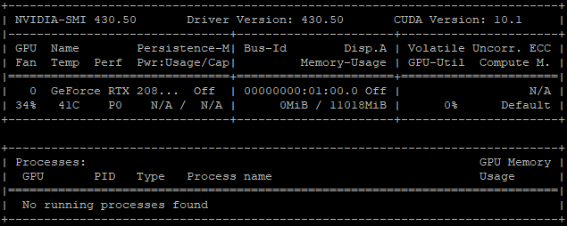

## 使用nvidia gpu

必须安装nvidia-container-toolkit

see: https://github.com/NVIDIA/nvidia-docker#ubuntu-16041804-debian-jessiestretchbuster

```bash
# Add the package repositories
distribution=$(. /etc/os-release;echo $ID$VERSION_ID)
curl -s -L https://nvidia.github.io/nvidia-docker/gpgkey | sudo apt-key add -
curl -s -L https://nvidia.github.io/nvidia-docker/$distribution/nvidia-docker.list | sudo tee /etc/apt/sources.list.d/nvidia-docker.list

sudo apt-get update && sudo apt-get install -y nvidia-container-toolkit
sudo systemctl restart docker

# 使用含CUDA镜像创建容器方式
docker run --gpus all --entrypoint=/bin/bash -it <imageid>
# 如果需要nvcc之类工具，需要额外安装
apt-get install -y cuda-core-8-0	# cuda-8.0
```

注意：

1. 并不是使用了docker就可以创建任何cuda环境，CUDA版本的支持与GPU驱动所支持的CUDA版本有关，例如`NVIDIA-SMI 430.50`版本最高支持`CUDA Version: 10.1`，那么创建的CUDA环境只能<=10.1

