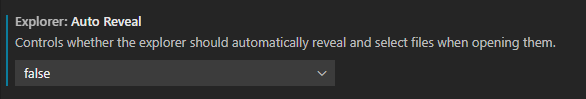

## 插件

 MagicPython：语法高亮，用于代替默认的高亮规则。默认的规则对python内置函数竟然不高亮，这一点忍不了。注意颜色主题需要选择Dark+(default dark)，这时插件才起作用。

https://blog.csdn.net/u011459278/article/details/51841481

## launch.json

### 环境

```
"env": {"PYTHONPATH": "${workspaceRoot}"}
```

可以防止debug时，`sys.path.append('../../..')`不起作用找不到模块。


## 取消文件自动定位到侧边栏

打开设置File-Preference-Settings，搜索reveal，滑到Auto Reveal，选择false。

