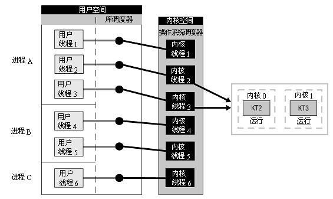
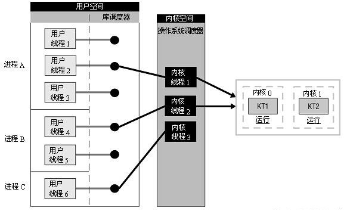
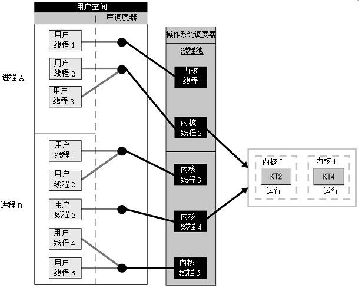

第一个被创造出来的进程是0号进程，这个进程在操作系统层面是不可见的，但它存在着。0号进程完成了操作系统的功能加载与初期设定，然后它创造了1号进程(init)。1号进程是管理整个操作系统的，所以在用pstree查看进程树可知，1号进程位于树根。再之后，系统的很多管理程序都以进程身份被1号进程创造出来，还创造了shell。每一个任务(进程)被创建时，系统会为他分配存储空间等必要资源，然后在内核管理区为该进程创建管理节点，以便后来控制和调度该任务的执行。 

 进程真正进入执行阶段，还需要获得CPU的使用权，这一切都是操作系统掌管着，也就是所谓的调度，在各种条件满足(资源与CPU使用权均获得)的情况下，启动进程的执行过程。 

除CPU而外，一个很重要的资源就是存储器了，系统会为每个进程分配独有的存储空间，当然包括它特别需要的别的资源，比如写入时外部设备是可使用状态等等。有了上面的引入，我们可以对进程做一个简要的总结：

进程，是计算机中的程序关于某数据集合上的一次运行活动，是系统进行资源分配和调度的基本单位，是操作系统结构的基础。它的执行需要系统分配资源创建实体之后，才能进行。

随着技术发展，在执行一些细小任务时，本身无需分配单独资源时(多个任务共享同一组资源即可，比如所有子进程共享父进程的资源)，进程的实现机制依然会繁琐的将资源分割，这样造成浪费，而且还消耗时间。后来就有了专门的多任务技术被创造出来——线程。 

 线程的特点就是在不需要独立资源的情况下就可以运行。 

 相同点 

无论是进程还是线程，对于程序员而言，都是用来实现多任务并发的技术手段。

二者都可以独立被调度，因此在多任务环境下，功能上并无差异。都具有各自的实体，是系统独立管理的对象个体。所以在系统层面，都可以通过技术手段实现二者的控制。

二者所具有的状态都非常相似。

在多任务程序中，子进程(子线程)的调度一般与父进程(父线程)平等竞争。 

多线程程序中至少有一个主线程，而这个主线程其实就是有main函数的进程。它是整个程序的进程，所有线程都是它的子线程。我们通常把具有多线程的主进程称之为主线程。 


差异

1 进程是资源分配的基本单位，线程是调度的基本单位。  它强调的是分配资源时的对象必须是进程，不会给一个线程单独分配系统管理的资源。若要运行一个任务，想要获得资源，最起码得有进程，其他子任务可以以线程身份运行，资源共享就行了。 

2 进程的个体间是完全独立的，而线程间是彼此依存的。多进程环境中，任何一个进程的终止，不会影响到其他进程。而多线程环境中，父线程终止，全部子线程被迫终止(没有了资源)。而任何一个子线程终止一般不会影响其他线程，除非子线程执行了exit()系统调用。任何一个子线程执行exit()，全部线程同时灭亡。 

3 多进程环境间完全独立，要实现通信的话就得采用进程间的通信方式，它们通常都是耗时间的。而线程则不用任何手段数据就是共享的。当然多个子线程在同时执行写入操作时需要实现互斥，否则数据就写“脏”了。 

4 从系统实现角度讲，进程的实现是调用fork系统调用：

pid_t fork(void);

线程的实现是调用clone系统调用：

int clone(int (*fn)(void *), void *child_stack, int flags, void *arg, ...

/* pid_t *ptid, struct user_desc *tls, pid_t *ctid */

);

其中，fork()是将父进程的全部资源复制给了子进程。而线程的clone只是复制了一小部分必要的资源。在调用clone时可以通过参数控制要复制的对象。可以说，fork实现的是clone的加强完整版。当然，后来操作系统还进一步优化fork实现——写时复制技术。在子进程需要复制资源(比如子进程执行写入动作更改父进程内存空间)时才复制，否则创建子进程时先不复制。

实际中，编写多进程程序时采用fork创建子进程实体。而创建线程时并不采用clone系统调用，而是采用线程库函数。常用线程库有Linux-Native线程库和POSIX线程库。其中应用最为广泛的是POSIX线程库。因此读者在多线程程序中看到的是pthread_create而非clone。

我们知道，库是建立在操作系统层面上的功能集合，因而它的功能都是操作系统提供的。由此可知，线程库的内部很可能实现了clone的调用。不管是进程还是线程的实体，都是操作系统上运行的实体。

最后，我们说一下vfork() 。这也是一个系统调用，用来创建一个新的进程。它创建的进程并不复制父进程的资源空间，而是共享，也就说实际上vfork实现的是一个接近线程的实体，只是以进程方式来管理它。并且，vfork()的子进程与父进程的运行时间是确定的：子进程“结束”后父进程才运行。请读者注意“结束”二字。并非子进程完成退出之意，而是子进程返回时。一般采用vfork()的子进程，都会紧接着执行execv启动一个全新的进程，该进程的进程空间与父进程完全独立不相干，所以不需要复制父进程资源空间。此时，execv返回时父进程就认为子进程“结束”了，自己开始运行。实际上子进程继续在一个完全独立的空间运行着。举个例子，比如在一个聊天程序中，弹出了一个视频播放器。你说视频播放器要继承你的聊天程序的进程空间的资源干嘛？莫非视频播放器想要窥探你的聊天隐私不成？懂了吧！


实体间(进程间，线程间，进线程间)通信方式的不同

进程间的通信方式有这样几种：

A.共享内存  B.消息队列  C.信号量  D.有名管道  E.无名管道  F.信号 G.文件    H.socket

线程间的通信方式上述进程间的方式都可沿用，且还有自己独特的几种：

A.互斥量   B.自旋锁   C.条件变量 D.读写锁   E.线程信号 G.全局变量

值得注意的是，线程间通信用的信号不能采用进程间的信号，因为信号是基于进程为单位的，而线程是共属于同一进程空间的。故而要采用线程信号。

综上，进程间通信手段有8种。线程间通信手段有13种。

而且，进程间采用的通信方式要么需要**切换内核上下文**，要么要与外设访问(有名管道，文件)。所以速度会比较慢。而线程采用自己特有的通信方式的话，基本都在自己的进程空间内完成，不存在切换，所以通信速度会较快。也就是说，进程间与线程间分别采用的通信方式，除了种类的区别外，还有速度上的区别。

另外，进程与线程之间穿插通信的方式，除信号以外其他进程间通信方式都可采用。
  线程有内核态线程与用户级线程


控制方式的异同

进程与线程的身份标示ID管理方式不一样，进程的ID为pid_t类型，实际为一个int型的变量(也就是说是有限的)：

```
/usr/include/unistd.h:260:typedef __pid_t  pid_t;
/usr/include/bits/types.h:126:# define __STD_TYPE  typedef
/usr/include/bits/types.h:142:__STD_TYPE __PID_T_TYPE  __pid_t;
/usr/include/bits/typesizes.h:53:#define __PID_T_TYPE  __S32_TYPE
/usr/include/bits/types.h:100:#define  __S32_TYPE   int
```

在全系统中，进程ID是唯一标识，对于进程的管理都是通过PID来实现的。每创建一个进程，内核去中就会创建一个结构体来存储该进程的全部信息：

注：下述代码来自 Linux内核3.18.1

 ```
include/linux/sched.h:1235:struct task_struct {
    volatile long state;  /* -1 unrunnable, 0 runnable, >0 stopped */
    void *stack;
	...
    pid_t pid;
    pid_t tgid;
	...
};
 ```

每一个存储进程信息的节点也都保存着自己的PID。需要管理该进程时就通过这个ID来实现(比如发送信号)。当子进程结束要回收时(子进程调用exit()退出或代码执行完)，需要通过wait()系统调用来进行，未回收的消亡进程会成为僵尸进程，其进程实体已经不复存在，但会虚占PID资源，因此回收是有必要的。

线程的ID是一个long型变量：

```
/usr/include/bits/pthreadtypes.h:60:typedef unsigned long int pthread_t;
```

它的范围大得多，管理方式也不一样。线程ID一般在本进程空间内作用就可以了，当然系统在管理线程时也需要记录其信息。其方式是，在内核创建一个内核态线程与之对应，也就是说每一个用户创建的线程都有一个内核态线程对应。但这种对应关系不是一对一，而是**多对一**的关系，也就是一个内核态线程可以对应着多个用户级线程。还是请读者参看《Linux线程的实质》普及相关概念。此处贴出blog地址：http://my.oschina.net/cnyinlinux/blog/367910

对于线程而言，若要主动终止需要调用pthread_exit() ，主线程需要调用pthread_join()来回收(前提是该线程没有被detached，相关概念请查阅线程的“分离属性”)。


资源管理方式的异同

进程本身是资源分配的基本单位，因而它的资源都是独立的，如果有多进程间的共享资源，就要用到进程间的通信方式了，比如共享内存。共享数据就放在共享内存去，大家都可以访问，为保证数据写入的安全，加上信号量一同使用。一般而言，共享内存都是和信号量一起使用。消息队列则不同，由于消息的收发是原子操作，因而自动实现了互斥，单独使用就是安全的。

线程间要使用共享资源不需要用共享内存，直接使用全局变量即可，或者malloc()动态申请内存。显得方便直接。而且互斥使用的是同一进程空间内的互斥量，所以效率上也有优势。

实际中，为了使程序内资源充分规整，也都采用共享内存来存储核心数据。不管进程还是线程，都采用这种方式。原因之一就是，共享内存是脱离进程的资源，如果进程发生意外终止的话，共享内存可以独立存在不会被回收(是否回收由用户编程实现)。进程的空间在进程崩溃的那一刻也被系统回收了。虽然有coredump机制，但也只能是有限的弥补。共享内存在进程down之后还完整保存，这样可以拿来分析程序的故障原因。同时，运行的宝贵数据没有丢失，程序重启之后还能继续处理之前未完成的任务，这也是采用共享内存的又一大好处。

总结之，进程间的通信方式都是脱离于进程本身存在的，是全系统都可见的。这样一来，进程的单点故障并不会损毁数据，当然这不一定全是优点。比如，进程崩溃前对信号量加锁，崩溃后重启(加锁的信号量还在？)，然后再次进入运行状态，此时直接进行加锁，可能造成死锁，程序再也无法继续运转。再比如，共享内存是全系统可见的，如果你的进程资源被他人误读误写（系统不保护？），后果肯定也是你不想要的。所以，各有利弊，关键在于程序设计时如何考量，技术上如何规避。这说起来又是编程技巧和经验的事情了。


个体间辈分关系的迥异（关系不同有何作用？）

进程的辈分关系森严，在父进程没有结束前，所有的子进程都尊从父子关系，也就是说A创建了B，则A与B是父子关系，B又创建了C，则B与C也是父子关系，A与C构成爷孙关系，也就是说C是A的孙子进程。在系统上使用pstree命令打印进程树，可以清晰看到辈分关系。

多线程间的关系没有那么严格，不管是父线程还是子线程创建了新的线程，都是共享父线程的资源，所以，都可以说是父线程的子线程，也就是只存在一个父线程，其余线程都是父线程的子线程。


进程池与线程池的技术实现差别

我们都知道，进程和线程的创建时需要时间的，并且系统所能承受的进程和线程数也是有上限的，这样一来，如果业务在运行中需要动态创建子进程或线程时，系统无法承受不能立即创建的话，必然影响业务。综上，聪明的程序员发明了一种新方法——池。

在程序启动时，就预先创建一些子进程或线程，这样在需要用时直接使唤。这就是老人口中的“多生孩子多种树”。程序才开始运行，没有那么多的服务请求，必然大量的进程或线程空闲，这时候一般让他们“冬眠”，这样不耗资源，要不然一大堆孩子的口食也是个负担啊。对于进程和线程而言，方式是不一样的。另外，当你有了任务，要分配给那些孩子的时候，手段也不一样。下面就分别来解说。

进程池

首先创建了一批进程，就得管理，也就是你得分开保存进程ID，可以用数组，也可用链表。建议用数组，这样可以实现常数内找到某个线程，而且既然做了进程池，就预先估计好了生产多少进程合适，一般也不会再动态延展。就算要动态延展，也能预估范围，提前做一个足够大的数组。不为别的，就是为了快速响应。

接下来就要让闲置进程冬眠了，可以让他们pause()挂起，也可用信号量挂起，还可以用IPC阻塞，方法很多，分析各自优缺点根据实际情况采用就是了。

然后是分配任务了，当你有任务的时候就要让他干活了。唤醒了进程，让它从哪儿开始干呢？肯定得用到进程间通信了，比如信号唤醒它，然后让它在预先指定的地方去读取任务，可以用函数指针来实现，要让它干什么，就在约定的地方设置代码段指针。这也只是告诉了它怎么干，还没说干什么(数据条件)，再通过共享内存把要处理的数据设置好，这时子进程就知道怎么做了。干完之后再来一次进程间通信然后自己继续冬眠，父进程就知道孩子干完了，收割成果。

最后结束时回收子进程，向各进程发送信号唤醒，改变激活状态让其主动结束，然后逐个wait()就可以了。

线程池

线程池的思想与上述类似，只是它更为轻量级，所以调度起来不用等待额外的资源。

要让线程阻塞，用条件变量就是了，需要干活的时候父线程改变条件，子线程就被激活。

线程间通信方式就不用赘述了，不用繁琐的通信就能达成，比起进程间效率要高一些。

线程干完之后自己再改变条件，这样父线程也就知道该收割成果了。

整个程序结束时，逐个改变条件并改变激活状态让子线程结束，最后逐个回收即可。


并发和并行

在同一个时间里，同一个计算机系统中如果允许两个或两个以上的进程处于运行状态，这便是多任务。现代的操作系统几乎都是多任务操作系统，能够同时管理多个进程的运行。 多任务带来的好处是明显的，比如你可以边听mp3边上网，与此同时甚至可以将下载的文档打印出来，而这些任务之间丝毫不会相互干扰。俗话说，一心不能二用，这对计算机也一样，原则上一个CPU（核心）只能分配给一个进程，以便运行这个进程。如果要使一个CPU（核心）同时运行多个进程，就必须使用**并发技术**。实现并发技术相当复杂，最容易理解的是“时间片轮转进程调度算法”，它的思想简单介绍如下：在操作系统的管理下，所有正在运行的进程轮流使用CPU（核心），每个进程允许占用CPU（核心）的时间非常短(比如10毫秒)，这样用户根本感觉不出来CPU（核心）是在轮流为多个进程服务，就好象所有的进程都在不间断地运行一样。但实际上在任何一个时间内有且仅有一个进程占有CPU（核心）。

如果一台计算机有多个CPU（核心），情况就不同了，如果进程数小于CPU（核心）数，则不同的进程可以分配给不同的CPU（核心）来运行，这样，多个进程就是真正同时运行的，这便是并行。但如果进程数大于CPU（核心）数，则仍然需要使用并发技术。

在Linux中，进行CPU（核心）分配是以线程为单位的，有如下关系：

总线程数 <= CPU数量：并行运行

总线程数 > CPU数量：并发运行

并行运行的效率显然高于并发运行，所以在多CPU（核心）的计算机中，多任务的效率比较高。但是，如果在多CPU（核心）计算机中只运行一个进程(线程)，就不能发挥多CPU（核心）的优势。

 多核CPU也有许多种，例如INTEL的超线程技术，而LINUX内核对一个INTEL超线程CPU会看成多个不同的CPU处理器。 


用户级线程(UserLevel Threads，ULT)和内核级线程(Kernel Supported threads，KST)

内核级线程KST

对于一切的进程，无论是系统进程还是用户进程，进程的创建和撤销，以及I/O操作都是利用系统调用进入到内核，由内核处理完成，所以说在KST下， 所有进程都是在操作系统内核的支持下运行的，是与内核紧密相关的。内核空间实现还为每个内核支持线程设置了一个线程控制块，内核是根据该控制块而感知某个 线程是否存在，并加以控制。

优点：

1. 在多核处理器上，内核可以调用同一进程中的多个线程同时工作；

2. 如果一个进程中的一个线程阻塞了，其他线程仍然可以得到运行；

缺点：对于用户线程的切换代价太大，在同一个线程中，从一个线程切换到另一个线程时，需要从用户态，进入到内核态并且由内核切换。因为线程调度和管理在内核实现。

内核级线程驻留在内核空间，它们是内核对象。有了内核线程，每个用户线程被映射或绑定到一个内核线程。用户线程在其生命期内都会绑定到该内核线程。一旦用户线程终止，两个线程都将离开系统。这被称作"一对一"线程映射，如图所示。

  

操作系统调度器管理、调度并分派这些线程。运行时库为每个用户级 线程请求一个内核级线程。操作系统的内存管理和调度子系统必须要考虑到数量巨大的用户级线程。您必须了解每个进程允许的线程的最大数目是多少。操作系统为每个线程创建上下文。进程的每个线程在资源可用时都可以被指派到处理器内核。 


用户级线程ULT

用户进程ULT仅存在于用户空间中。对于这种线程的创建、撤销、线程之间的同步和通信等功能，都无需系统调用来实现。对于同一进程的线程之间切换仍然是不需要内核支持的。所以，内核也会是完全不会知道用户级线程的存在。

但是有一点必须注意：设置了用户级线程的系统，其调度荏苒是以进程为单位进行的哦。

优点：

1. 线程切换不需要转换到内核空间，节省了宝贵的内核空间；

2. 调度算法可以是进程专用，由用户程序进行指定；

3. 用户级线程实现和操作系统无关；

缺点:

1. 系统调用阻塞，同一进程中一个线程阻塞和整个进程都阻塞了。

2. 一个进程只能在一个cpu上获得执行。

  

用户级线程驻留在用户空间或模式。运行时库管理这些线程，它也位于用户空间。它们对于操作系统是不可见的，因此无法被调度到处理器内核。每个线程并不具有 自身的线程上下文。因此，就线程的同时执行而言，任意给定时刻每个进程只能够有一个线程在运行，而且只有一个处理器内核会被分配给该进程。对于一个进程， 可能有成千上万个用户级线程，但是它们对系统资源没有影响。运行时库调度并分派这些线程。如同在图中看到的那样，库调度器从进程的多个线程中 选择一个线程，然后该线程和该进程允许的一个内核线程关联起来。内核线程将被操作系统调度器指派到处理器内核。用户级线程是一种"多对一"的线程映射。 

- **混合方式**

在很多的操作系统中ULT和KLT进行组合，整合了ULT和KLT的优点。



混合线程实现是用户线程和内核线程的交叉，使得库和操作系统都可以管理线程。用户线程由运行时库调度器管理，内核线程由操作系统调度器管理。在这种实现中，进程有着自己的内核线程池。可运行的用户线程由运行时库分派并标记为准备好执行的可用线程。操作系统选择用户线程并将它映射到线程池中的可用内核线程。多个用户线程可以分配给相同的内核线程。在图中，进程A在它的线程池中有两个内核线程，而进程B有3个内核线程。进程A的用户线程2和3 被映射到内核线程(2)。进程B有5个线程，用户线程1和2映射到同一个内核线程(3)，用户线程4和5映射到内核同一个内核线程(5)。当创建新的用户 线程时，只需要简单地将它映射到线程池中现有的一个内核线程即可。这种实现使用了"多对多"线程映射。该方法中尽量使用多对一映射。很多用户线程将会映射 到一个内核线程，就像您在前面的示例中所看到的。因此，对内核线程的请求将会少于用户线程的数目。

内核线程池不会被销毁和重建，这些线程总是位于系统中。它们会在必要时分配给不同的用户级线程，而不是当创建新的用户级线程时就创建一个新的内核线程，而 纯内核级线程被创建时，就会创建一个新的内核线程。只对池中的每个线程创建上下文。有了内核线程和混合线程，操作系统分配一组处理器内核，进程的线程可以 在这些处理器内核之上运行。线程只能在为它们所属线程指派的处理器内核上运行。

疑问：

网际快车中文件分成100部分 10个线程 文件就被分成了10份来同时下载 1-10 占一个线程 11-20占一个线程,依次类推,线程越多,文件就被分的越多,同时下载 当然速度也就越快 

