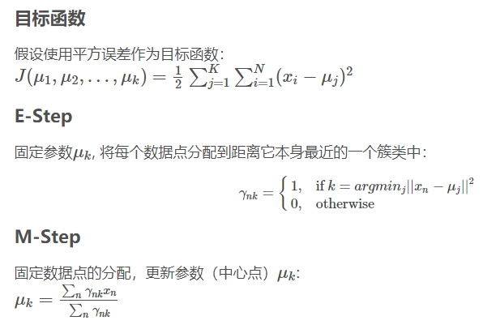

几点重要结论：

1. 对于任意给定的迭代聚类中心初值（或者任意给定的一种划分方式）， kmeans算法的目标函数一定会收敛。
2. 随着迭代次数趋向无穷， k个中心点必然会收敛，即对于每种确定的初值选取方式，聚类结果是唯一确定的。

可以根据EM算法的收敛性来推出k-means算法的收敛性。

## KMeans++

K-Means的主要优点有：

1. 原理比较简单，实现也是很容易，收敛速度快。
2. 聚类效果较优。
3. 算法的可解释度比较强。
4. 主要需要调参的参数仅仅是簇数k。

K-Means的主要缺点有：

1. K值的选取不好把握
2. 对噪音和异常点比较的敏感。
3. 对于不是凸的数据集比较难收敛
4. 如果各隐含类别的数据不平衡，比如各隐含类别的数据量严重失衡，或者各隐含类别的方差不同，则聚类效果不佳。
5. 采用迭代方法，得到的结果只是局部最优。

参考：

- https://www.cnblogs.com/pinard/p/6164214.html