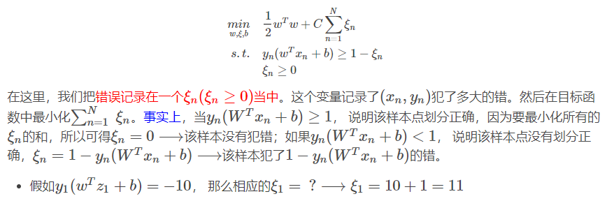

## 核函数

通过将输入空间内线性不可分的数据映射到一个高维的特征空间内使得数据在特征空间内是可分的。

- 如果特征的数量大到和样本数量差不多，则选用LR或者线性核的SVM；
- 如果特征的数量小，样本的数量正常，则选用SVM+高斯核函数；
- 如果特征的数量小，而样本的数量很大，则需要手工添加一些特征从而变成第一种情况。

## SVM如何实现多分类

**一对多法（one-versus-rest,简称OVR SVMs）**

训练时依次把某个类别的样本归为一类,其他剩余的样本归为另一类，这样k个类别的样本就构造出了k个SVM。分类时将未知样本分类为具有最大分类函数值的那类。

**一对一法（one-versus-one,简称OVO SVMs或者pairwise）**

其做法是在任意两类样本之间设计一个SVM，因此k个类别的样本就需要设计k(k-1)/2个SVM。

**层次支持向量机**

层次分类法首先将所有类别分成两个子类，再将子类进一步划分成两个次级子类，如此循环，直到得到一个单独的类别为止。

## 软间隔SVM

可以容忍一些错误的发生，即，可以容忍分隔超平面对某些点划分错误，所以我们在模型中引入了对错误的衡量，将其作为惩罚性加在目标方程中。

- C大⟶表明我们更care的是划分的正确性，margin可以“瘦”一点，但是划分错误的点要少一点。
- C小⟶表明我们想要的是更“胖”一点的边界，划分错误的点多一点没有关系。

C越大，对噪声的容忍度就越小，就越容易overfit。所以就算我们使用的是带有高斯核函数的软间隔SVM，也是由可能会出现过拟合的情况，所以这就需要我们认真的挑选参数(γ,C)，γ是高斯核函数的参数，C是软间隔分类的SVM的参数。