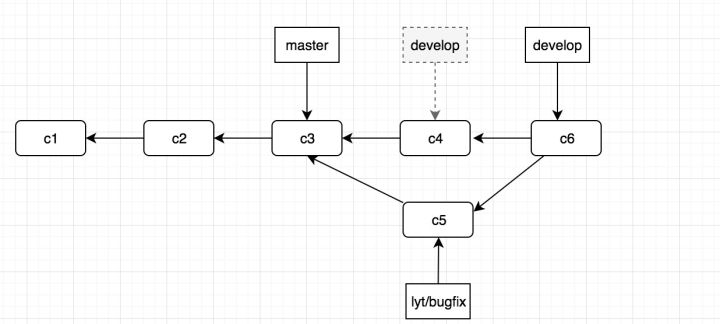
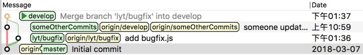
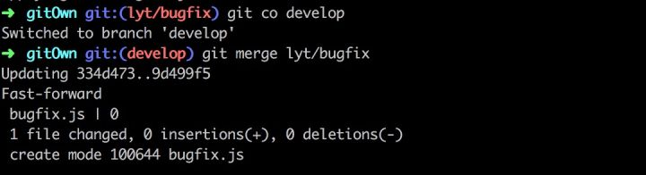
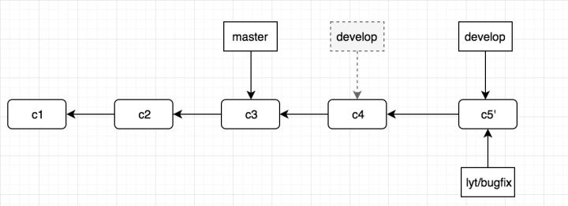
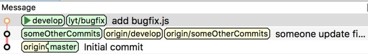
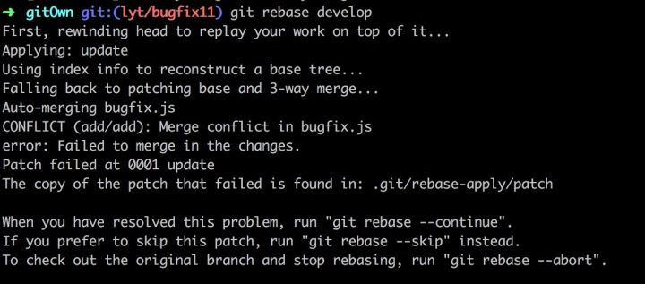
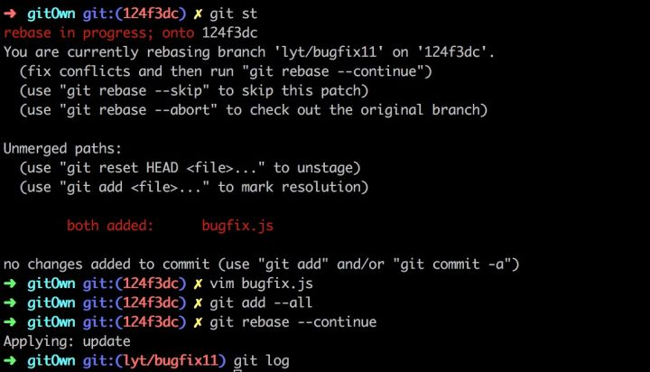

## 需求

  

将bugfix分支合并到develop分支上

## merge

[这篇文章](https://blog.csdn.net/boysky0015/article/details/78185879)写的很详细。命令总结如下：

```bash
# 查看当前分支，假设是bugfix
git branch

# 也可以通过IDE提交bugfix修改
git  add .
git  commit -m 'fix xxx bug'
# 将dev修改推到远端
git push -u origin bugfix

### 切换到develop分支上
git checkout develop

# 如果是多人开发的话 需要把远程develop上的代码pull下来，防止冲突
# 如果是自己一个开发就没有必要了，为了保险起见还是pull（也有可能自己从另一个机器上作了提交）
git pull origin develop

### 把bugfix分支的代码合并到develop上
git merge develop

# 查看状态
git status

# 把同步后的develop更新到远端
git push origin develop
```

如果某个分支仅仅是为开发某个特性而产生多次commit，直接合并到master分支将导致master的commit看起来很乱，此时最好可以合并此特性分支的多次commit后再合并，参见[这篇文章](https://juejin.im/entry/5ae9706d51882567327809d0)。

由于当前 develop 分支所指向的提交对象（C4）并不是 lyt/bugfix 分支的直接祖先，Git 不得不进行一些额外处理。就此例而言，Git 会用两个分支的末端（C4 和 C5）以及它们的共同祖先（C3）进行一次简单的三方合并计算 **并重新做一个新的快照，并自动创建一个指向它的提交对象**，因此我们会看到git merge 之后会创建一个默认为`Merge branch 'lyt/bugfix' into develop`的commit信息。 

最后的提交历史如图：



用 git merge 是最方便的合并操作，也会保留真实完整的 commit 信息。但是也会导致一个问题，就是会使得提交历史发生很多分叉，如下图:



由图可见，提交从 master 开始分叉，分成 develop 和 lyt/bugfix 两个分支，最后又合并到 develop 分支上。这样如果提交变得多了，分支分叉就会导致提交历史历史线变得十分混乱。因此，就有 rebase 操作，可以使得分支的线变得十分干净。

## rebase

如果我们使用`git rebase develop`就会使得 lyt/bugfix 这个分支变基到 develop 上，也就是说提取在 C5 中引入的补丁和修改，然后在 C4 的基础上应用一次。 简单来说，使用 rebase 命令将提交到某一分支上的所有修改都移至另一分支上，就好像“重新播放”一样。 

rebase 的原理就是会找到当前分支（lyt/bugfix）和变基的基底分支(develop)这两个分支的共同提交祖先C3，然后对比当前分支相对于祖先之后的历次提交，将这些提交存储为临时文件，最后找到基底分支的目标提交C4，将这些暂存的临时文件依次应用。

之后我们看到的提交历史就如下：


变基之后再回到 develop 分支，就可以进一次快进合并。



合并时出现了“Fast forward”的提示就是快进合并。由于当前 develop 分支所在的提交对象是要并入的 lyt/bugfix 分支的直接上游，Git 只需把 develop 分支指针直接右移。**换句话说，如果顺着一个分支走下去可以到达另一个分支的话，那么 Git 在合并两者时，只会简单地把指针右移，因为这种单线的历史分支不存在任何需要解决的分歧，所以这种合并过程可以称为快进（Fast forward）。**

快进合并不会创建上面使用 git merge 直接整合分支的过程中自动创建的一个第三方提交信息。

最后合并之后的提交历史如图：



现在的 C5’ 对应的快照，其实和普通的三方合并，即 git merge 中的 C6 对应的快照内容一模一样了,但是会使得历史更清晰。

如下图，我们使用图形化的界面可以看到现在的提交历史是一根线，没有分叉的地方，看上去十分干净，但是我们也可以注意到此时更改了提交历史。lyt/bugfix 这个分支能向前追溯到原来不属于它的提交(其余人在 someOtherCommits 上提交的 commit 信息)，这样就会篡改提交历史。



### 解决冲突

如果在 rebase 的操作过程中遇到了冲突，比如我重新从 master 新建了一个分支，同时修改了 develop 分支中修改的一个文件。再 rebase 的时候就会遇到这样的问题。



上面说的意思就是遇到了冲突，此时我们使用`git status`查看是哪个文件冲突之后，再手动解决冲突。之后添加到暂存区再继续进行 rebase。 rebase 完成之后通过 `git log`就能看到之前在 develop 分支上的提交出现在 lyt/bugfix11 这个分支上了，说明已经变基成功。



## git merge or git rebase?

关于这个问题，每个团队都会有不一样的标准。有的团队会觉得 Git 最关键的就是要保留最原始最真实的提交信息，方便后面进行查阅。有的团队会觉得认为提交历史是项目过程中发生的事，最核心的是要使得提交历史一目了然。选择哪种操作还是根据团队去决定。

但是对于变基操作，最关键的一点就是如果自己的分支被别人使用了成为了一个公共的分支，此时千万不要再进行变基操作。如果使用 rebase 操作了那些已经公开的提交对象，并且已经有人基于这些提交对象开展了后续开发工作的话，就会使得提交历史变得十分混乱。

借用一句话：**只对尚未推送或分享给别人的本地修改执行变基操作清理历史，从不对已推送至别处的提交执行变基操作，这样，你才能享受到两种方式带来的便利。**

## 参考

- https://zhuanlan.zhihu.com/p/34592377

