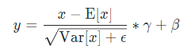

使用注意

- 一般放在卷积后，ReLU等激活函数前
-  一般不与dropout 同时使用
-  测试时要使用 eval 模式，此时使用训练阶段 *指数加权平均* 的均值和方差
-   遇到收敛速度很慢，或梯度爆炸等无法训练的状况时可以尝试BN来解决 

```python
CLASS torch.nn.BatchNorm2d(num_features, eps=1e-05, momentum=0.1, affine=True, track_running_stats=True)
```

see: https://pytorch.org/docs/stable/nn.html?highlight=batchnorm2d#torch.nn.BatchNorm2d



 The mean and standard-deviation are calculated per-dimension over the mini-batches and *γ* and *β* are learnable parameter vectors of size C (where C is the input size). By default, the elements of *γ* are set to 1 and the elements of *β* are set to 0. 

 Also by default, during training this layer keeps running estimates of its computed mean and variance, which are then used for normalization during evaluation. The running estimates are kept with a default `momentum` of 0.1. 

 If `track_running_stats` is set to `False`, this layer then does not keep running estimates, and batch statistics are instead used during evaluation time as well. 

 Because the Batch Normalization is done over the C dimension, computing statistics on (N, H, W) slices, it’s common terminology to call this Spatial Batch Normalization. 

- Parameters
  - **num_features** – C*C* from an expected input of size (*N*,*C*,*H*,*W*)
  - **eps** – a value added to the denominator for numerical stability. Default: 1e-5
  - **momentum** – the value used for the running_mean and running_var computation. Can be set to `None` for cumulative moving average (i.e. simple average). Default: 0.1
  - **affine** – a boolean value that when set to `True`, this module has learnable affine parameters. Default: `True`
  - **track_running_stats** – a boolean value that when set to `True`, this module tracks the running mean and variance, and when set to `False`, this module does not track such statistics and always uses batch statistics in both training and eval modes. Default: `True`

- Shape:
  - Input: (*N*,*C*,*H*,*W*)
  - Output: (*N*,*C*,*H*,*W*) (same shape as input)

Examples:

```python
>>> # With Learnable Parameters
>>> m = nn.BatchNorm2d(100)
>>> # Without Learnable Parameters
>>> m = nn.BatchNorm2d(100, affine=False)
>>> input = torch.randn(20, 100, 35, 45)
>>> output = m(input)
```