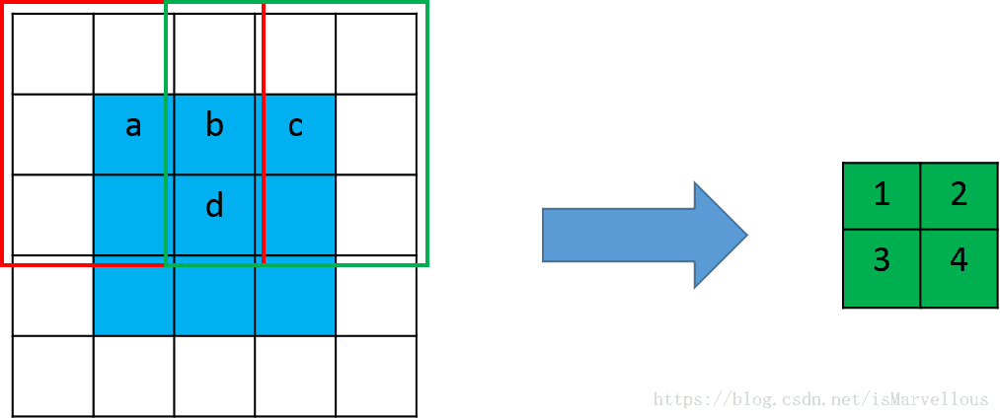
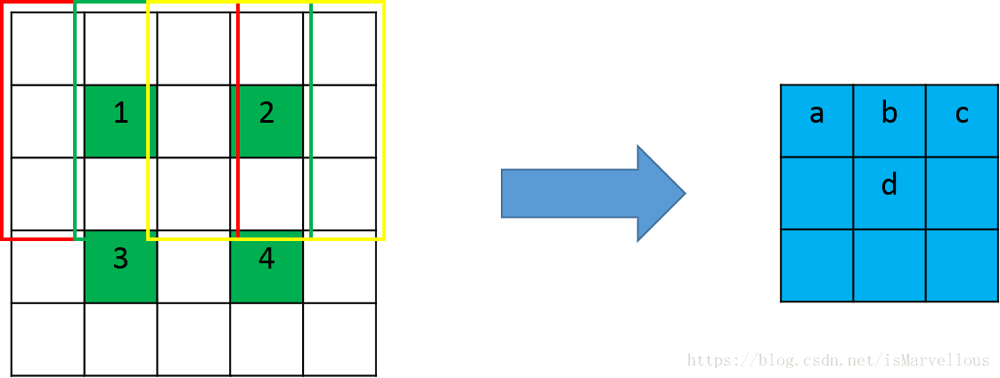
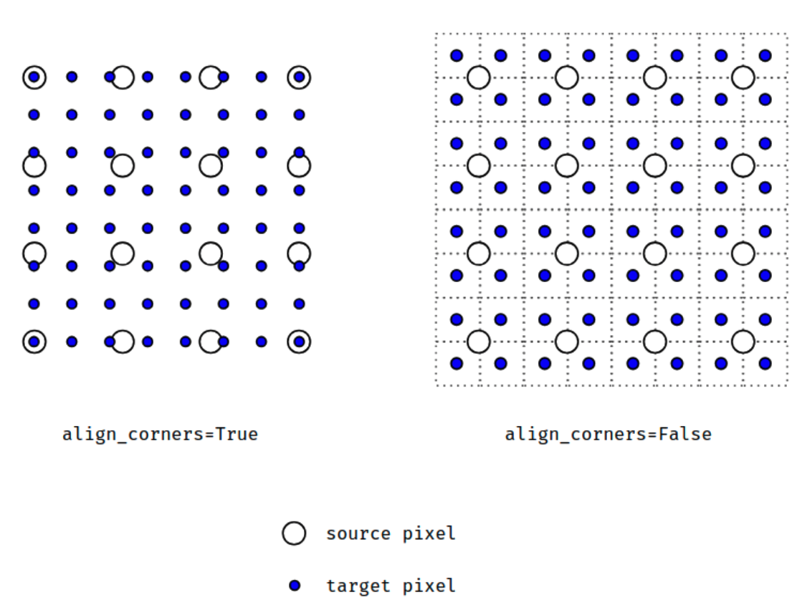

1 使用转置卷积

```python

class torch.nn.ConvTranspose2d(in_channels, out_channels, kernel_size, stride=1, padding=0, 
                                                       output_padding=0, groups=1, bias=True, dilation=1)
```

参数的含义如下：

- in_channels(int) – 输入信号的通道数
- out_channels(int) – 卷积产生的通道数
- kerner_size(int or tuple) - 卷积核的大小
- stride(int or tuple,optional) - 卷积步长，即要将输入扩大的倍数。
- padding(int or tuple, optional) - 输入的每一条边补充0的层数，高宽都增加2*padding
- output_padding(int or tuple, optional) - 输出边补充0的层数，高宽都增加padding
- groups(int, optional) – 从输入通道到输出通道的阻塞连接数
- bias(bool, optional) - 如果bias=True，添加偏置
- dilation(int or tuple, optional) – 卷积核元素之间的间距

CenterNet中resdcn18 backbone上采样采用此种方式。

反卷积 size 输入输出关系

  


转置卷积（Transposed Convolution）又称为反卷积（Deconvolution）。在PyTorch中可以使用torch.nn.ConvTranspose2d()来调用，在Caffe中也有对应的层deconv_layer。

转置卷积常常用于CNN中对特征图进行上采样，比如语义分割和超分辨率任务中。之所以叫转置卷积是因为，它其实是把我们平时所用普通卷积操作中的卷积核做一个转置，然后把普通卷积的输出作为转置卷积的输入，而转置卷积的输出，就是普通卷积的输入。这样说可能有点绕，我们可以参照CNN中的反向传播过程来理解，转置卷积形式上就和一个卷积层的反向梯度计算相同。既然是输入输出对调，那么就有两个很重要的特性：

转置的卷积核变为了普通卷积核的转置；
如果把由输入特征图到输出特征图的计算过程画成一个计算图，那么输入输出元素的连接关系是不变的
关于第二点，也就是说，在普通卷积中，若元素a和元素1有连接（元素1由a计算得到），那么在相应的转置卷积中，元素1和元素a依然是有连接的（元素a由元素1计算得到）。

普通卷积

  

这是一个卷积核大小为3x3，步长为2，padding为1的普通卷积。卷积核在红框位置时输出元素1，在绿色位置时输出元素2。我们可以发现，输入元素a仅和一个输出元素有运算关系，也就是元素1，而输入元素b和输出元素1, 2均有关系。同理c只和一个元素2有关，而d和1,2,3,4四个元素都有关。那么在进行转置卷积时，依然应该保持这个连接关系不变。

转置卷积

  上图中绿色的特征图作为输入，蓝色的特征图作为输出，并且保证连接关系不变。也就是说，a只和1有关，b和1,2两个元素有关，其它类推。怎么才能达到这个效果呢？我们可以先用0给绿色特征图做插值，插值的个数就是使相邻两个绿色元素的间隔为卷积的步长，同时边缘也需要进行与插值数量相等的补0 ，如下图

 

这时候卷积核的滑动步长就不是2了，而是1，步长体现在了插值补0的过程中。一般在CNN中，转置卷积用于对特征图进行上采样，比如我们想要将特征图扩大2倍，那么就可以使用步长为2的转置卷积。但是且慢！为什么我们这里2x2的输入，只得到了3x3的输出呢？说好的扩大2倍呢？不应该是4x4么？ 
别急，我们来算一算为什么是3x3。 
我们将2x2的特征图插空并在边缘补0后，边长变成了2x2+1=5，使用3x3的卷积核做滑动步长为1的卷积，得到的特征图边长为(5-3+1)/1=3。所以我们只得到了3x3而非4x4的输出。那么在一般情况下，输出特征图的大小要怎么计算呢？下面我们来总结一下。
输出特征图的尺寸计算
假设我们做转置卷积的输入特征图大小为 n×n，卷积核大小为 k×k，后面为了表示方便，我们直接使用边长来表示大小。 
步长stride为s，那么转置卷积需要在四周每个边缘补0的数量为s−1，边缘和内部插空补0后输入特征图大小变为 s×n+s−1

使用大小为k的卷积核进行卷积（滑动步长为1），得到的输出特征图大小为： 
(s×n+s−1−k+1)/1=s×n+(s−k)

可以看到，转置卷积并不是严格将输入特征图变为了s倍，而是还相差了个s−k。 
这和PyTorch中的torch.nn.ConvTranspose2d()得到的结果是一致的。

参考：

- https://blog.csdn.net/isMarvellous/article/details/80087705

2 使用插值方法

```python
# 这里的代码是在这里设置多一个卷积,这样子就起到了可以修改其输出通道的功能了。
# 相当于功能跟ConvTranspose2d()差不多，只是上采样的方法不同
nn.Sequential(  
    # out_channels is always going to be the same as in_channels
    nn.Upsample(mode='bilinear', scale_factor=2, align_corners=True),
    # 使用1x1卷积修改通道数
    conv1x1(in_channels, out_channels)
)

def conv1x1(in_channels, out_channels, groups=1):
    return nn.Sequential(
        nn.Conv2d(
            in_channels,
            out_channels,
            kernel_size=1,
            groups=groups,
            stride=1),
        nn.BatchNorm2d(out_channels))
```


```python
torch.nn.Upsample(size=None, scale_factor=None, mode='nearest', align_corners=None)
```

上采样一个给定的多通道的 1D (temporal,如向量数据), 2D (spatial，如jpg、png等图像数据) or 3D (volumetric，如点云数据)数据 。假设输入数据的格式为minibatch x channels x [optional depth] x [optional height] x width。因此对于一个空间spatial输入，我们期待着4D张量的输入，即minibatch x channels x height x width。而对于体积volumetric输入，我们则期待着5D张量的输入，即minibatch x channels x depth x height x width

对于上采样有效的算法分别有对 3D, 4D和 5D 张量输入起作用的 最近邻、线性,、双线性, 双三次(bicubic)和三线性(trilinear)插值算法

可以给定scale_factor来指定输出为输入的scale_factor倍或直接使用参数size指定目标输出的大小，但是不能同时制定两个

**参数：**

- **size** ([*int*](https://docs.python.org/3/library/functions.html#int) *or* *Tuple**[*[*int*](https://docs.python.org/3/library/functions.html#int)*] or* *Tuple**[*[*int*](https://docs.python.org/3/library/functions.html#int)*,* [*int*](https://docs.python.org/3/library/functions.html#int)*] or* *Tuple**[*[*int*](https://docs.python.org/3/library/functions.html#int)*,* [*int*](https://docs.python.org/3/library/functions.html#int)*,* [*int*](https://docs.python.org/3/library/functions.html#int)*]**,* *optional*) – 根据不同的输入类型制定的输出大小
- **scale_factor** ([*float*](https://docs.python.org/3/library/functions.html#float) *or* *Tuple**[*[*float*](https://docs.python.org/3/library/functions.html#float)*] or* *Tuple**[*[*float*](https://docs.python.org/3/library/functions.html#float)*,* [*float*](https://docs.python.org/3/library/functions.html#float)*] or* *Tuple**[*[*float*](https://docs.python.org/3/library/functions.html#float)*,* [*float*](https://docs.python.org/3/library/functions.html#float)*,* [*float*](https://docs.python.org/3/library/functions.html#float)*]**,* *optional*) – 指定输出为输入的多少倍数。如果输入为tuple，其也要制定为tuple类型
- **mode** ([*str*](https://docs.python.org/3/library/stdtypes.html#str)*,* *optional*) – 可使用的上采样算法，有`'nearest'`, `'linear'`, `'bilinear'`, `'bicubic'` and `'trilinear'`. `默认使用``'nearest'`
- **align_corners** ([*bool*](https://docs.python.org/3/library/functions.html#bool)*,* *optional*) – 如果为True，输入的角像素将与输出张量对齐，因此将保存下来这些像素的值。仅当使用的算法为`'linear'`, `'bilinear'`or `'trilinear'时可以使用。``默认设置为``False`


  当align_corners = True时，线性插值模式(线性、双线性、双三线性和三线性)不按比例对齐输出和输入像素 

 

```bash
UserWarning: nn.Upsample is deprecated. Use nn.functional.interpolate instead.
```

mmdet的FPN实现采用nn.functional.interpolate上采样

参考：

- https://www.cnblogs.com/wanghui-garcia/p/11400866.html
- https://www.cnblogs.com/wanghui-garcia/p/11399053.html