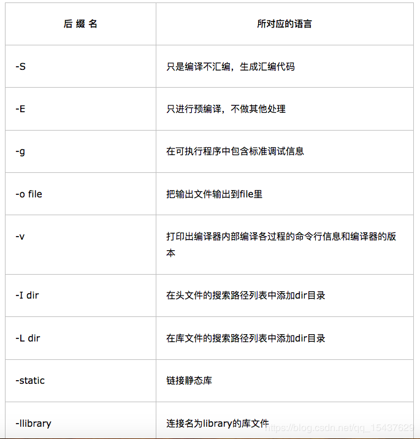
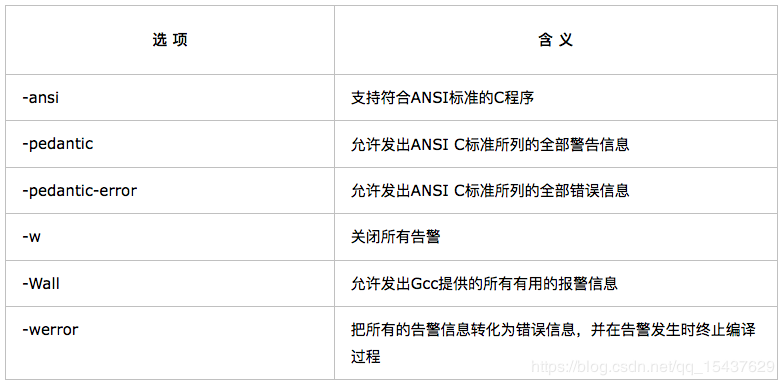

我们用gcc编译程序时，可能会用到“-I”（大写i），“-L”（大写l），“-l”（小写l）等参数，例：

```bash
gcc -o hello hello.c -I /home/hello/include -L /home/hello/lib -lworld
```

上面这句表示在编译hello.c时：

- `-I /home/hello/include`表示将`/home/hello/include`目录作为第一个寻找头文件的目录，寻找的顺序是：`/home/hello/include`-->`/usr/include-->/usr/local/include`
- `-L /home/hello/lib`表示将`/home/hello/lib`目录作为第一个寻找库文件的目录，寻找的顺序是：`/home/hello/lib-->/lib`-->`/usr/lib`-->`/usr/local/lib`
- `-lworld`表示在上面的lib的路径中寻找`libworld.so`动态库文件（如果gcc编译选项中加入了“-static”表示寻找libworld.a静态库文件）

  

  

### 预定义变量

- CC C编译器的名称，默认值为 cc
- CPP C预编译器的名称，默认值为 $(CC) -E
- CFLAGS C编译器的选项
- CXX C++编译器的名称，默认值为 g++
- CXXFLAGS 表示用于 C++ 编译器的选项
- $<  第一个依赖文件的名称 
- $@  所有的依赖文件，以空格分开，这些依赖文件的修改日期比目标的创建日期晚 

**CFLAGS**： 指定头文件（.h文件）的路径，如：CFLAGS=-I/usr/include -I/path/include。同样地，安装一个包时会在安装路径下建立一个include目录，当安装过程中出现问题时，试着把以前安装的包的include目录加入到该变量中来。

**LDFLAGS**：gcc 等编译器会用到的一些优化参数，也可以在里面指定库文件的位置。用法：LDFLAGS=-L/usr/lib -L/path/to/your/lib。每安装一个包都几乎一定的会在安装目录里建立一个lib目录。如果明明安装了某个包，而安装另一个包时，它愣是说找不到，可以抒那个包的lib路径加入的LDFALGS中试一下。

**LIBS**：告诉链接器要链接哪些库文件，如`LIBS = -lpthread -liconv`

简单地说，LDFLAGS是告诉链接器从哪里寻找库文件，而LIBS是告诉链接器要链接哪些库文件。不过使用时链接阶段这两个参数都会加上，所以你即使将这两个的值互换，也没有问题。

有时候LDFLAGS指定-L虽然能让链接器找到库进行链接，但是运行时链接器却找不到这个库，如果要让软件运行时库文件的路径也得到扩展，那么我们需要增加这两个库给"-Wl,R"：

LDFLAGS = -L/var/xxx/lib -L/opt/mysql/lib -Wl,R/var/xxx/lib -Wl,R/opt/mysql/lib

如果在执行./configure以前设置环境变量export LDFLAGS="-L/var/xxx/lib -L/opt/mysql/lib -Wl,R/var/xxx/lib -Wl,R/opt/mysql/lib" ，注意设置环境变量等号两边不可以有空格，而且要加上引号（shell的用法）。那么执行configure以后，Makefile将会设置这个选项，链接时会有这个参数，编译出来的可执行程序的库文件搜索路径就得到扩展了。