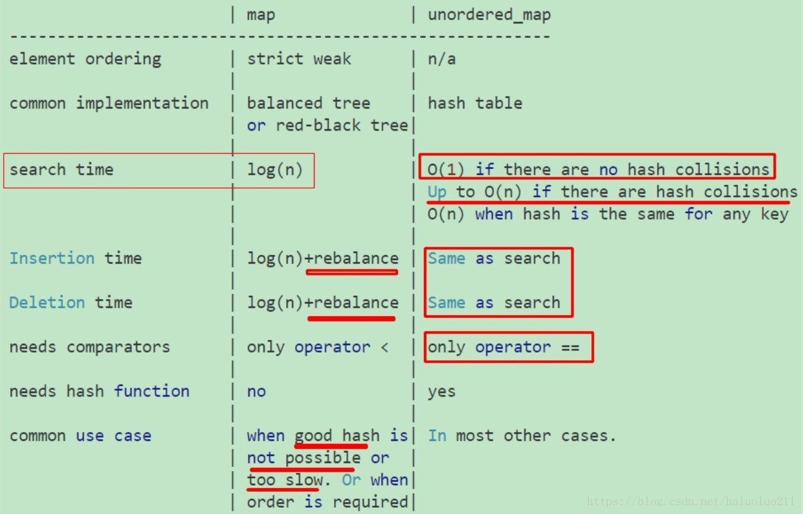

## 特性

- 增删：快
- 查找：快。O(1)或O(logn)时间
- 支持键的随机访问

## STL实现

### map 

底层数据结构为红黑树，有序，可重复。红黑树的效率决定了`map`的效率 。如果对内存大小比较敏感或者数据存储要求有序的话，则可以用 `map` 容器。  key值需要比较函数，如果没有，需要自己创建，否则不能作为key。

### hash_map

底层数据结构为hash表，无序，不重复  

非标准库名称。在C++11中被`unordered_map`取代。key值需要hash函数，如果没有，需要自己创建，否则不能作为key。例如：`pair`不能使用作为键，它没有默认的hash函数，需要[自己创建一个进STL](https://stackoverflow.com/questions/20590656/error-for-hash-function-of-pair-of-ints)。

- 优点：
  - 因为内部实现了哈希表，因此其查找速度非常的快
- 缺点：
  - 哈希表的建立比较耗费时间，内存消耗更多
- 适用处
  - 对于查找问题，unordered_map会更加高效一些

 ### 对比

 

```
                       | map              | unordered_map
---------------------------------------------------------
element ordering       | strict weak      | n/a 
                       |                  |
common implementation  | balanced tree    | hash table
                       | or red-black tree|  
                       |                  |
search time            | log(n)           | O(1) if there are no hash collisions
                       |                  | Up to O(n) if there are hash collisions 
                       |                  | O(n) when hash is the same for any key
                       |                  |     
Insertion time         | log(n)+rebalance | Same as search
                       |                  | 
Deletion time          | log(n)+rebalance | Same as search
                       |                  | 
needs comparators      | only operator <  | only operator ==
                       |                  |
needs hash function    | no               | yes
                       |                  |
common use case        | when good hash is| In most other cases. 
                       | not possible or  | 
                       | too slow. Or when|
                       | order is required| 
```

from: https://stackoverflow.com/questions/13799593/how-to-choose-between-map-and-unordered-map/13799886#13799886

### 常用操作

```C++
// 头文件
#include <map>
#include <unordered_map>

std::unordered_map<int, std::string> map;
```

- clear  // 清除 map 中所有元素；
- erase  // 删除 map 中指定位置的元素；
- insert  // 在 map 指定位置添加 pair 类型的元素；
- find // 获取 map 中元素的迭代器；
- begin, end  // map 的正向迭代器的起始位置与终点位置；

### insert

```cpp
// insert方式，重复的key会直接被放弃，而不是进行覆盖（这一点与Java不同） 
map.insert(make_pair(1, "Scala"));
map.insert(make_pair(2, "Haskell"));
map.insert(make_pair(3, "C++"));
map.insert(make_pair(6, "Java"));
map.insert(make_pair(2, "Erlang"));

// []方式是可以覆盖的
map.insert(make_pair(2, "Erlang"));  
cout <<"insert convert test:  " << map[2] << endl;
```
`[]`方式要比 `insert` 快。

在map的源码中，insert方法是这样定义的：

```cpp
pair<iterator,bool> insert(const value_type& __x) 
    { return _M_t.insert_unique(__x); }
```

调用`_M_t.insert_unique(_x)`方法，该方法会首先遍历整个集合，判断是否存在相同的key，如果存在则直接返回，放弃插入操作。如果不存在才进行插入。 而`[]`方式是通过重载`[]`操作符来实现的，它直接进行插入或覆盖。

### find函数

```cpp
iterator find ( const key_type& key );
```

如果key存在，则find返回key对应的迭代器，如果key不存在，则find返回unordered_map::end。因此可以通过

```cpp
map.find(key) == map.end()
```

 来判断，key是否存在于当前的unordered_map中。 