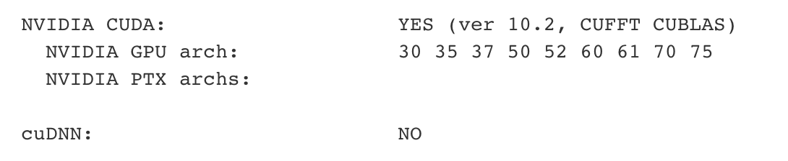

## with cuda



cmkae配置完，默认编译了所有GPU架构的CUDA代码，编译速度非常慢。如果没有必要兼容所有GPU，可以设置需要编译的GPU架构，大大加快编译速度。

```
        -DWITH_CUDA=ON \
#        -DOPENCV_DNN_CUDA=ON \
        -DCUDA_ARCH_BIN=7.0 \
        -DCUDA_ARCH_PTX=7.0 \
```

改完之后：


PS：最好将DCUDA_ARCH_PTX设置成最高的等级（如7.5），可以向下兼容。


同时，不需要所有有CUDA支持的模块都编译的话，可以指定一些不需要编译的模块：

```
# 这是所有有CUDA支持的模块
-DBUILD_opencv_cudaarithm=OFF 
-DBUILD_opencv_cudabgsegm=OFF 
-DBUILD_opencv_cudafeatures2d=OFF 
-DBUILD_opencv_cudafilters=OFF 
-DBUILD_opencv_cudaimgproc=OFF 
-DBUILD_opencv_cudalegacy=OFF 
-DBUILD_opencv_cudaobjdetect=OFF 
-DBUILD_opencv_cudaoptflow=OFF 
-DBUILD_opencv_cudastereo=OFF 
-DBUILD_opencv_cudawarping=OFF 
-DBUILD_opencv_cudacodec=OFF
```

如何确认模块已经关闭，在输出的log中搜索模块名！


完整配置：

```bash
# 1 st step - clone repository & build opencv (using a lot of time!!)
ENV OPENCV_VERSION="4.3.0"
RUN wget -O OpenCV-${OPENCV_VERSION}.zip https://github.com/opencv/opencv/archive/${OPENCV_VERSION}.zip \
    && unzip OpenCV-${OPENCV_VERSION}.zip \
    && rm -rf OpenCV-${OPENCV_VERSION}.zip \
    && wget -O OpenCV_contrib-${OPENCV_VERSION}.zip https://github.com/opencv/opencv_contrib/archive/${OPENCV_VERSION}.zip \
    && unzip OpenCV_contrib-${OPENCV_VERSION}.zip \
    && rm -rf OpenCV_contrib-${OPENCV_VERSION}.zip \
    && cd opencv-${OPENCV_VERSION} \
    && mkdir build \
    && cd build \
    ### using cmake refer from INSTALLATION.md default file ###
    && cmake \ 
        -DCMAKE_BUILD_TYPE=Release \
        -DWITH_CUDA=ON \
        -DCUDA_ARCH_BIN=7.0 \
        -DCUDA_ARCH_PTX=7.0 \
        -DBUILD_opencv_cudastereo=OFF \
        -DBUILD_opencv_cudaobjdetect=OFF \
        -DOPENCV_EXTRA_MODULES_PATH=../../opencv_contrib-${OPENCV_VERSION}/modules/ \
        -DWITH_TBB=ON \
        -DWITH_IPP=OFF \
        -DBUILD_opencv_cnn_3dobj=OFF \
        -DBUILD_opencv_dnn=OFF \
        -DBUILD_opencv_dnn_modern=OFF \
        -DBUILD_opencv_dnns_easily_fooled=OFF \
        -DBUILD_TIFF=ON \
        -DBUILD_opencv_java=OFF \
        -DBUILD_TESTS=OFF \
        -DBUILD_PERF_TESTS=OFF \
        -DOPENCV_ENABLE_NONFREE=ON \
        -DCMAKE_INSTALL_PREFIX=$(python3 -c "import sys; print(sys.prefix)") \
        -DPYTHON_EXECUTABLE=$(which python3) \
        -DPYTHON_INCLUDE_DIR=$(python3 -c "from distutils.sysconfig import get_python_inc; print(get_python_inc())") \
        -DPYTHON_PACKAGES_PATH=$(python3 -c "from distutils.sysconfig import get_python_lib; print(get_python_lib())") \
        .. \
    && make -j8
    && make install
```

关掉IPP，是因为下载IPP包太耗时。也可以离线下载好，然后替换CMakefile.txt中相关配置。但实际上IPP加速的效果一般吧？


参考：

- https://jamesbowley.co.uk/accelerate-opencv-4-2-0-build-with-cuda-and-python-bindings/
- https://blog.csdn.net/DumpDoctorWang/article/details/81052597
- https://bbs.cvmart.net/topics/1417/created_at?


## 使用Ninja构建系统

目的：加快编译速度！

好像只有在Windows上的实践


参考：

- https://ninja-build.org/