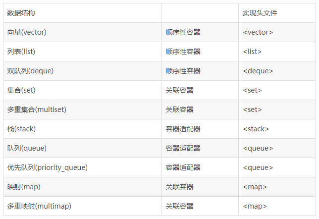

## 为什么要有泛型编程
C++是一门编译型语言，无法做到像动态（脚本）语言（python、javascript等），编写一段通用的逻辑，可以把任意类型的变量传进去处理。泛型编程弥补了这个缺点，把通用逻辑设计为模板，摆脱了类型的限制，提供了继承机制以外的另一种抽象机制，极大地提升了代码的可重用性。

模板定义本身不参与编译，而是编译器根据模板的用户使用模板时提供的类型参数生成代码，再进行编译，这一过程被称为模板实例化。用户提供不同的类型参数，就会实例化出不同的代码。


## 函数模板定义
把处理不同类型的公共逻辑抽象成函数，就得到了函数模板。函数模板可以声明为inline或者constexpr的，将它们放在template之后，返回值之前即可。

 下面的几种写法是等效的并且class 和typename是可以互换的。 

```cpp
template  <typename T1, typename T2>
T1 fun(T1, T2, int )
{  
    // ...
}

template  <typename T1, T2>  T1 fun(T1, T2, int )
{  
    // ...
}

template  <class T1, class T2>
T1 fun(T1, T2, int )
{  
    // ...
}

template <class T1, T2> T1 fun(T1, T2, int)
{  
    // ...
}
```

### 函数模板的性质

1. 函数模板并不是真正的函数，它只是C++编译生成具体函数的一个模板。
2. 函数模板本身并不生成函数，实际生成的函数是替换函数模板的那个函数，比如上例中的add(sum1,sum2)，这种替换是编译期就绑定的。
3. 函数模板不是只编译一份满足多重需要，而是为每一种替换它的函数编译一份。
4. 函数模板不允许自动类型转换。
5. 函数模板不可以设置默认模板实参。比如`template <typename T=0>`不可以。
   


##  类模版的语法

```cpp
template  <class 模版参数列表…>
class 类名
{ 
    // 类体
}

// 成员的实现…
```

举例

```cpp
// 类声明部分，有两个模板参数T1，T2
template  <class T1, class T2 >
class A {
private:
    int a;
    T1 b;  // 成员变量也可以用模板参数
public: 
    int fun1(T1 x, int y);
    T2 fun2(T1 x, T2 y);
}

// 类实现部分
template  <class T1, class T2 >
int A<T1>::fun1(T1 x, int y ) {
    // 实现…… 
}

template  <class T1, class T2 >
T2 A<T1, T2>::fun2(T1 x, T2 y) {
    // 实现…… 
}

// 使用类A
int main( ) {
    // 定义对象a,并用int替换T1, float替换T2
    A<int, float>  a;
    // 实例化a,调用a的属性和方法 ...
}
```

由上例可以看出, 类模板参数T1,T2对类的成员变量和成员函数均有效。在C++编程中，当要实现的一个类的某些成员函数和成员变量的算法数据类型有关，可以考虑用类模板。C++的STL数据结构和算法大都用类模板实现。 

### 类模板的性质

1. 类模板不是真正的类，它只是C++编译器生成具体类的一个模板。
2. 类模板可以设置默认模板实参。 


## C++ STL

STL（Standard Template Library，标准模板库)是C++对泛型编程思想的实现，最早是惠普实验室开发的。在被引入C++之前该技术就已经存在了很长的一段时间。后来STL成为ANSI/ISO C++标准的一部分。各个C++厂商也有各自相应的模板库，这些库效率可能很高，但可移植性不一定好。

STL广义上分为三类：algorithm（算法）、container（容器）和iterator（迭代器），几乎所有的代码都采用了模板类和模板函数的方式，这相比于传统的由函数和类组成的库来说提供了更好的代码重用机会。

在C++标准中，STL被组织为下面的13个头文件：

```
<algorithm>
<iterator>
<deque>
<vector>
<list>
<map>
<queue>
<set>
<stack>
<memory>
<numeric>
<utility>
<functional>
```


### 算法（algorithm）

STL提供了大约100个实现算法的模版函数，算法部分主要由头文件<algorithm>，<numeric> 和<functional>组成。

<algorithm>是所有STL头文件中最大的一个，它是由一大堆模板函数组成的，其中常用到的功能范围涉及到比较、
交换、查找、遍历操作、复制、修改、移除、反转、排序、合并等等。

<numeric>体积很小，只包括一些简单数学运算的模板函数。

<functional>中则定义了一些模板类，用以声明函数对象。


### 容器（container）（又称集合collection）

在实际的开发过程中，数据结构本身的重要性不会逊于操作于数据结构的算法的重要性，当程序中存在着对时间要求很高的部分时，数据结构的选择就显得更加重要。

通过设置一些模版类，STL容器对最常用的数据结构提供了支持，这些模板的参数允许指定容器中元素的数据类型，可以将许多重复而乏味的工作简化。

如下表：




### 迭代器（iterator）

迭代器是一种允许程序员检查容器内元素，并实现元素遍历的数据类型。C++标准库为每一种标准容器定义了一种迭代器类型。迭代器类型提供了比下标操作更一般化的方法：所有的标准库容器都定义了相应的迭代器类型，而只有少数的容器（比如数组）支持下标操作。因为迭代器对所有的容器都适用，现代C++程序更倾向于使用迭代器而不是下标操作访问容器元素。

迭代器从作用上来说是STL最基本的部分，迭代器在STL中用来将算法和容器联系起来，起着一种黏和剂的作用。几乎STL提供的所有算法都是通过迭代器存取元素序列进行工作的，每一个容器都定义了其本身所专有的迭代器，用以存取容器中的元素。

迭代器部分主要由头文件<utility>，<iterator> 和<memory>组成。<utility>是一个很小的头文件，它包括了贯穿使用在STL中的几个模板的声明，<iterator>中提供了迭代器使用的许多方法， <memory>为容器中的元素分配存储空间，同时也为某些算法执行期间产生的临时对象提供机制，<memory>中的主要部分是模板类allocator，它负责产生所有容器中的默认分配器。

