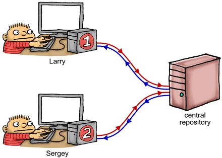

> 翻译自：https://preshing.com/20120710/memory-barriers-are-like-source-control-operations/
>
> 略有修改

如果使用源代码控制，那么您将逐渐理解内存顺序，这是使用C，C ++和其他语言编写无锁代码时的重要考虑因素。*[PS：内存顺序真的很重要，问题不仅仅来源于CPU的多层次存储系统，事实上这个问题在处理器层次已经比较好的解决了。假如只有共享内存，更容易看出真正的问题是：多线程环境下数据对象的败坏。我们所有的努力都是为了数据对象的同步，也就是对读写次序的控制。]*

在上一篇文章中，我写了关于[编译期时内存排序](http://preshing.com/20120625/memory-ordering-at-compile-time)，它构成了内存排序难题的一半。这篇文章是关于另一半的：运行时的内存排序，在处理器本身上。*[PS：也就是处理器执行时的指令排序，由处理器决定]*像编译器重新排序一样，处理器重新排序对于单线程程序是不可见的。仅当使用[无锁技术](http://preshing.com/20120612/an-introduction-to-lock-free-programming)时，即在没有线程之间相互排斥的情况下操作共享内存时，这种情况才变得明显。但是，与编译器重新排序不同，处理器重新排序的效果[仅在多核和多处理器系统中可见](http://preshing.com/20120515/memory-reordering-caught-in-the-act)。

您可以通过发出任何充当**内存屏障**的指令来在处理器上强制执行正确的内存排序。在某些方面，这是您唯一需要知道的技术，因为当您使用这些指令时，编译器的排序会自动执行。用作内存屏障的指令示例包括（但不限于）以下内容：

- GCC中的某些内联汇编指令，例如PowerPC特定的 `asm volatile("lwsync" ::: "memory")`
- 任何[Win32互锁操作](http://msdn.microsoft.com/en-us/library/windows/desktop/ms684122.aspx)，Xbox 360除外
- 对[C ++ 11原子类型](http://en.cppreference.com/w/cpp/atomic/atomic)的许多操作，例如`load(std::memory_order_acquire)`
- POSIX互斥锁上的操作，例如 [`pthread_mutex_lock`](http://linux.die.net/man/3/pthread_mutex_lock)

就像有许多指令充当内存屏障一样，也有许多不同类型的内存屏障需要了解。确实，并非所有上述指令都会产生相同类型的内存障碍 - 导致在编写无锁代码时出现另一个可能的混乱地方。为了在某种程度上解决问题，我想提供一个类比，它有助于理解绝大多数（但不是全部）可能的内存屏障类型。

首先，请考虑典型的多核系统的体系结构。这是一个具有两个内核的设备，每个内核具有32 KiB的私有L1数据缓存。两个内核之间共享1 MiB的L2高速缓存，以及512 MiB的主内存。


多核系统有点像一群程序员使用一种奇怪的源代码控制策略在一个项目上进行协作。例如，上述双核系统对应于只有两个程序员的情况。我们命名为拉里和谢盖尔。



在右侧，我们有一个共享的中央存储库–它表示主内存和共享的L2缓存的组合。拉里在他的本地计算机上拥有该存储库的完整工作副本，谢盖尔也是如此 – 这些（有效地）代表了附加到每个CPU内核的L1缓存。每台机器上都有一个暂存区，用于私下跟踪寄存器和/或局部变量。我们的两个程序员坐在那里，狂热地编辑他们的工作副本和暂存区，同时根据所看到的数据来决定下一步的工作-就像在该内核上运行的执行线程一样。

这将我们带到了源代码控制策略。以此类推，源代码控制策略确实非常奇怪。当拉里和谢盖尔修改其存储库的工作副本时，他们的修改总是在完全随机的时间在后台向中央存储库和从中央存储库**泄漏**。一旦拉里编辑了文件X，他的更改将泄漏到中央存储库，但不能保证何时发生。它可能会立即发生，也可能会在很多以后发生。他可能会继续编辑其他文件，例如Y和Z，并且这些修改可能会*在* X泄漏*之前*泄漏到存储库中。通过这种方式，可以有效地将存储重新排序到存储库。

同样，谢尔盖的机器上，没有关于这些变化在后台向中央存储库和从中央存储库**泄漏**的时间和顺序保证。通过这种方式，加载将高效地以它的方式重新排序。

现在，如果每个程序员都在存储库的完全独立的部分上工作，那么任何一个程序员都不会知道这些正在进行的背后泄漏，甚至都不知道另一个程序员的存在。这类似于运行两个独立的单线程进程。在这种情况下，将[保持内存排序的基本规则](http://preshing.com/20120625/memory-ordering-at-compile-time)。

一旦我们的程序员开始处理存储库的相同部分，该类比就变得更加有用。让我们回顾一下我[在较早的文章中](http://preshing.com/20120515/memory-reordering-caught-in-the-act)给出的示例。X和Y是全局变量，都初始为0：


将X和Y视为存在于拉里存储库的工作副本，谢盖尔的工作副本以及中央存储库本身上的文件。拉里在其工作副本X中写入1，而几乎同时谢尔盖在其工作副本Y中写入1。如果两个修改都没有时间泄漏到存储库中，然后又在每个程序员查找*另一个*文件的工作副本之前返回，则最终它们都将以r1 = 0和r2 = 0结束。实际上在源代码控制类比中变得很明显。


## 内存屏障的类型

幸运的是，拉里和谢盖尔并不完全受后台发生的这些随机的、不可预测的泄漏的影响。它们还具有发出特殊指令的能力，称为屏障( *fence* )指令，扮演内存屏障角色。对于这个比喻，定义四种类型的内存屏障就足够了，因此定义了四种不同的屏障指令就足够了。每种类型的内存屏障均以其，旨在防止的内存重新排序类型来命名：例如，`#StoreLoad`旨在防止存储紧随加载后的重新排序。


正如[Doug Lea指出的那样](http://g.oswego.edu/dl/jmm/cookbook.html)，这四个类别可以很好地映射到真实CPU上的特定指令，尽管不完全相同。在大多数情况下，实际的CPU指令可能是上述屏障类型的某种组合，可能还有其他影响。无论如何，一旦您理解了这四种类型的内存障碍在源代码控制类比中，就可以很好地了解它们在真实CPU上的大量指令以及几种高级编程语言构造。

### #LoadLoad

LoadLoad屏障有效地防止了在屏障之前执行的加载和在屏障之后执行的加载之间的重排列。

以我们的类比，`#LoadLoad`fence指令基本上等效于从中央存储库中**pull**信息。想想`git pull`，`hg pull`，`p4 sync`，`svn update`或者`cvs update`对整个存储库的作用。如果与他的本地更改存在任何合并冲突，我们可以说它们是随机解决的。


提醒您，我们无法保证`#LoadLoad`会`pull`整个存储库的最新修订版本！ 可能拉取到比head更旧的修订版，只要修订版至少与从中央仓库泄漏到本地机器的最新值一样新就行。

这听起来像是一个薄弱的保证，但它仍然是防止看到陈旧数据的绝妙方法。考虑一下经典示例，其中谢盖尔检查一个共享标志，以查看拉里是否已发布某些数据。如果该标志为真，则`#LoadLoad`在读取发布的值之前，他将发布一个屏障：

```cpp
if (IsPublished)                   // Load and check shared flag
{
    LOADLOAD_FENCE();              // Prevent reordering of loads
    return Value;                  // Load published value
}
```

显然，此示例取决于`IsPublished`标志本身是否泄漏到谢盖尔的工作副本中。何时发生并不重要。一旦观察到泄漏的标志，他就会发出`#LoadLoad`屏障以防止读取`Value`比标志本身还旧的值。

### #StoreStore

StoreStore屏障有效地防止了在屏障之前执行的存储与屏障之后执行的存储的重新排序。

以我们的比喻，`#StoreStore`fence指令对应于对中央存储库的**push**。想想`git push`，`hg push`，`p4 submit`，`svn commit`或者`cvs commit`，对整个存储库的作用。


另外，让我们假设`#StoreStore`指令**不是即时的**。它们以延迟的异步方式执行。因此，即使拉里执行了`#StoreStore`，我们也无法对他所有以前的存储何时最终在中央存储库中可见做出任何假设。

同样，这听起来似乎是一个薄弱的保证，但再次足以防止谢盖尔看到拉里发布的任何过时数据。回到上面的相同示例，拉里只需要将一些数据发布到共享内存，发出`#StoreStore`屏障，然后将共享标志设置为true：

```cpp
Value = x;                         // Publish some data
STORESTORE_FENCE();
IsPublished = 1;                   // Set shared flag to indicate availability of data
```

再次，我们指望`IsPublished`自己从拉里的工作副本泄漏到谢尔盖的。一旦谢尔盖检测到，他就能确信自己会看到的正确`Value`值。有趣的是，要使这种模式起作用，`Value`甚至不需要是原子类型。它也可能是一个包含许多元素的巨大结构。

### #LoadStore


与`#LoadLoad`和不同`#StoreStore`，`#LoadStore`在源代码控制操作方面没有巧妙的隐喻。理解`#LoadStore`屏障的最好方法很简单，就是在指令重新排序方面。

想象一下，拉里有一系列要遵循的指示。有些指令使他将自己的私人工作副本中的数据加载到寄存器中，有些指令使他将寄存器中的数据存储回了工作副本中。拉里可以处理指令，但只能在特定情况下使用。每当遇到加载时，他都会提前看看即将出现的任何存储。如果存储与当前加载完全无关，则允许他跳过，先进行存储，然后再返回以完成加载。在这种情况下，仍然遵循内存排序的基本规则（从不修改单线程程序的行为）。

在实际的CPU上，如果在加载时出现缓存未命中，然后在存储中命中缓存，则某些处理器可能会发生这种指令重新排序。但是就理解比喻而言，此类硬件细节并不重要。我们可以说拉里的工作很无聊，这是他被允许发挥创造力的几次机会之一。他是否选择这样做完全是不可预测的。幸运的是，这是一种相对轻量的重新排序类型；当拉里遇到`#LoadStore`屏障时，他只是避免围绕该屏障进行这种重新排序。

以我们的比喻，即使加载与存储之间存在`#LoadLoad`或`#StoreStore`屏障，对于拉里执行这种LoadStore重排序也是合法的。但是，在实际的CPU上，充当`#LoadStore`屏障的指令通常充当其他两种屏障类型中的至少一种。

### #StoreLoad

StoreLoad屏障可确保屏障之前执行的所有存储对于其他处理器都是可见的，并且屏障之后执行的所有加载都将收到屏障时可见的最新值。换句话说，它有效地防止了屏障之前所有存储的重新排序，使其免受屏障之后的所有加载的影响，并[遵循顺序一致的](http://preshing.com/20120612/an-introduction-to-lock-free-programming#sequential-consistency)多处理器执行这些操作的方式。

`#StoreLoad`是独特的。这是唯一一种可以防止在 [Memory Reordering Caught in the Act](http://preshing.com/20120515/memory-reordering-caught-in-the-act) 的例子中，出现`r1 = r2 = 0`结果的内存屏障类型；我在本文前面重复过的示例相同。

如果您一直在密切关注，您可能会想：`#StoreLoad`与一个`#StoreStore`后面跟着一个`#LoadLoad`有什么区别？毕竟，`#StoreStore`将更改推送到中央存储库，而`#LoadLoad`将远程更改拉回。但这两种屏障类型不完备。请记住，推送操作可能会延迟任意数量的指令，并且推送操作可能不会从头部修订版中提取。这暗示了为什么PowerPC的`lwsync`指令-它充当`#LoadLoad`，`#LoadStore`和`#StoreStore`三个内存障碍，但没有`#StoreLoad`- 在这个例子中是不足以防止`r1 = r2 = 0`的。

从比喻的角度来看，`#StoreLoad`可以通过将所有本地更改推送到中央后备仓库，等待该操作完成，然后拉动存储库的最新绝对头版修订来实现障碍。在大多数处理器上，充当`#StoreLoad`屏障的指令往往比充当其他屏障类型的指令更昂贵。


如果我们在该操作中设置`#LoadStore`屏碍，这没什么大不了的，那么我们得到的是完整的内存屏障 - 一次充当所有四种屏障类型。[正如Doug Lea所指出的](http://g.oswego.edu/dl/jmm/cookbook.html)那样，在所有当前处理器上，每条充当`#StoreLoad`屏障的指令也充当了完整的内存屏障。

## 这个比喻能带您到多远？

如前所述，每个处理器在内存排序方面都有不同的习惯。尤其是x86/64系列，具有强内存模型。已知将内存重新排序保持在最低限度。PowerPC和ARM的内存模型较弱，而Alpha则以其独树一帜而闻名。幸运的是，本文中提出的类比喻对应于一个[弱内存模型](http://preshing.com/20120930/weak-vs-strong-memory-models)。如果您蒙起头来，并按照此处给出的屏障指令执行正确的内存排序，则您应该能够处理大多数CPU。

该比喻还非常符合C ++ 11（以前称为C ++ 0x）和C11所针对的抽象机。因此，如果您使用这些语言的标准库编写无锁代码，同时牢记上述类比，则它更有可能在任何平台上正常运行。

以此比喻，我说过每个程序员代表一个运行在单独内核上的执行线程。在实际的操作系统上，线程倾向于在其整个生命周期中在不同的内核之间移动，但是比喻仍然有效。我还在机器语言的示例和用C/C ++编写的示例之间进行了交替。显然，我们更喜欢使用C/C ++或另一种高级语言。这是可能的，因为任何充当内存屏障的操作都将阻止[编译器重新排序](http://preshing.com/20120625/memory-ordering-at-compile-time)。

我还没有写关于每种类型的内存屏障的文章。例如，也存在[数据依赖障碍](http://www.mjmwired.net/kernel/Documentation/memory-barriers.txt#305)。我将在以后的文章中进一步描述。

如果你有兴趣CPU在引擎盖下是如何工作 - 比如存储的缓冲区，高速缓存一致性协议和其他硬件实现细节-为什么他们首先执行内存重新排序，我推荐Paul McKenney & David Howells的[优秀成果](http://www.kernel.org/doc/Documentation/memory-barriers.txt)。的确，我怀疑大多数成功编写了无锁代码的程序员都至少对这种硬件细节有一定的了解。