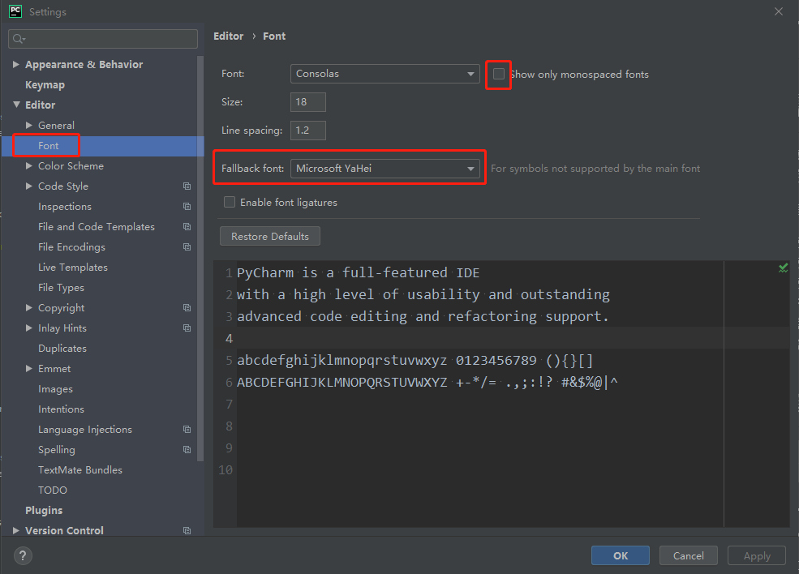

## 配置文件及缓存目录移至D盘

随着使用，缓存越来越大，少则几G，多则几十G，最好安装软件后立即设置安装目录下bin中[idea.properties](https://blog.csdn.net/qq_34374211/article/details/89394807)文件的config和system路径。

## 文件名和目录颜色含义

文件

- 绿色：已经加入版本控制暂未提交
- 红色：未加入版本控制
- 蓝色：加入版本控制，已提交，有改动
- 白色：加入版本控制，已提交，无改动
- 灰色：版本控制已忽略文件

目录

- 黑色：目录中文件不为空
- 暗绿色：目录中文件为空

## 中文字体

一般选用微软雅黑

 Editor - Font 配置，将 `Fallback font` 修改为你喜欢的中文字体即可（部分字体找不到需取消上方的 `Show only monospaced fonts`） 