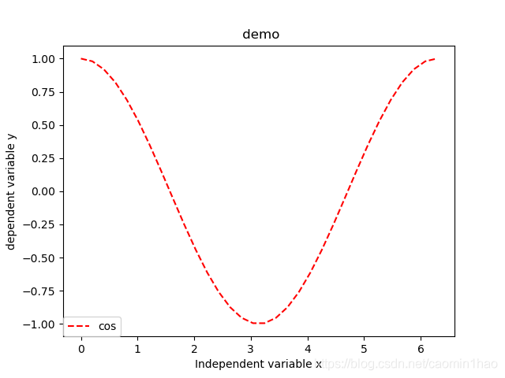
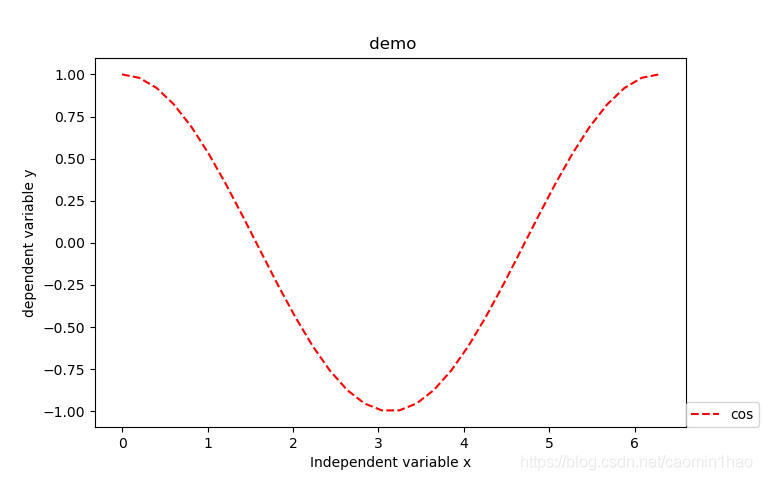
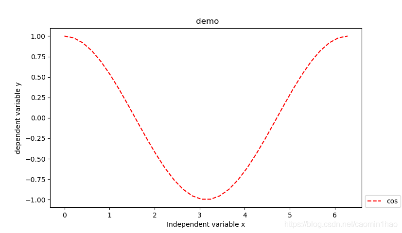

```python
plt.legend(bbox_to_anchor=(num1, num2), loc=num3, borderaxespad=num4)
```

说明：bbox_to_anchor被赋予的二元组中，num1用于控制legend的左右移动，值越大越向右边移动，num2用于控制legend的上下移动，值越大，越向上移动。用于微调图例的位置。

 1） num1=0 表示 legend 位于图像的左侧垂直线 ( 其它设置： num2=0,num3=3,num4=0) ； 

  num2=0 表示 legend 位于图像下侧水平线 

  

 2 ） num1=1 表示 legend 位于图像的右侧垂直线 ( 其它设置： num2=0,num3=3,num4=0) ； 

  

 3 ）为了美观，需要将 legend 放于图像的外侧，而又距离不是太大，一般设 num1=1.01 ； 

  

```
loc的可选参数
0: 'best'
1: 'upper right'
2: 'upper left'
3: 'lower left'    
4: 'lower right'
5: 'right'
6: 'center left'   
7: 'center right'
8: 'lower center'
9: 'upper center'
10: 'center'
```


#### 图例放在外侧保存时显示不完整问题解决

 **subplots_adjust()** 调整

https://www.yht7.com/news/107190


图例字体设置

```python
font = {'family': 'Times New Roman', 'weight': 'normal', 'size': 15}
legend = plt.legend(prop=font)
```

