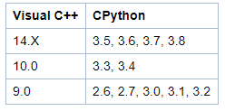

编译工具与python版本



编译前先升级setuptools:

```bash
pip install --upgrade setuptools
```

安装MS Visual C++编译工具：

https://visualstudio.microsoft.com/zh-hans/visual-cpp-build-tools/


参考：

- https://wiki.python.org/moin/WindowsCompilers