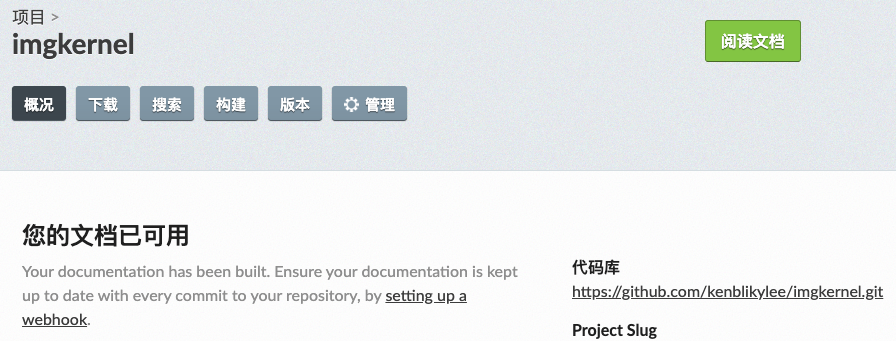
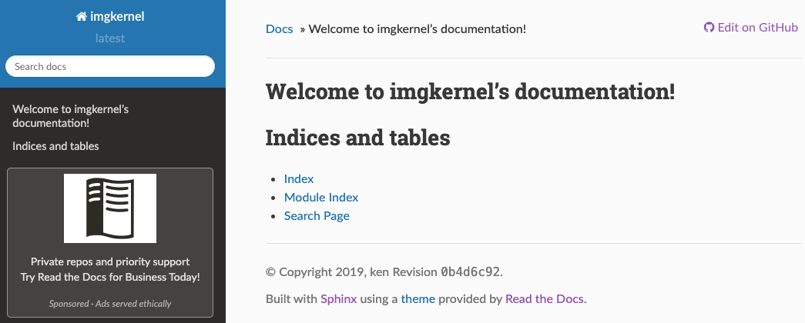

## 1. Sphinx 和 Read the Docs

### 1.1 Sphinx

Sphinx 是一个强大的文档生成器，具有许多用于编写技术文档的强大功能，包括：

- 维护一份源文档，生成网页，可打印的PDF，用于电子阅读器（ePub）的文档等
- 支持 reStructuredText 或 Markdown 编写文档
- 被广泛使用的代码文档系统
- 代码示例语法高亮
- 活跃的官方和第三方扩展生态

### 1.2 Read the Docs

“Read the Docs” 提供自动构建，版本控制和在线托管，来简化软件文档的发布和管理。它使用 Sphinx 生成 html 静态页面，通过 github 账户授权，在本地项目 push 到 github 仓库时，自动完成文档的生成和在线更新。

### 1.3 两者关系

可以简单认为 Sphinx 是一个独立的文档生成工具，可以支持不同的主题；而 Read the Docs 是一个免费的在线文档托管平台，它使用 Sphinx 作为文档生成工具，并提供自己的主题。两者关系类似于 jekyll 和 GitHub Pages。

## 2. 安装

### 2.1 安装 Sphinx

```javascript
pip install sphinx
```

### 2.2 安装 Read the Docs 主题

```javascript
pip install sphinx_rtd_theme
```

### * 2.3 安装 Sphinx Markdown 扩展

默认使用 reStructuredText (.rst) 编写文档，如需支持 Markdown (.md)，需要安装此扩展。

```javascript
pip install recommonmark
```

## 3. 给已有项目添加文档

以笔者真实托管在 GitHub 上的项目 `cvtools` 为例。读者以自己实际项目对相关部分做修改，下文不再单独讲述。

### 3.1 在项目根目录创建 docs 目录

克隆项目：

```javascript
git clone https://github.com/gfjiangly/cvtools.git
cd cvtools
```

创建并切换到 `docs` 分支：

```javascript
git checkout -b docs
```

创建子目录 `docs`:

```javascript
mkdir docs
```

### 3.2 使用 `sphinx-quickstart` 初始化文档

进入 `docs` 目录中，运行命令 `sphinx-quickstart`:

```javascript
cd docs
sphinx-quickstart
```

选项配置参考：

```javascript
> Separate source and build directories (y/n) [n]: y
> Name prefix for templates and static dir [_]:
> Project name: cvtools
> Author name(s): jiang.g.f
> Project release []: 0.0.1
> Project language [en]: zh_CN
> Source file suffix [.rst]:
> Name of your master document (without suffix) [index]:
> autodoc: automatically insert docstrings from modules (y/n) [n]: y
> doctest: automatically test code snippets in doctest blocks (y/n) [n]:
> intersphinx: link between Sphinx documentation of different projects (y/n) [n]:
> todo: write "todo" entries that can be shown or hidden on build (y/n) [n]:
> coverage: checks for documentation coverage (y/n) [n]:
> imgmath: include math, rendered as PNG or SVG images (y/n) [n]:
> mathjax: include math, rendered in the browser by MathJax (y/n) [n]: y
> ifconfig: conditional inclusion of content based on config values (y/n) [n]:
> viewcode: include links to the source code of documented Python objects (y/n) [n]:
> githubpages: create .nojekyll file to publish the document on GitHub pages (y/n) [n]:
> Create Makefile? (y/n) [y]:
> Create Windows command file? (y/n) [y]:
```

初始化完成，查看目录结构如下：

```javascript
$ tree --dirsfirst
.
├── build
├── source
│   ├── _static
│   ├── _templates
│   ├── conf.py
│   └── index.rst
├── Makefile
└── make.bat
```

### 3.3 更改主题配置

编辑文档配置文件 `docs/source/conf.py`。默认主题是 `alabaster` (sphinx 其他内置主题参考文末链接 [6])，将其改为 `sphinx_rtd_theme`。

```javascript
html_theme = 'sphinx_rtd_theme'
```

*补充：如需支持 markdown ，添加 `recommonmark` 扩展到 `extensions` 配置列表中:*

```javascript
extensions = [
    'otherextension',
    '...' ,
    'recommonmark',
]
```

### 3.4 生成 html

```javascript
make html
```

html 生成在 `build` 目录下，查看目录结构如下：

```javascript
$ tree --dirsfirst -L 2 -I doctrees build
build
└── html
    ├── _sources
    ├── _static
    ├── genindex.html
    ├── index.html
    ├── objects.inv
    ├── search.html
    └── searchindex.js
```

本地预览：

```javascript
open build/html/index.html
```

## 4. 提交项目，push 到 github

```javascript
cd ..
git add docs
git commit -m "add docs."
git push origin docs:docs
```

## 5. 发布到 Read the Docs

### 5.1 授权导入项目

浏览器打开 “Read the Docs” 网站 [readthedocs.org](https://readthedocs.org/) 。使用 GitHub 账号授权登陆。”Read the Docs” 会自动同步 GitHub 所有项目，并以列表显示出来，选择项目 `imgkernel` ，点击右边的按钮 ➕ ，导入项目。

### 5.2 更改项目配置

进入项目页面-管理-高级设置。

- 选择【默认分支】为 `docs`
- 将【Python 配置文件】改成 `docs/source/conf.py`

点击底部 【Save】按钮，保存更改。”Read the Docs” 会重新拉取分支 `docs`，构建生成 html 。构建需要一点时间，构建完成后，点击页面主页右边的绿色按钮 【阅读文档】，即可打开最终我们需要的在线[文档的地址](https://imgkernel.readthedocs.io/)。





仅需配置一次，以后每次提交文档到 `docs` 分支，“Read the Docs” 网站都会自动构建发布，是不是很方便。^^

## 6. 文档编写

Sphinx 使用 reStructuredText 作为默认纯文本标记语言。 reStructuredText 使用语法参考 [reStructuredText 入门](http://www.sphinx-doc.org/en/master/usage/restructuredtext/basics.html)。

## 参考

- [1] [Getting Started with Sphinx](https://docs.readthedocs.io/en/stable/intro/getting-started-with-sphinx.html)
- [2] [Currently supported languages by Sphinx](https://www.sphinx-doc.org/en/master/usage/configuration.html?highlight=Project language#options-for-internationalization)
- [3] [Configure Sphinx - sphinx-quickstart](https://docs-python2readthedocs.readthedocs.io/en/master/configure-sphinx.html)
- [4] [sphinx-rtd-theme.readthedocs.io](https://sphinx-rtd-theme.readthedocs.io/en/latest/installing.html)
- [5] [Read the Docs](https://readthedocs.org/)
- [6] [Sphinx builtin themes](https://www.sphinx-doc.org/en/master/usage/theming.html#themes)
- [7] [github imgkernel](https://github.com/kenblikylee/imgkernel)
- [8] [reStructuredText 入门](http://www.sphinx-doc.org/en/master/usage/restructuredtext/basics.html)
- [9] https://cloud.tencent.com/developer/article/1525551