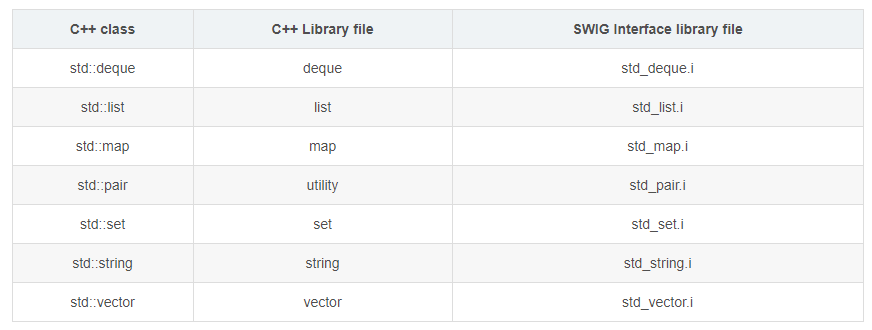

## 何为SWIG

连接C/C++到其它高级语言，一般是脚本语言如Python，以利用C/C++的高效。 其原理是解析C/C++头文件，找到申明并利用他们生成目标语言访问C/C++代码所必须的封装代码，需要目标语言本身支持调用C/C++代码（一般都会有相应的库支持）。

## 安装

下载SWIG，解压后跟目录下有INSTALL文件，为在Linux下安装的说明文件。Windows平台上不需要安装下载的安装包中已经编译好swig.exe工具，只需将其添加到用户环境变量中。

## 如何使用

正常的C/C++代码+后缀为`.i`的转换文件，如`example.i`，在命令行中进入`.i`所在文件键入命令：

```
swig -c++ -python example.i
```

即可为C++代码生成Python接口（用于在Python中使用）和cxx文件（用于编译C++代码）。然后在Python的setup.py中编译C/C++模块，生成`.pyd`（Windows平台）或`.so`（Linux平台），即可使用Python接口中函数。

## 转换规则

### SWIG库

SWIG提供了一组库文件，用以支持常用的包装，如数组、标准库等。可以在接口文件中引入这些库文件。比如，在%include “std_string.i”后，就可以直接给需要string参数数的函数传Python字符串了（SWIG库完成了此类型映射）。对”std_vector.i”举例如下：

```
%module example
%include "std_vector.i"

namespace std {
%template(vectori) vector<int>;
};

>>> from example import *
>>> v = vectori()
>>> v.push_back(1)
>>> print v.size()
1
```

C++库与SWIG接口文件的对应表



### 字符串处理

SWIG将char *映射为Python的字符串，但是Python字符串是不可修改的（immutable），如果某函数有修改char* ，很可能导致Python解释器崩溃。对由于这种情况，可以使用SWIG库里的cstring.i。

### 全局变量

SWIG创建一个特殊的变量’cvar’来存取全局变量，如：

```
%module example
%inline %{
double density = 2.5;
%}

>>>import example
>>>print example.cvar.density
2.5
```

###  inline 指示器

inline是另一个常见的SWIG指示器，用来在接口文件中插入C/C++代码，并将代码中声明的内容输出到接口中。

##  类型映射 

Python中的list、tuple类型不等价C/C++中的数组，C++的STL容器在Python中也没有直接的类型可以对应，由于存在不同语言类型底层实现不一致问题，Python调用C/C++代码时参数类型需要被转换，这就是类型映射。

类型映射是SWIG最核心的一部分，类型映射就是告诉SWIG对某个C/C++类型，生成什么样的代码。不过，SWIG的文档里说类型映射是SWIG的高级自定义部分，不是使用SWIG需要理解的。

### C/C++辅助函数

可以通过辅助函数来完一些SWIG本身不支持的功能。事实上，辅助函数可谓SWIG包装的瑞士军刀，一旦了解它使用，你可以使SWIG支持几乎所有你需要的功能，不过提醒一下，有很多C++特性是SWIG本身支持或者通过库支持的，不需要通过辅助函数实现。

同样的，直接上例示代码：

```
void set_transform(Image *im, double m[4][4]);

>>> a = [
... [1,0,0,0],
... [0,1,0,0],
... [0,0,1,0],
... [0,0,0,1]]
>>> set_transform(im,a)
Traceback (most recent call last):
File "<stdin>", line 1, in ?
TypeError: Type error. Expected _p_a_4__double
```

可以看到，set_transform是不能接受Python二维List的，可以用辅助函数帮助实现：

```
%inline %{
    /* Note: double[4][4] is equivalent to a pointer to an array double (*)[4] */
    double (*new_mat44())[4] {
    return (double (*)[4]) malloc(16*sizeof(double));
}
void free_mat44(double (*x)[4]) {
    free(x);
}
void mat44_set(double x[4][4], int i, int j, double v) {
    x[i][j] = v;
}
double mat44_get(double x[4][4], int i, int j) {
    return x[i][j];
}
%}

>>> a = new_mat44()
>>> mat44_set(a,0,0,1.0)
>>> mat44_set(a,1,1,1.0)
>>> mat44_set(a,2,2,1.0)
...
>>> set_transform(im,a)
>>>
```

当然，这样使用起来还不够优雅，但可以工作了，接下来介绍通过插入额外的Python代码来让使用优雅起来。

### 插入额外的Python代码

为了让set_transform函数接受Python二维list或tuple，我们也可以对它的Python代码稍加改造：

```
void set_transform(Image *im, double x[4][4]);

...
/* Rewrite the high level interface to set_transform */
%pythoncode %{
    def set_transform(im,x):
    a = new_mat44()
    for i in range(4):
    for j in range(4):
    mat44_set(a,i,j,x[i][j])
    _example.set_transform(im,a)
    free_mat44(a)
%}

>>> a = [
... [1,0,0,0],
... [0,1,0,0],
... [0,0,1,0],
... [0,0,0,1]]
>>> set_transform(im,a)
```

SWIG还提供了%feature(“shadow”), %feature(“pythonprepend”), %feature(“pythonappend”)来支持重写某函数的代理函数，或在某函数前后插入额外代码，在%feature(“shadow”)中 可用$action来指代对C++相应函数的调用：

```
%module example

// Rewrite bar() python code

%feature("shadow") Foo::bar(int) %{
    def bar(*args):
        #do something before
        $action
        #do something after
%}

class Foo {
    public:
       int bar(int x);
}
```

或者：

```
%module example

// Add python code to bar() 

%feature("pythonprepend") Foo::bar(int) %{
#do something before C\+\+ call
%}

%feature("pythonappend") Foo::bar(int) %{
#do something after C\+\+ call
%}

class Foo {
public:
int bar(int x);
}
```

## C/C++限制

由于技术实现或其它方面原因导致swig无法支持C/C++的全部特性或功能，因此在编写用于swig解析的C/C++代码（`.h`文件）时需要注意某些限制，这些限制可能导致`.i`编写复杂或效率降低或Python端调用不方便，可以在编写完C/C++代码后再考虑寻找合适的替代方案，不必在使用C/C++实现某些需要被高效计算的模块时便考虑这些问题。

- 完整指支持C/C++指针
- 部分支持重载（short/int重载不能区分，int&/int*重载不能区分）
-  SWIG能够自动处理运算符重载 
- 有限支持模板（需实例化）