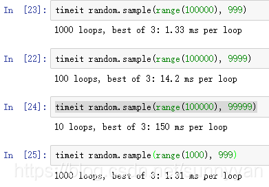
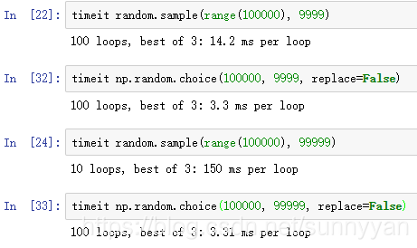

## 有限候选集

  python中random.sample()方法可以随机地从指定列表中提取出N个不同的元素，但在实践中发现，当N的值比较大的时候，该方法执行速度很慢，如： 

  

numpy random模块中的choice方法可以有效提升随机提取的效率 

  

 需要注意的是，需要置replace为False，即抽取的元素不能重复，默认为True。 


## 范围内采整数

```python
x1 = np.random.randint(bbox_x1, bbox_x2)
y1 = np.random.randint(bbox_y1, bbox_y2)
```


## 范围内采小数

```python
np.random.uniform(0.2, 0.5) # A single value 
np.random.uniform(0.2, 0.5, [2,3]) # A 2x3 array 
```