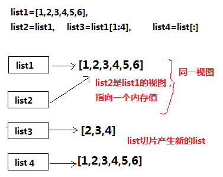

<<<<<<< HEAD
不拷贝：数据完全共享


浅拷贝：数据部分共享


深拷贝：数据完全独立，不共享


=======
---
title: Python之深浅拷贝
date: 2019/12/21 23:00
categories: Python
tags: Python
---

本文主要讨论`copy`和`view`或者说`deep copy`和`shallow copy`。下文使用`深拷贝`一词表示复制对象的每一个元素。使用`浅拷贝`一词表示仅复制对象的浅层。在讨论与Numpy相关知识时使用拷贝表示对数组数据的深拷贝，使用`视图`一词表示共享数组数据。

## Q1 从list构造array，使用复制还是视图？

A1 如果list中是相同基本数据类型（int, float等），则采用copy，否则采用view。因为如果list保存如字典这类数据，np的数组没法以连续内存保存这些数据，因此不得不采用view形式。

```python
>>> import numpy as np
>>> a = [[1, 2], [3, 4]]
>>> b = np.array(a)
>>> b
array([[1, 2],
       [3, 4]])
>>> b[0][0] = 0
>>> a
[[1, 2], [3, 4]]
>>> b
array([[0, 2],
       [3, 4]])
>>> a = [{'a': 1, 'b':2}, {'a': 3, 'b': 4}]
>>> b = np.array(a)
>>> b[0]['a'] = 0
>>> a
[{'a': 0, 'b': 2}, {'a': 3, 'b': 4}]
```

## Python内置数据类型嵌套结构的浅拷贝


## list切片产生新list

而直接赋值，实质上指向的是同一个内存值。

  

>>>>>>> 4e900c70f408abab6b3b371e58e0c7cd0f46eebf
