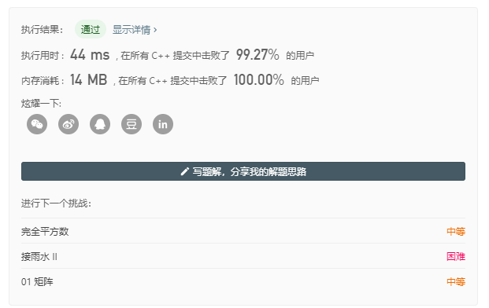

## 问题描述

在一个 N × N 的方形网格中，每个单元格有两种状态：空（0）或者阻塞（1）。

一条从左上角到右下角、长度为 k 的畅通路径，由满足下述条件的单元格 `C_1`, `C_2`, ..., `C_k` 组成：

- 相邻单元格 `C_i`和 `C_{i+1}` 在八个方向之一上连通（此时，`C_i` 和 `C_{i+1}` 不同且共享边或角）
- C_1 位于` (0, 0)`（即，值为 `grid[0][0]`）
- C_k 位于 `(N-1, N-1)`（即，值为 `grid[N-1][N-1]`）
- 如果 `C_i` 位于 `(r, c)`，则 `grid[r][c] `为空（即`grid[r][c] == 0`）
  返回这条从左上角到右下角的最短畅通路径的长度。如果不存在这样的路径，返回 -1 。

示例 1：

```
输入：[[0,1],[1,0]]

输出：2
```

示例 2：

```
输入：[[0,0,0],[1,1,0],[1,1,0]]

输出：4
```


## 搜索解法

BFS算法

```C++
class Solution {
private:
    typedef struct elemStruct
    {
        int x;  //点的x坐标
        int y;  //点的y坐标
        //int flag;  //点表示，-1代表障碍物，1代表已走过的点，0代表未走过的点
    }Elem;
    queue<Elem> nodes;
    int shortest = 0;

    void push_nodes(Elem node, vector<vector<int>>& grid) {
        // 可以使用方向控制数组来跳过中心元素判断
        // int direction[8][2] = {{1, -1}, {1, 0}, {1, 1}, {0, -1}, {0, 1}, {-1, -1}, {-1, 0}, {-1, 1}};
        for (int i = node.x - 1; i <= node.x + 1; ++i) {
            for (int j = node.y - 1; j <= node.y + 1; ++j) {
                if (i >= 0 && i < grid.size() && j >= 0 && j < grid[0].size()) {
                    if (grid[i][j] == 0) {
                        Elem new_node = {i, j};
                        nodes.push(new_node);
                        grid[i][j] = 1;  // 容易忽略
                    }
                }
            }
        }
    }

public:
    int shortestPathBinaryMatrix(vector<vector<int>>& grid) {
        if (grid[0][0] != 0) return -1;
        Elem start = {0, 0};
        nodes.push(start);
        while(!nodes.empty()) {
            int size = nodes.size();  // 先记录这一层有多少元素，关键！否则就无法统计shortest了
            while(size-- > 0) {
                Elem node = nodes.front();
                nodes.pop();
                if (node.x == grid.size()-1 && node.y == grid[0].size() - 1) {
                    return ++shortest;
                }
                push_nodes(node, grid);
            }
            ++shortest;
        }
        return -1;
    }
};
```

