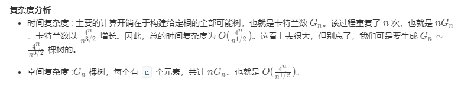

## 问题描述

给定一个整数 n，生成所有由 1 ... n 为节点所组成的二叉搜索树。

示例:
```
输入: 3
输出:
[
  [1,null,3,2],
  [3,2,null,1],
  [3,1,null,null,2],
  [2,1,3],
  [1,null,2,null,3]
]
解释:
以上的输出对应以下 5 种不同结构的二叉搜索树：

   1         3     3      2      1
    \       /     /      / \      \
     3     2     1      1   3      2
    /     /       \                 \
   2     1         2                 3
```

## 分治

```cpp
/**
 * Definition for a binary tree node.
 * struct TreeNode {
 *     int val;
 *     TreeNode *left;
 *     TreeNode *right;
 *     TreeNode(int x) : val(x), left(NULL), right(NULL) {}
 * };
 */
class Solution {
    vector<TreeNode*> generate_trees(int s, int e) {
        vector<TreeNode*> ans;
        if (s >= e) {
            ans.push_back(NULL);
            return ans;
        }
        for (int i = s; i < e; ++i) {
            vector<TreeNode*> l_trees = generate_trees(s, i);
            vector<TreeNode*> r_trees = generate_trees(i+1, e);
            for (auto l : l_trees) for (auto r : r_trees) {
                TreeNode* new_tree = new TreeNode(i);
                new_tree->left = l;
                new_tree->right = r;
                ans.push_back(new_tree);
            }
        }
        return ans;
    }
public:
    vector<TreeNode*> generateTrees(int n) {
        if (n == 0) {
            vector<TreeNode*> ans;
            return ans;
        }
        return generate_trees(1, n+1);
    }
};
```



## 动态规划

考虑k以及k+1的情况，推及n的情况。

例如, k=2

```
考虑 [ 1 2 ] 的所有解
  2
 /
1

 1
  \
   2
```

k=3时，新增加的数字3大于之前的所有数字，所以新增加的数字出现的位置只可能是根节点或者是根节点的右孩子，右孩子的右孩子，右孩子的右孩子的右孩子等等，总之不是根节点就是在右边。其次，新数字所在位置原来的子树，改为当前插入数字的左孩子即可，因为插入数字是最大的。

```
对于下边的解 
  2
 /
1

增加 3
1.把 3 放到根节点
    3
   /
  2
 /
1

2. 把 3 放到根节点的右孩子
   2
    / \
 1   3

对于下边的解
 1
  \
   2

增加 3
1.把 3 放到根节点
     3
    /
   1
    \
     2
       
2. 把 3 放到根节点的右孩子，原来的子树作为 3 的左孩子       
      1
        \
         3
        /
      2

3. 把 3 放到根节点的右孩子的右孩子
    1
    \
     2
      \
       3
```
以上就是根据 [ 1 2 ] 推出 [ 1 2 3 ] 的所有过程。我们只需要两个 list，pre 保存上一次的所有解，cur 计算当前的所有解。最外层循环不短增大k。第二层循环考虑pre的所有情况。第三层循环，探索pre结果的右边。共有3层循环。

