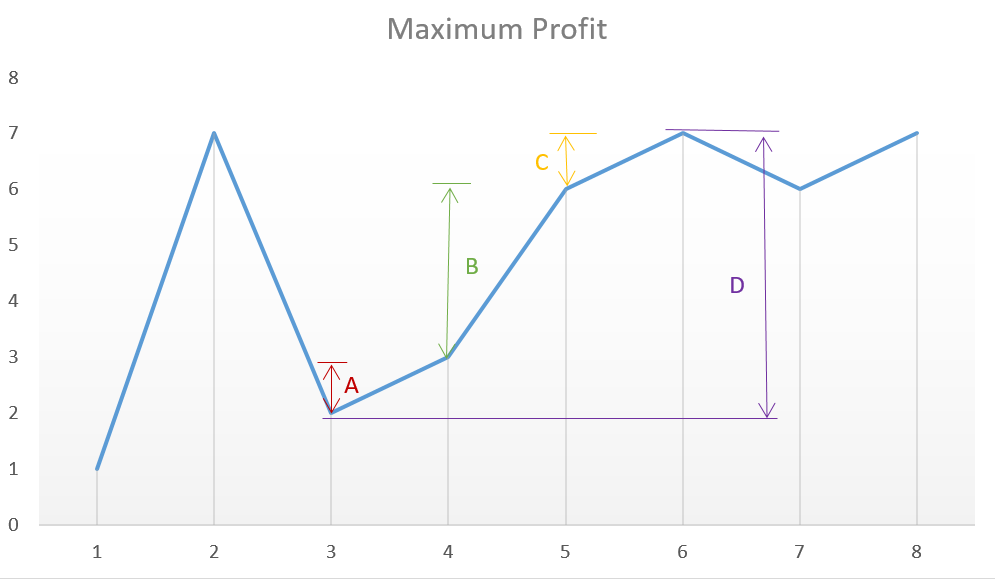

## 问题描述

给定一个数组，它的第 i 个元素是一支给定股票第 i 天的价格。

设计一个算法来计算你所能获取的最大利润。你可以尽可能地完成更多的交易（多次买卖一支股票）。

注意：你不能同时参与多笔交易（你必须在再次购买前出售掉之前的股票）。

示例 1:

```
输入: [7,1,5,3,6,4]
输出: 7
解释: 在第 2 天（股票价格 = 1）的时候买入，在第 3 天（股票价格 = 5）的时候卖出, 这笔交易所能获得利润 = 5-1 = 4 。
     随后，在第 4 天（股票价格 = 3）的时候买入，在第 5 天（股票价格 = 6）的时候卖出, 这笔交易所能获得利润 = 6-3 = 3 。
```


示例 2:

```
输入: [1,2,3,4,5]
输出: 4
解释: 在第 1 天（股票价格 = 1）的时候买入，在第 5 天 （股票价格 = 5）的时候卖出, 这笔交易所能获得利润 = 5-1 = 4 。
     注意你不能在第 1 天和第 2 天接连购买股票，之后再将它们卖出。
     因为这样属于同时参与了多笔交易，你必须在再次购买前出售掉之前的股票。
```

示例 3:

```
输入: [7,6,4,3,1]
输出: 0
解释: 在这种情况下, 没有交易完成, 所以最大利润为 0。
```


## 递归枚举

下面代码有误，错在哪里？

```C++
class Solution {
private:
    int helper(vector<int>& prices, int start, int end) {
        int max_profit = 0;
        if (end <= start) return 0;
        // 错误二：返回条件错误，不一定相邻两个差1返回
        if (end - start == 1) {
            return prices[end] - prices[start];
        }
        for (int i = start; i <= end; i++) {
            // 错误一：i==end时又回到初始问题，循环递归，最终会stack overflow
            int profit = helper(prices, start, i) + helper(prices, i+1, end);
            max_profit = max(max_profit, profit);
        }
        return max_profit;
    }

public:
    int maxProfit(vector<int>& prices) {
        if (prices.size() == 0) return 0;
        return helper(prices, 0, prices.size()-1);
    }
};
```


## 峰谷法

一个重要结论：每个单调递增区间（谷峰之间）作一次交易，利润最大。见下图

 


```C++
class Solution {
public:
    int maxProfit(vector<int>& prices) {
        if (prices.size() == 0) return 0;
        int buy_price = prices[0];
        int max_profit = 0;
        int last_price = prices[0];

        for (int i = 1; i < prices.size(); i++) {
            if (prices[i] < last_price) {
                max_profit += max(0, last_price - buy_price);
                buy_price = prices[i];
            }
            last_price = prices[i];
        }
        max_profit += max(0, last_price - buy_price);
        return max_profit;
    }
};
```

看了答案，思路更简单：

 

```C++
class Solution {
public 
   int maxProfit(vector<int>& prices) {
        int max_profit = 0;
        for (int i = 1; i < prices.size(); i++) {
            if (prices[i] > prices[i - 1])
                max_profit += prices[i] - prices[i - 1];
        }
        return max_profit;
    }
}
```

我的方案交易次数更少，更符合实际。答案的方案，代码最简。


## 有冷冻期

如果有一天冷冻期，即每次 sell 之后要等一天才能继续交易，上面的思考就不是很通用了。得用动态规划、状态转移的思想去做。

设`dp[i][0]`代表在第`i`天是购买股票的条件下的收益，`dp[i][1]`代表在第`i`天未购买股票的条件下最大收益，则

```cpp
dp[i][0] = max(dp[i-1][0], dp[i-1][1]+prices[i]);
dp[i][1] = max(dp[i-1][1], dp[i-2][0]-prices[i]);
```

初始条件，

```cpp
dp[0][0] = 0;
dp[0][1] = 0;
```

代码：

```cpp
class Solution {
public:
    int maxProfit(vector<int>& prices) {
        int size = prices.size();
        if (size < 2) return 0;
        int* dp0 = new int[size+1]();
        int* dp1 = new int[size+1]();
        dp1[1] = -prices[0];
        for (int i = 2; i <= size; ++i) {
            dp0[i] = max(dp0[i-1], dp1[i-1]+prices[i-1]);
            dp1[i] = max(dp1[i-1], dp0[i-2]-prices[i-1]);
        }
        return dp0[size];
    }
};
```


## 有交易费用

非负整数 `fee` 代表了交易股票的手续费用。我们将交易费用算入到sell时计算。

```cpp
class Solution {
public:
    int maxProfit(vector<int>& prices, int fee) {
        int size = prices.size();
        if (size < 2) return 0;
        int* dp0 = new int[size+1]();
        int* dp1 = new int[size+1]();
        dp1[1] = -prices[0];
        for (int i = 2; i <= size; ++i) {
            dp0[i] = max(dp0[i-1], dp1[i-1]+prices[i-1]-fee);
            dp1[i] = max(dp1[i-1], dp0[i-1]-prices[i-1]);
            // 有冷冻期的转移方程如下
            // dp1[i] = max(dp1[i-1], dp0[i-2]-prices[i-1]);
        }
        return dp0[size];
    }
};
```

