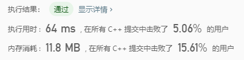

## 问题描述

班上有 N 名学生。其中有些人是朋友，有些则不是。他们的友谊具有传递性。如果已知 A 是 B 的朋友，B 是 C 的朋友，那么我们可以认为 A 也是 C 的朋友。所谓的朋友圈，是指所有朋友的集合。

给定一个 N * N 的矩阵 M，表示班级中学生之间的朋友关系。如果`M[i][j] = 1`，表示已知第 i 个和 j 个学生互为朋友关系，否则为不知道。你必须输出所有学生中的已知的朋友圈总数。

示例 1:

```
输入: 
[[1,1,0],
 [1,1,0],
 [0,0,1]]
输出: 2 
说明：已知学生0和学生1互为朋友，他们在一个朋友圈。
第2个学生自己在一个朋友圈。所以返回2。
```

示例 2:

```
输入: 
[[1,1,0],
 [1,1,1],
 [0,1,1]]
输出: 1
说明：已知学生0和学生1互为朋友，学生1和学生2互为朋友，所以学生0和学生2也是朋友，所以他们三个在一个朋友圈，返回1。
```

**注意：**

1. 对于所有学生，有`M[i][i] = 1`。
2. 如果有`M[i][j] = 1`，则有`M[j][i] = 1`。


## 深度优先搜索

```C++
class Solution {
private:
    int n;
    int m;
    int dfs(vector<vector<int>>& M, int i, int j)
    {
        if (M[i][j] == 0) return 0;
        M[i][j] = 0;
        int num = 1;
        for (int k = 0; k < n; ++k) {
            num += dfs(M, k, j);
        }
        for (int k = 0; k < m; ++k) {
            num += dfs(M, i, k);
        }
        return num;
    }

public:
    int findCircleNum(vector<vector<int>>& M) {
        n = M.size();
        m = M[0].size();
        int num = 0;

        for (int i = 0; i < n; ++i) {
            for (int j = 0; j < m; ++j) {
                if (dfs(M, i, j) > 0) ++num;
            }
        }
        return num;
    }
};
```



上面搜索写的太复杂了，没必要可以优化。唯一的优点就是没有用额外的存储空间。

