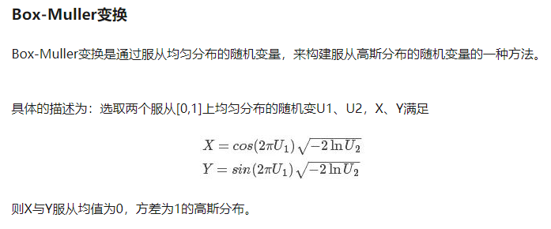

给一个01二项分布的随机器，参数为p，用它设计一个0-1的均匀分布的随机器（连续的）

关键是构造等概率的两个相互独立的事件。产生00/01/10/11的概率分别是pp/p(1-p)/(1-p)p/(1-p)(1-p)，其中事件01和事件10相互独立，并且等概率。但是这还不能生成值范围在【0,1】之间的均匀分布。现在已经有了0-1分布，问题转换为使用0-1分布生成值范围在0-N之间的均匀分布，然后再讲所有数组除以N，1/N就是误差。

想到位运算，因为i个二进制位随机的选择0或1，可以随机的构成0~2^i的数，而这些数构成了所有的组合数是等概率出现的。比如：2位二进制位，这两位可以随机为0或1而互不影响，随机的构成了00 01 10 11，它们代表了四个数，且这四个数是等概率的，误差是1/4。 

参考：

- https://www.nowcoder.com/discuss/448038?type=post&order=time&pos=&page=1&channel=-2&source_id=search_post
- https://blog.csdn.net/weixin_41902489/article/details/79705363

有一个0-1的均匀分布随机器，用它实现一个N(0, 1)的正太分布随机器

中心极限定理说明，在适当的条件下，大量相互独立[随机变量](https://zh.wikipedia.org/wiki/随机变量)的均值经适当标准化后[依分布收敛](https://zh.wikipedia.org/wiki/依分布收敛)于[正态分布](https://zh.wikipedia.org/wiki/正态分布)。这组定理是[数理统计学](https://zh.wikipedia.org/wiki/数理统计学)和误差分析的理论基础，指出了大量随机变量之和近似服从正态分布的条件。因此可以考虑使用n个均匀分布随机数生成正太分布。但实际上并不高效，并且生成的分布有瑕疵。

比较好的方法是Box-Muller变换

参考：

- https://blog.csdn.net/doublehhcc/article/details/81166502
- https://blog.csdn.net/weixin_37895339/article/details/80380346

