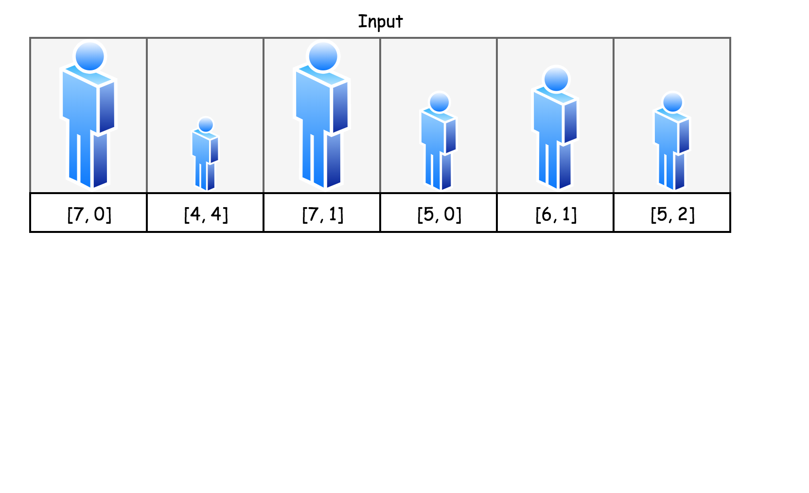
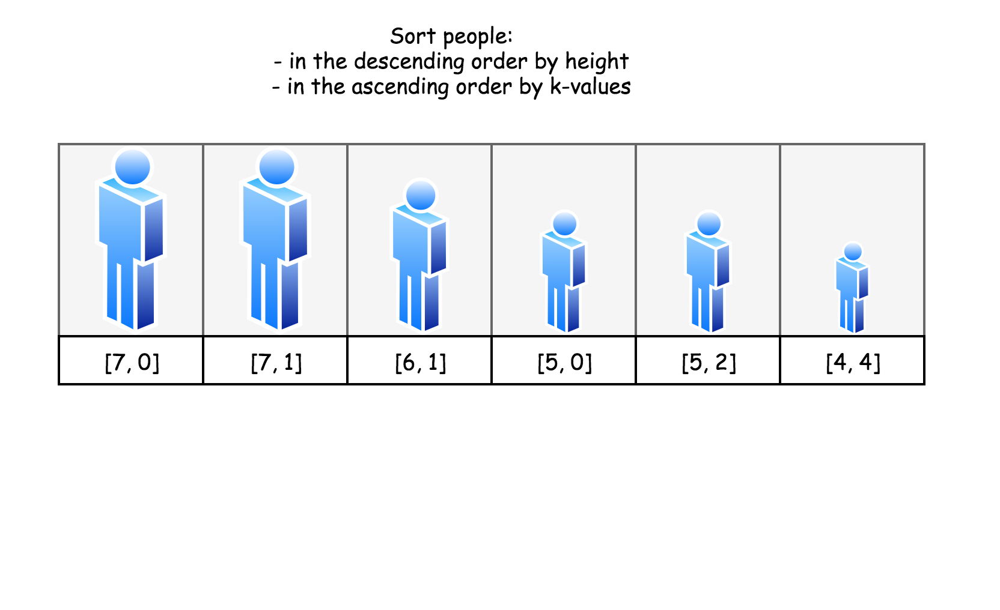
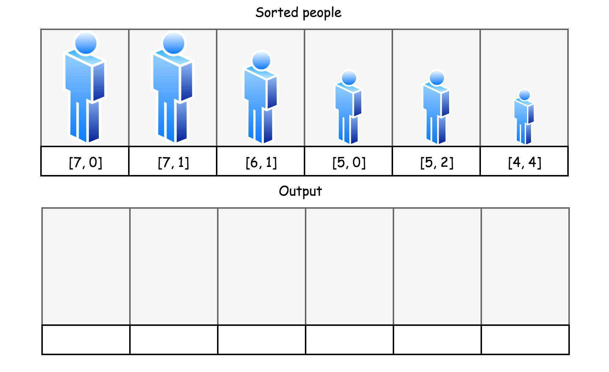
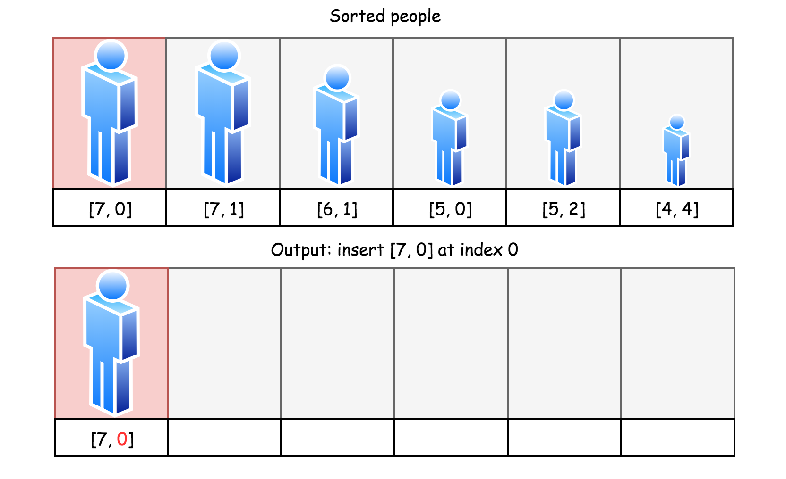
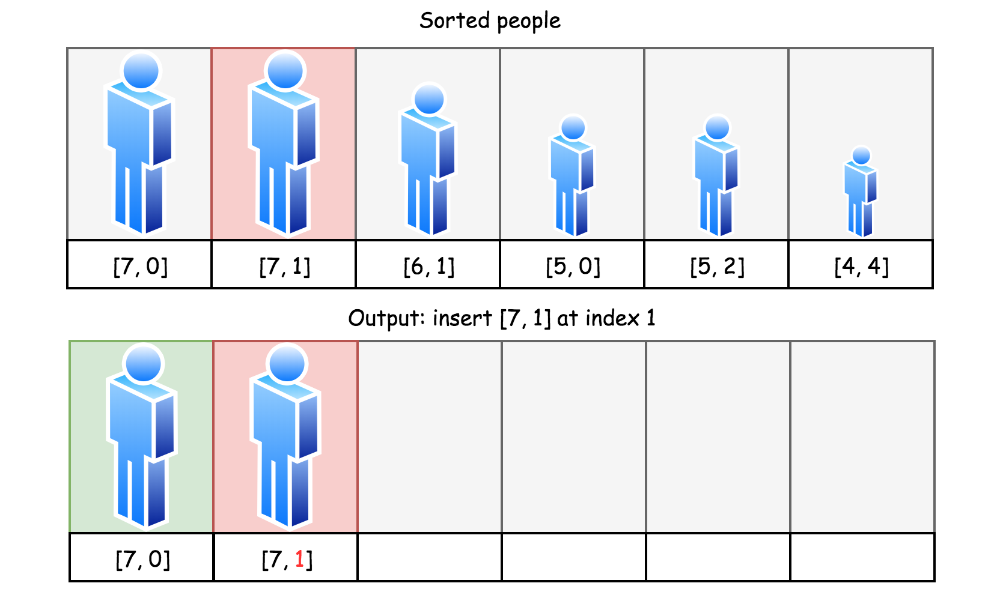
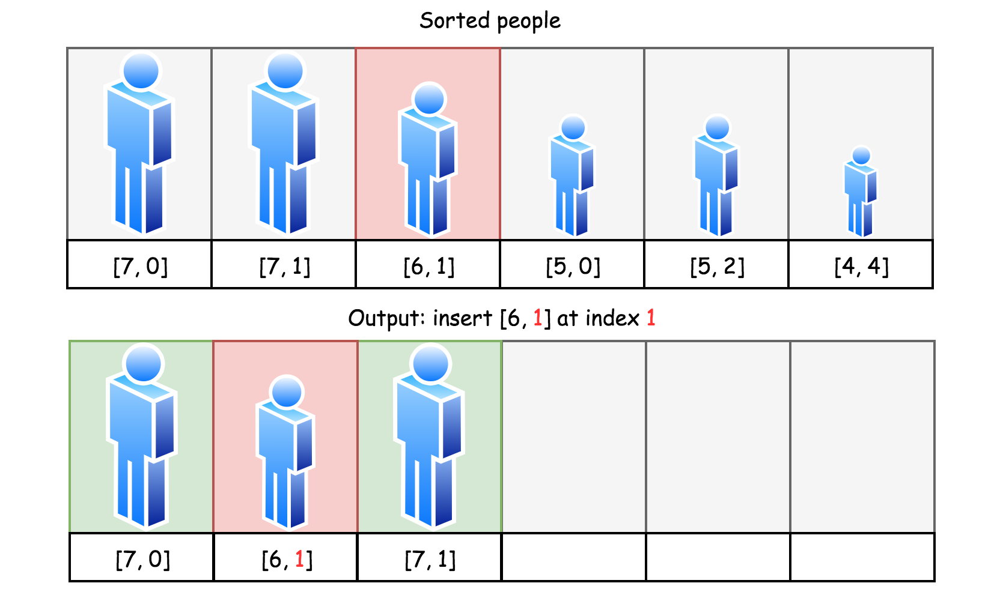
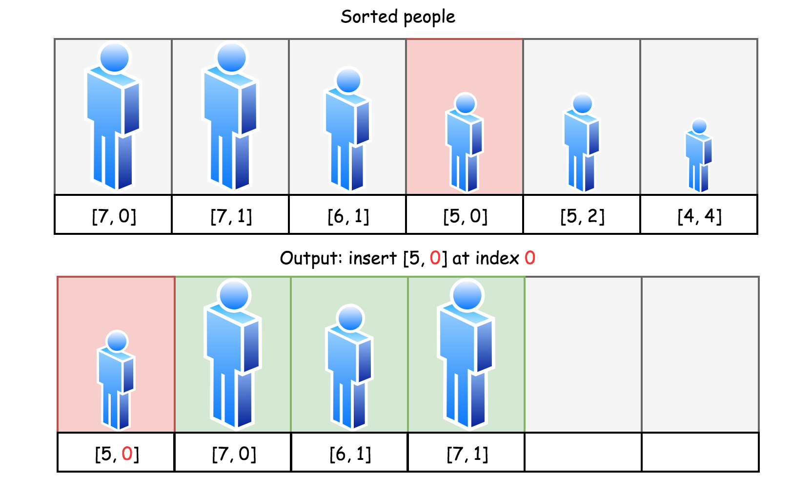
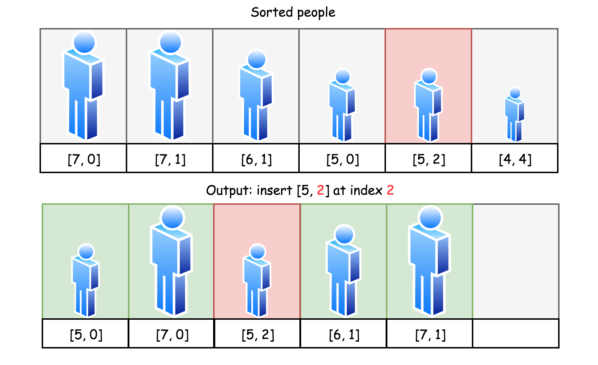
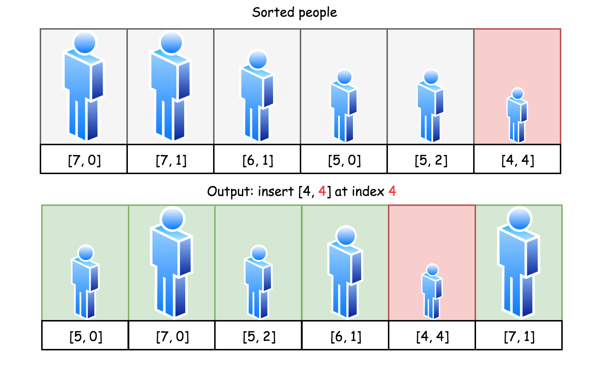
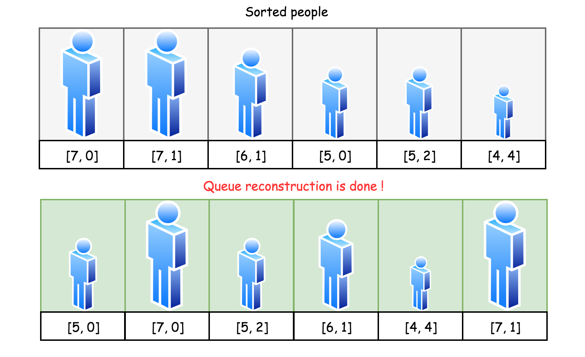

假设有打乱顺序的一群人站成一个队列。 每个人由一个整数对(h, k)表示，其中h是这个人的身高，k是排在这个人前面且身高大于或等于h的人数。 编写一个算法来重建这个队列。

注意：总人数少于1100人。

示例
```
输入:
[[7,0], [4,4], [7,1], [5,0], [6,1], [5,2]]

输出:
[[5,0], [7,0], [5,2], [6,1], [4,4], [7,1]]
```

## 方法一

策略：

- 将最高的人按照 `k` 值升序排序，然后将它们放置到输出队列中与 `k` 值相等的索引位置上。
- 按降序取下一个高度，同样按 `k` 值对该身高的人升序排序，然后逐个插入到输出队列中与 `k` 值相等的索引位置上。
-  直到完成为止。 

依据：因为个子矮的人相对于个子高的人是 “看不见” 的，所以可以先安排个子高的人。然后将个子矮的人插入到个子高人里面，这样不会影响前面已经排好的人。贪心算法的思路一般都是从极端出发，后面的操作不影响前面的操作，每一步操作均满足要求，最终的操作也会满足要求。

图解：

  

  

  

  

   

  

  

  

  

 


```cpp
class Solution {
private:
    // 双(多)关键字排序，此函数必须是静态的
    static bool compare(vector<int> a, vector<int> b) {
        if (a[0] > b[0]) return true;
        else if (a[0] < b[0]) return false;
        else {
            if (a[1] < b[1]) return true;
            else return false;
        }
    }
public:
    vector<vector<int>> reconstructQueue(vector<vector<int>>& people) {
        vector<vector<int>> ans;
        sort(people.begin(), people.end(), compare);
        for (int i = 0; i < people.size(); ++i) {
            // printf("h=%d, k=%d\n", people[i][0], people[i][1]);
            ans.insert(ans.begin()+people[i][1], people[i]);
        }
        return ans;
    }
};
```

