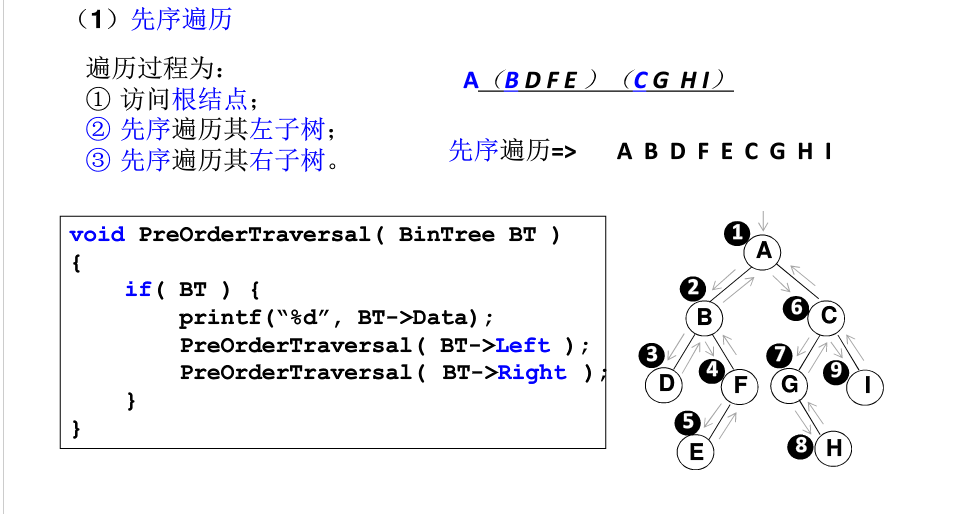
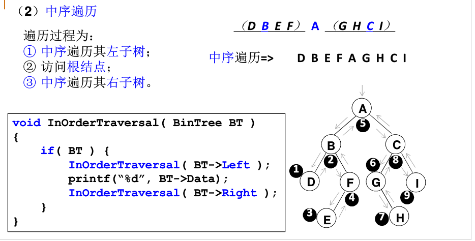
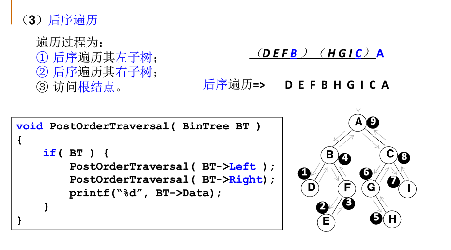

## 先序

1. 访问根结点
2. 访问左子树
3. 访问右子树

  

 ## 中序

1. 访问左子树
2. 访问根结点
3. 访问右子树

 

特点：如果是一颗二叉查找树，中序遍历依次从小到大输出结点。

## 后序

1. 访问左子树
2. 访问右子树
3. 访问根

  

## 总结

实质都是先访问根节点再访问左右结点，只是结点数据使用的时间先后与递归顺序相关而已。没有根结点哪来的左右。