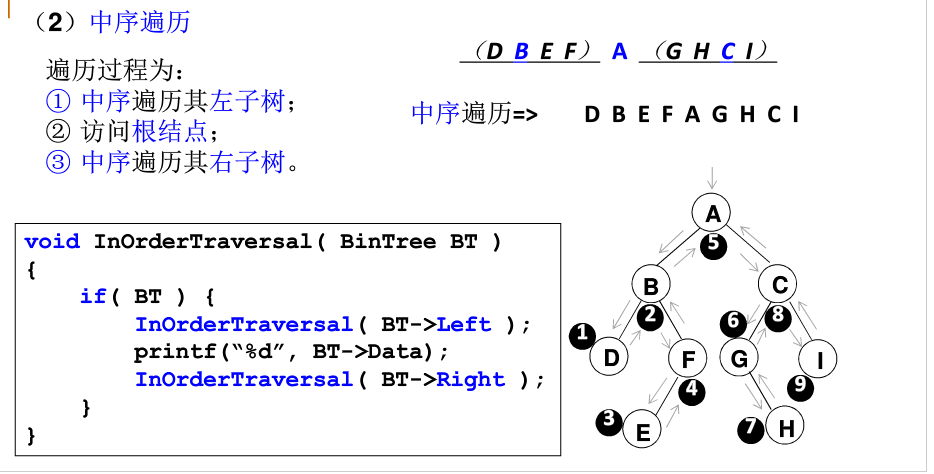
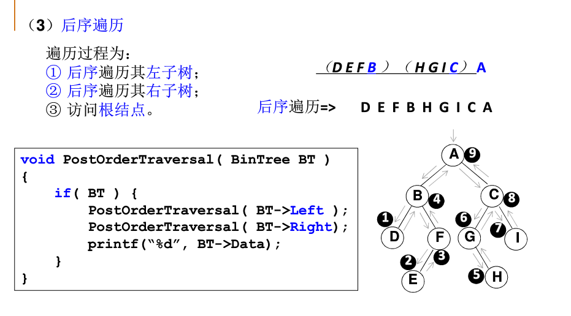

## 先序

1. 访问根结点
2. 访问左子树
3. 访问右子树

  

特点：与dfs访问方式一致

 ## 中序

1. 访问左子树
2. 访问根结点
3. 访问右子树

 

特点：如果是一颗二叉查找树，中序遍历依次从小到大输出结点。

## 后序

1. 访问左子树
2. 访问右子树
3. 访问根

  

## 总结

实质都是先访问根节点再访问左右结点，只是结点数据使用的时间先后与递归顺序相关而已。没有根结点哪来的左右。


非递归访问：

```cpp
// 非递归
/*      
	   5
    /     \
   3       8
  / \     / \
 4   10  1   9
     /\
    0  7
*/
// 前序 dfs
void pre_order(BTreeNode* root) {
	stack<BTreeNode*> s;
	while (root != NULL || !s.empty()) {
		if (root != NULL) {
			printf("%d\n", root->val);
			s.push(root);
			root = root->left;
		}
		else {
			root = s.top();
			root = root->right;
			s.pop();
		}
	}
}
// 中序
void in_order(BTreeNode* root) {
	stack<BTreeNode*> s;
	while (root != NULL || !s.empty()) {
		if (root != NULL) {
			s.push(root);
			root = root->left;
		} else {
			root = s.top();
			printf("%d\n", root->val);
			root = root->right;
			s.pop();
		}
	}
}
// 后序
void post_order(BTreeNode* root) {
	BTreeNode* last_r = NULL;
	stack<BTreeNode*> s;
	while (root != NULL || !s.empty()) {
		if (root != NULL) {
			s.push(root);
			root = root->left;
		} else {
			root = s.top();
             // 注意第二个条件
			if (root->right != NULL && root->right != last_r) 
				root = root->right;
			else {
				printf("%d\n", root->val);
				last_r = root;  // 用于判断“访问根节点之前，右子树是否已访问过”
				root = NULL;
				s.pop();
			}
		}
	}
}

// 层次 bfs
void bfs_order(BTreeNode* root) {
	if (root == NULL) return;
	queue<BTreeNode*> s;
	s.push(root);
	while (!s.empty()) {
		int size = s.size();
		while (size--) {
			BTreeNode* node = s.front();
			s.pop();
			printf("%d ", node->val);
			if (node->left != NULL) s.push(node->left);
			if (node->right != NULL) s.push(node->right);
		}
		printf("\n");
	}
}
```

