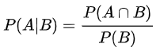
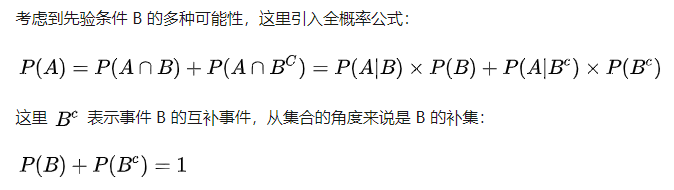
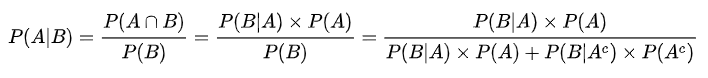

### 考察概率密度函数、分布函数

给定一个或多个分布，求新的分布。例如：x, y服从0-1均匀分布，求x+y<1的概率？x, y, z服从0-1均匀分布，求x+y+z<1的概率？

首先得求出联合概率密度，一般都会说这两个分布独立，此时联合概率密度就是两个分布密度函数相乘。

例如本题的`f(x,y) = 1, 1>x>0, 1>y>0`

设`u=x+y`，则`x=u-y`代入到上面联合概率密度上，然后对y和u积分即可求得`Z=X+Y`的分布函数，注意`f(u-y,y)`不是常数1而是与u定义域相关的分段函数：

```
u取值范围：[0,2]
u-y取值范围：[u-1, u]
y取值范围：[0, 1]
在u-y和y公共区域，值为1，其它区域值为0
当2>u>1, 公共区域：[u-1, 1], 区域长度：2-u, 概率密度：2-u，分布函数：-ln(2-u)
1>u>0, 公共区域：[0, u], 区域长度：u, 概率密度：1/u, 分布函数： ln(u)
```

​              


上图是在网上找的，只要将区间改成`[0,1]`就是本题的公式。

同理，设`u=x+y+z`，联合概率密度函数`f(x,y,x)`，将`z=u-x-y`代入联合概率密度函数得`f(x,y,u-x-y)`，讨论：

````
x范围：[0, 1]
y范围：[0, 1]
u范围：[0, 3]
u-x-y范围：[u-2, u]
在三者的公共区间，概率密度为1，其它区间为0
3>u>2, 公共区域为：[u-2, 1]，区间长度为：3-u, 概率密度为：1/(3-u)， 分布函数为: -ln(3-u)
2>u>1, 公共区域为：[0, 1], 区间长度为：1, 概率密度为: 1， 分布函数为u
1>u>0, 公共区域为：[0, u]，区间长度为：u，概率密度为：1/u, 分布函数为ln(u)
````

计算举例：

x+y+z<1的概率，P(x+y+x<1) = F(1>u>0) = 0.5


条件概率：



全概率：



条件概率+全概率 => 贝叶斯公式：



问题1：

人群中男人色盲的概率为5%，女人为0.25%。从男女人数相等的人群中随机选一人，恰好是色盲。求此人是男人的概率。

设“一个人是男人”是事件A，“一个人患色盲”为事件B。需要求的是P(A|B)。

已知P(B|A) = 0.05, P(A) = 0.5, P(B|A_c) = 0.0025, P(A_c) = 0.5带入贝叶斯公式 => `0.05*0.5 / (0.05*0.5+0.0025*0.5) = 500/(500+25) = 20/21 `


10个小球，随机分到12个盒子里，求恰好10个盒子都为空的概率。


问题2：

在网游中，野怪被杀死时，有p=0.2的概率掉落一把宝剑。野怪的死亡是独立事件。玩家持续杀死了10个野怪，求掉落4把宝剑的概率。  

独立重复试验，二项分布。`C(10,4)*(p^4)*((1-p)^6)`


问题3：

一辆巴士载了25人，路经10个车站。每个乘客以相同的概率在各个车站下车。如果某个车站有乘客要下车，则大巴在该站停车。每个乘客下车的行为是独立的。记大巴停车次数为X，求X的数学期望（要求通过编程求数学期望）。

```python
import random
n=10000
cnt=[0]*11
for i in range(n):
    arr=[0]*10
    for j in range(25):
        rnd=random.randint(0,9)
        arr[rnd]+=1
    SUM=0
    for j in range(10):
        if arr[j]>0:
            SUM+=1
    cnt[SUM]+=1
ans=0.0
for i in range(11):
    ans+=i*cnt[i]/n
print(ans)
```

